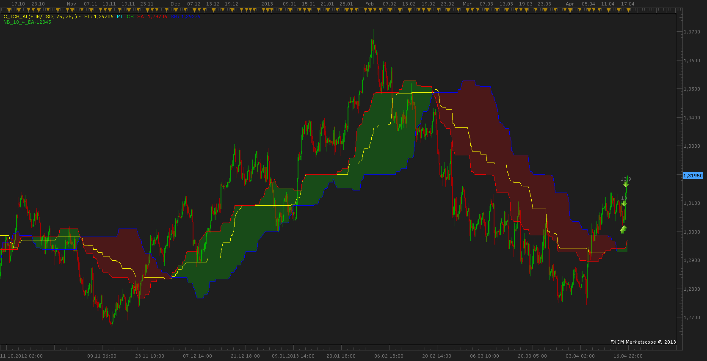
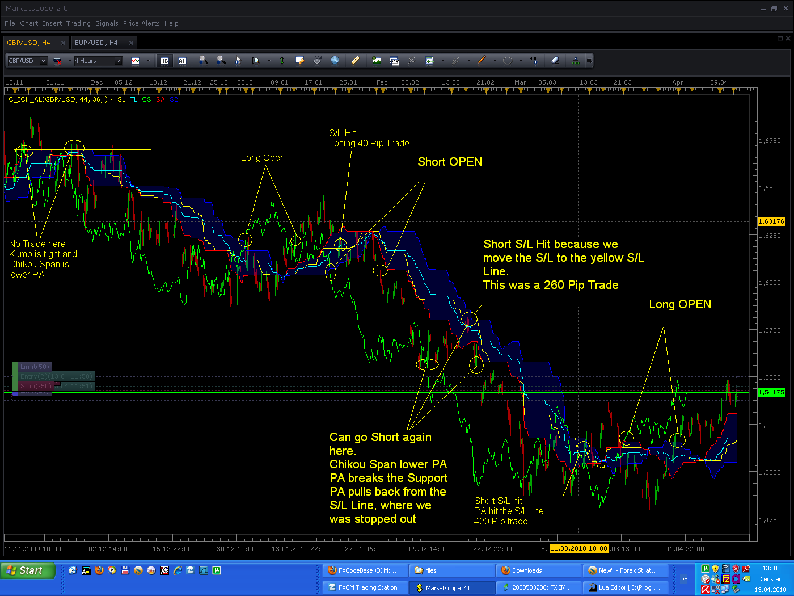

# Alternate Ichimoku Indicator New Version

> Source: https://fxcodebase.com/code/viewtopic.php?f=17&t=627  
> Forum: 17 · Topic 627 · 21 post(s)

---

## Alternate Ichimoku Indicator New Version

**Gidien** · Tue Apr 13, 2010 6:37 am

This is the alternate Ichimoku found here

[http://codebase.mql4.com/en/1467](http://codebase.mql4.com/en/1467)

Settup :
Pair Time SSP SSK
EURGBP 4H 44 38
CADCHF 4H 62 52
CADJPY 4H 48 36
GBPUSD 4H 44 36
GBPCHF 4H 34 29
GBPJPY 4H 36 29
EURUSD 4H 34 34
EURCHF 4H 72 50
EURJPY 4H 72 36
USDCAD 4H 24 60
USDCHF 4H 34 29
USDJPY 4H 34 29

How to sett up can found here

[http://articles.mql4.com/497](http://articles.mql4.com/497)

Colored Cloud:

 

file:

 [C_ICH_AL.lua](files/1115/C_ICH_AL.lua)

 [Alternate Ichimoku.lua](files/1115/Alternate%20Ichimoku.lua)

MT5/MQ5 version.
[viewtopic.php?f=38&t=69891](https://fxcodebase.com/code/viewtopic.php?f=38&t=69891)

---

## Re: Alternate Ichimoku Indicator

**Gidien** · Tue Apr 13, 2010 7:46 am

Simple Rules:

 

---

## Re: Alternate Ichimoku Indicator New Version

**barbs666** · Wed Apr 28, 2010 11:27 pm

having error when loading custom indicator in market scope II

---

## Re: Alternate Ichimoku Indicator New Version

**Nikolay.Gekht** · Thu Apr 29, 2010 8:12 am

What kind of error do you have? The most typical error (yeah, I got it, we have to simplify loading process) - is an attempt to load the custom indicator using signal->manage custom signals or to load the custom signal using chart->manage custom indicators.

---

## Re: Alternate Ichimoku Indicator New Version

**barbs666** · Thu Apr 29, 2010 6:24 pm

it says that it failed to install/load and yeah i was using the manage function --> Load

---

## Re: Alternate Ichimoku Indicator New Version

**Apprentice** · Thu Nov 15, 2012 5:17 am

You can choose one of four filters.
1) SA / SB
2) SA / Price
3) SB / Price
4) SL / ML

 [Alternate Ichimoku Bar Overlay.lua](files/44651/Alternate%20Ichimoku%20Bar%20Overlay.lua)

---

## Re: Alternate Ichimoku Indicator New Version

**nazaar** · Thu Nov 15, 2012 12:35 pm

> **Apprentice wrote:**
>
>
> Alternate Ichimoku Bar Overlay.png
>
>
> You can choose one of four filters.
> 1) SA / SB
> 2) SA / Price
> 3) SB / Price
> 4) SL / ML
>
>
> Alternate Ichimoku Bar Overlay.lua

Please advise what these stand for and mean:

1) SA / SB
2) SA / Price
3) SB / Price
4) SL / ML

is sa = span a?
sb = span b?
is the "/" mean greater than or less than?
sl?
ml?

Thanks in advance.

---

## Re: Alternate Ichimoku Indicator New Version

**Apprentice** · Fri Nov 16, 2012 4:49 am

Span A > Span B
Green
Span A < Span B
Red
else
Blue

SA > Price
Green
SA < Price
Red
else
Blue

and so on....

If you use more then one filter.
Both must have same indication,
Otherwise you'll have a Neutral.

---

## Re: Alternate Ichimoku Indicator New Version

**rose123** · Sat Nov 17, 2012 11:43 am

hi,

can you create same alterate ichimoku bar overlay as alternate ichimoku underlying bar.

---

## Re: Alternate Ichimoku Indicator New Version

**Apprentice** · Sun Nov 18, 2012 4:27 am

u want alterate ichimoku bar overlay,
to be shown below chart?

---

## Re: Alternate Ichimoku Indicator New Version

**rose123** · Sun Nov 18, 2012 8:55 am

yes.

i want alternate ichimoku indicator new version below the chart.

---

## Re: Alternate Ichimoku Indicator New Version

**Apprentice** · Mon Nov 19, 2012 3:52 am

 [Alternate Ichimoku Bar.lua](files/45080/Alternate%20Ichimoku%20Bar.lua)

---

## Re: Alternate Ichimoku Indicator New Version

**transformer** · Tue Apr 16, 2013 3:53 am

hi,

in this indicator for cloud there is only one color. can u add two different color for up cloud and down cloud.

---

## Re: Alternate Ichimoku Indicator New Version

**Gidien** · Tue Apr 16, 2013 2:42 pm

Check Post One.

---

## Re: Alternate Ichimoku Indicator New Version

**transformer** · Tue Apr 16, 2013 7:04 pm

thank you. can u add facility to change line with and style of sa,sb, sl.

---

## Re: Alternate Ichimoku Indicator New Version

**Apprentice** · Wed Apr 17, 2013 2:53 am

Your request is added to the development list.

---

## Re: Alternate Ichimoku Indicator New Version

**Apprentice** · Wed Jul 23, 2014 5:09 am

Alternate Ichimoku.lua Added

---

## Re: Alternate Ichimoku Indicator New Version

**superleo** · Sun Feb 28, 2016 10:39 am

HI APPRENDICE,

I REQUEST A MTR MCP LIST ALTERNATE ICHIMOKU INDICATOR IN FIVE TIME FRAMES WITH FOLLOWING CONDITION

1.GREEN UPPER ARROW--- SA > SB AND PRICE > SA (PRICE IS ABOVE BULLISH CLOUD)

2GREEN UPPER ARROW WITH DOT --- SA> SB AND PRICE<SA AND PRICE>SL(PRICE WITH IN BULLISH CLOUD BUT ABOVE SL LINE)

3.RED DOWN ARROW----SA<SB AND PRICE<SA(PRICE IS BELOW BEARISH CLOUD)

4.RED DOWN ARROW WITH DOT ----- SA<SB AND PRICE>SA AND PRICE<SL( PRICE IS WITH IN BEARISH CLOUD BUT BELOW SL LINE)

5.OTHER WISE ------------YELLOW HORIZONDAL LINE

IF THE INDICATOR LOOK IS LIKE MTF MCP STOCH RSI INDICATOR IT WILL BE GOOD

IT IS IN FOLLOWING PAGE
[viewtopic.php?f=17&t=60341&p=102567&hilit=MTF+MCP#p102567](http://www.fxcodebase.com/code/viewtopic.php?f=17&t=60341&p=102567&hilit=MTF+MCP#p102567)

---

## Re: Alternate Ichimoku Indicator New Version

**Apprentice** · Mon Feb 29, 2016 5:49 am

Alternate Ichimoku.lua Update, Re-Download

---

## Re: Alternate Ichimoku Indicator New Version

**Apprentice** · Mon Feb 29, 2016 5:58 am

Required can be found here.
[viewtopic.php?f=17&t=63193](https://fxcodebase.com/code/viewtopic.php?f=17&t=63193)

---

## Re: Alternate Ichimoku Indicator New Version

**Apprentice** · Tue Jul 11, 2017 2:06 pm

The indicator was revised and updated.
