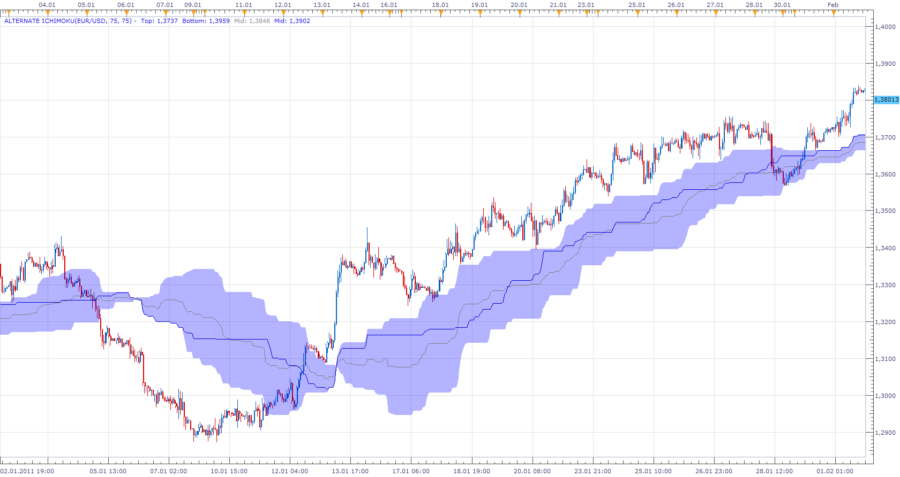

# Alternate Ichimoku

> Source: https://fxcodebase.com/code/viewtopic.php?f=17&t=7806  
> Forum: 17 · Topic 7806 · 13 post(s)

---

## Alternate Ichimoku

**Apprentice** · Fri Nov 04, 2011 6:29 am

This is a translation of MT4 indicators, with the same name.

 [Alternate Ichimoku.lua](files/17366/Alternate%20Ichimoku.lua)

 [Alternate Ichimoku with Alert.lua](files/17366/Alternate%20Ichimoku%20with%20Alert.lua)

The indicator was revised and updated

---

## Re: Alternate Ichimoku

**Gidien** · Sat Nov 05, 2011 8:18 am

Also an old version from me here

[http://www.fxcodebase.com/code/viewtopic.php?f=17&t=627](http://www.fxcodebase.com/code/viewtopic.php?f=17&t=627)

---

## Re: Alternate Ichimoku

**Apprentice** · Fri Mar 17, 2017 7:47 am

Indicator was revised and updated.

---

## Re: Alternate Ichimoku

**Leon Davidovich** · Tue Jul 17, 2018 3:17 pm

Could we have please an ALERT when crossing the middle line please

---

## Re: Alternate Ichimoku

**Leon Davidovich** · Tue Jul 17, 2018 3:38 pm

Please an alert on the middle line

---

## Re: Alternate Ichimoku

**Apprentice** · Wed Jul 18, 2018 7:33 am

Your request is added to the development list under Id Number 4188

---

## Re: Alternate Ichimoku

**Leon Davidovich** · Wed Jul 18, 2018 11:35 am

Thank you Mr Apprentice, an strategy could be even better

---

## Re: Alternate Ichimoku

**Apprentice** · Thu Jul 19, 2018 1:41 pm

Alternate Ichimoku with Alert added.

---

## Re: Alternate Ichimoku

**Leon Davidovich** · Thu Jul 19, 2018 10:44 pm

Thank you very very much Mr. Apprentice

---

## Re: Alternate Ichimoku

**lucool7** · Mon Jul 23, 2018 6:31 am

Hello Apprentice!

I use a strategy with Ichimoku
Can we set alerts like this
Break kijun + Break Tenkan below cloud or above cloud. But no warning when the price is in the cloud.

Excuse me if this message has already been posted

Thanks for your work

Lucool

---

## Re: Alternate Ichimoku

**Apprentice** · Tue Jul 24, 2018 8:36 am

Your request is added to the development list under Id Number 4195

---

## Re: Alternate Ichimoku

**lucool7** · Tue Jul 24, 2018 12:47 pm

Thanks you very Much Apprentice !

---

## Re: Alternate Ichimoku

**Apprentice** · Thu Jul 26, 2018 8:42 am

[Alternate Ichimoku with Alert.lua](files/120088/Alternate%20Ichimoku%20with%20Alert.lua)

Try this version.
