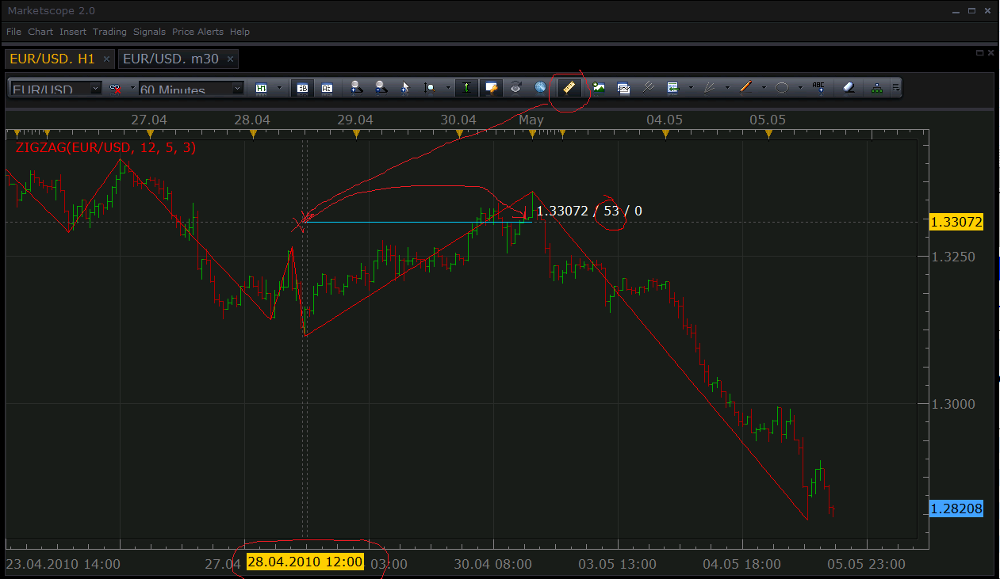
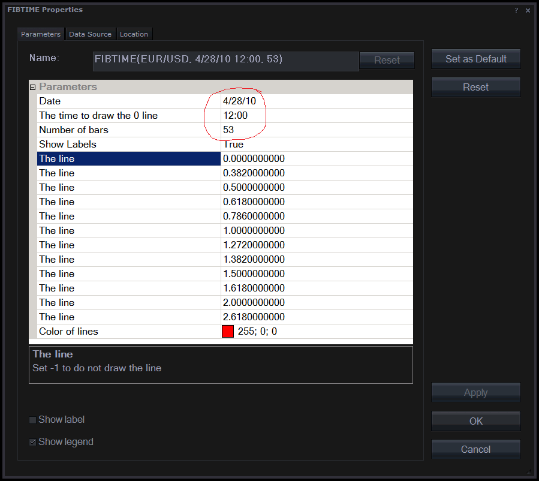
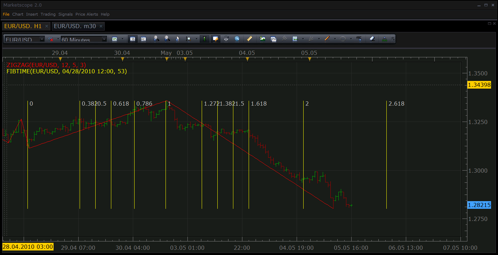

# Alternative for the standard fibonacci time retracement.

> Source: https://fxcodebase.com/code/viewtopic.php?f=17&t=964  
> Forum: 17 · Topic 964 · 7 post(s)

---

## Alternative for the standard fibonacci time retracement.

**Nikolay.Gekht** · Wed May 05, 2010 3:52 pm

Unlike the standard time replacement, this indicator shows the lines on the base of the fib's levels, e.g. 0,382, 0.5, 0.618 and so on.

How to use the indicator:
1) Decide at which bar you want to have the first line drawn and how long must be the distance to the 1.000 line. You can use the ruler tool to measure the length of the period in bars:

 

Remember the date/time and the number of bars.

2) Then apply the FIBTIME indicator on the chart. Enter the date in mm/dd/yyyy format, time in hh:mm format for the bar which the place of 0.000 line and the number of bars to 1.000 line. Change levels if you wish or set the level value to -1 if you don't want to see this level.

 

Apply the indicator.

3) Voila, the replacement levels are shown.

 

Download the indicator:

 [FIBTIME.lua](files/1776/FIBTIME.lua)

The indicator was revised and updated

---

## Re: Alternative for the standard fibonacci time retracement.

**thetruth** · Thu Oct 07, 2010 4:12 pm

Nikolay
the indicator has an error 103: specific candle is not found.

---

## Re: Alternative for the standard fibonacci time retracement.

**Nikolay.Gekht** · Fri Oct 08, 2010 11:50 am

This happen when a bar with the specified date or time is not exist on the chart.
Thank you for pointing to this indicator again. I'll change the interface, so you will be able to choose a bar via context menu, like for recently published auto fibonacci levels indicators.

---

## Re: Alternative for the standard fibonacci time retracement.

**ayatullah** · Fri Jan 14, 2011 7:49 am

This indicator can't be used on a daily chart because because it won;t accept having no time in-putted.

---

## Re: Alternative for the standard fibonacci time retracement.

**Nikolay.Gekht** · Tue Jan 18, 2011 3:34 pm

Thank you for report. I'll take a look shortly.

---

## Re: Alternative for the standard fibonacci time retracement.

**andymen** · Thu Jan 20, 2011 12:08 pm

This indicator is very usefull, but it can't be used for time projections. There's a great fibonacci time zones tool in Marketscope but you can edit cycle variables but there's no way to edit fractional values. Marcetscope accepts only integers. Is there any hope to change this?

---

## Re: Alternative for the standard fibonacci time retracement.

**Apprentice** · Sun Feb 12, 2017 7:53 am

Indicator was revised and updated.
