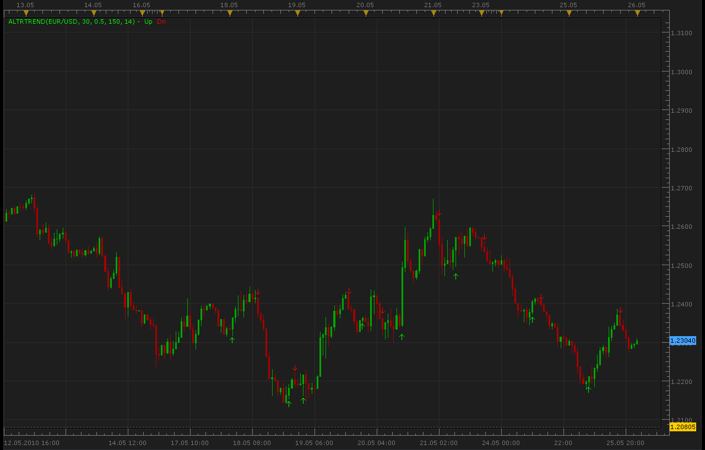

# Altr Trend indicator and signal

> Source: https://fxcodebase.com/code/viewtopic.php?f=17&t=1123  
> Forum: 17 · Topic 1123 · 13 post(s)

---

## Altr Trend indicator and signal

**Alexander.Gettinger** · Wed May 26, 2010 12:03 am

[viewtopic.php?f=27&t=1081&p=2054#p2054](https://fxcodebase.com/code/viewtopic.php?f=27&t=1081&p=2054#p2054)

 

Indicator:

Code: [Select all](https://fxcodebase.com/code/)
`function Init()
    indicator:name("Altr Trend indicator");
    indicator:description("");
    indicator:requiredSource(core.Bar);
    indicator:type(core.Indicator);

    indicator.parameters:addInteger("K", "K", "No description", 30);
    indicator.parameters:addDouble("KStop", "KStop", "No description", 0.5);
    indicator.parameters:addInteger("Kperiod", "Kperiod", "No description", 150);
    indicator.parameters:addInteger("PerADX", "PerADX", "No description", 14);

    indicator.parameters:addColor("UP_color", "Color of UP", "Color of UP", core.rgb(0, 255, 0));
    indicator.parameters:addColor("DN_color", "Color of DN", "Color of DN", core.rgb(255, 0, 0));
end

local K;
local KStop;
local Kperiod;
local PerADX;

local first;
local source = nil;
local ADX;
local buffUp=nil;
local buffDn=nil;
local uptrend=nil;
local old=nil;

function Prepare()
    K = instance.parameters.K;
    KStop = instance.parameters.KStop;
    Kperiod = instance.parameters.Kperiod;
    PerADX = instance.parameters.PerADX;
    source = instance.source;
    ADX=core.indicators:create("ADX", source, PerADX);
    first = ADX.DATA:first();
    local name = profile:id() .. "(" .. source:name() .. ", " .. K .. ", " .. KStop .. ", " .. Kperiod .. ", " .. PerADX .. ")";
    instance:name(name);
    buffUp = instance:createTextOutput ("Up", "Up", "Wingdings", 10, core.H_Center, core.V_Top, instance.parameters.UP_color, first);
    buffDn = instance:createTextOutput ("Dn", "Dn", "Wingdings", 10, core.H_Center, core.V_Bottom, instance.parameters.DN_color, first);
end

function Update(period, mode)
    if (period>first+Kperiod) then
     ADX:update(mode);
     local SSP=math.ceil(Kperiod/ADX.DATA[period-1]);
     local AvgRange=0.;
     for i=period-SSP,period,1 do
      AvgRange=AvgRange+math.abs(source.high[i]-source.low[i]);
     end
     local Range=AvgRange/(SSP+1);
     local SsMax=core.max(source.high,core.rangeTo(period,SSP-1));
     local SsMin=core.min(source.low,core.rangeTo(period,SSP-1));
     local smin=SsMin+(SsMax-SsMin)*K/100.;
     local smax=SsMax-(SsMax-SsMin)*K/100.;
     
     if source.close[period]<smin then
      uptrend=false;
     end
     if source.close[period]>smax then
      uptrend=true;
     end
     
     if uptrend~=old and uptrend==true then
      buffUp:set(period, source.low[period]-Range*KStop, "\225", "");
     end
     if uptrend~=old and uptrend==false then
      buffDn:set(period, source.high[period]+Range*KStop, "\226", "");
     end
     old=uptrend;

    end
end`

Signal:

Code: [Select all](https://fxcodebase.com/code/)
`function Init()
    strategy:name("Altr Trend signal");
    strategy:description("");

    strategy.parameters:addGroup("Parameters");
   
    strategy.parameters:addInteger("K", "K", "No description", 30);
    strategy.parameters:addDouble("KStop", "KStop", "No description", 0.5);
    strategy.parameters:addInteger("Kperiod", "Kperiod", "No description", 150);
    strategy.parameters:addInteger("PerADX", "PerADX", "No description", 14);

    strategy.parameters:addString("Period", "Timeframe", "", "m5");
    strategy.parameters:setFlag("Period", core.FLAG_PERIODS);

    strategy.parameters:addGroup("Signals");
    strategy.parameters:addBoolean("ShowAlert", "Show Alert", "", true);
    strategy.parameters:addBoolean("PlaySound", "Play Sound", "", false);
    strategy.parameters:addFile("SoundFile", "Sound File", "", "");
end

local SoundFile;
local gSourceBid = nil;
local gSourceAsk = nil;
local first;

local BidFinished = false;
local AskFinished = false;
local LastBidCandle = nil;

local ADX;

function Prepare()
    ShowAlert = instance.parameters.ShowAlert;
    if instance.parameters.PlaySound then
        SoundFile = instance.parameters.SoundFile;
    else
        SoundFile = nil;
    end
   
    assert(not(PlaySound) or (PlaySound and SoundFile ~= ""), "Sound file must be specified");
    assert(instance.parameters.Period ~= "t1", "Signal cannot be applied on ticks");

    ExtSetupSignal("Altr Trend signal:", ShowAlert);

    gSourceBid = core.host:execute("getHistory", 1, instance.bid:instrument(), instance.parameters.Period, 0, 0, true);
    gSourceAsk = core.host:execute("getHistory", 2, instance.bid:instrument(), instance.parameters.Period, 0, 0, false);

    ADX = core.indicators:create("ADX", gSourceBid, instance.parameters.PerADX);

    first = ADX.DATA:first() + instance.parameters.Kperiod;

    local name = profile:id() .. "(" .. instance.bid:instrument() .. "(" .. instance.parameters.Period  .. ")" .. instance.parameters.K .. ")" .. instance.parameters.KStop .. ")" .. instance.parameters.Kperiod .. ")" .. instance.parameters.PerADX .. ")";
    instance:name(name);
end

local LastDirection=nil;

-- when tick source is updated
function Update()
    if not(BidFinished) or not(AskFinished) then
        return ;
    end

    local period;

    -- update moving average
    ADX:update(core.UpdateLast);

    -- calculate enter logic
    if LastBidCandle == nil or LastBidCandle ~= gSourceBid:serial(gSourceBid:size() - 1) then
        LastBidCandle = gSourceBid:serial(gSourceBid:size() - 1);

        period = gSourceBid:size() - 1;
        if period > first then
         local SSP=math.ceil(instance.parameters.Kperiod/ADX.DATA[period-1]);
         local AvgRange=0.;
         for i=period-SSP,period,1 do
          AvgRange=AvgRange+math.abs(gSourceBid.high[i]-gSourceBid.low[i]);
         end
         local Range=AvgRange/(SSP+1);
         local SsMax=core.max(gSourceBid.high,core.rangeTo(period,SSP-1));
         local SsMin=core.min(gSourceBid.low,core.rangeTo(period,SSP-1));
         local smin=SsMin+(SsMax-SsMin)*instance.parameters.K/100.;
         local smax=SsMax-(SsMax-SsMin)*instance.parameters.K/100.;
         
         if gSourceBid.close[period]<smin and LastDirection~=-1 then
          ExtSignal(gSourceBid, period, "Sell", SoundFile);
          LastDirection=-1;
         end
         if gSourceBid.close[period]>smax and LastDirection~=1 then
          ExtSignal(gSourceAsk, period, "Buy", SoundFile);
          LastDirection=1;
         end
       
        end
    end
end

function AsyncOperationFinished(cookie)
    if cookie == 1 then
        BidFinished = true;
    elseif cookie == 2 then
        AskFinished = true;
    end
end

local gSignalBase = "";     -- the base part of the signal message
local gShowAlert = false;   -- the flag indicating whether the text alert must be shown

-- ---------------------------------------------------------
-- Sets the base message for the signal
-- @param base      The base message of the signals
-- ---------------------------------------------------------
function ExtSetupSignal(base, showAlert)
    gSignalBase = base;
    gShowAlert = showAlert;
    return ;
end

-- ---------------------------------------------------------
-- Signals the message
-- @param message   The rest of the message to be added to the signal
-- @param period    The number of the period
-- @param sound     The sound or nil to silent signal
-- ---------------------------------------------------------
function ExtSignal(source, period, message, soundFile)
    if source:isBar() then
        source = source.close;
    end
    if gShowAlert then
        terminal:alertMessage(source:instrument(), source[period], gSignalBase .. message, source:date(period));
    end
    if soundFile ~= nil then
        terminal:alertSound(soundFile, false);
    end
end`

 [AltrTrend.lua](files/2145/AltrTrend.lua)

 [AltrTrend_Signal.lua](files/2145/AltrTrend_Signal.lua)

 

 [AltrTrend Overlay.lua](files/2145/AltrTrend%20Overlay.lua)

Altr Trend indicator based strategy.
[viewtopic.php?f=31&t=66618](https://fxcodebase.com/code/viewtopic.php?f=31&t=66618)

---

## Re: Altr Trend indicator and signal

**Blackcat2** · Thu Jun 03, 2010 12:56 am

This is a useful indicator but I found that it sometime produce false signals..

Here's the steps to reproduce:
- Install indicators, use default values
- Once an arrow occurs, switch to different time frame.
- If the arrow stays, then the signal is true, if the arrow disappears that means the the signal was false.
- This is especially true when back testing after on it for some time..

Is there a way to fix this?

Thanks..
BC

---

## Re: Altr Trend indicator and signal

**Nikolay.Gekht** · Thu Jun 03, 2010 8:24 am

The same problem in the logic, as I reported for the BB_Stop signal.

---

## Re: Altr Trend indicator and signal

**craige** · Thu Dec 30, 2010 2:03 pm

Hey My friend

could you tell me how to configure this indicator's parameters?

thank you

best regards

---

## Re: Altr Trend indicator and signal

**RJH501** · Sun Jul 31, 2011 10:32 pm

Hello Nikolay,

Have you turned the signal into a strategy? If not would you please at your convenience create a strategy for this signal.

It will be much appreciated.

Regards,

Richard

---

## Re: Altr Trend indicator and signal

**RJH501** · Tue Aug 09, 2011 4:34 pm

Hello Nikolay,

I had the ALTR Sirnal open a LONG trade today. Is that possible?

I will continue to monitor.

RJH

---

## Re: Altr Trend indicator and signal

**virgilio** · Tue Sep 06, 2011 7:29 pm

Hello dear, is it possible to have a Multi Time Frame indicator (perhaps up to 5 different time frames) for this indicator? Thanks.

---

## Re: Altr Trend indicator and signal

**sunshine** · Wed Sep 07, 2011 12:26 am

In the next release of the platform you can choose the time frame for any indicator, right in the indicator properties, on the source tab. Please wait a bit. The beta version will be published on this site soon. Watch for updates.

---

## Re: Altr Trend indicator and signal

**easytrading** · Tue Jul 05, 2016 5:27 pm

hello Apprentice,

could we have overlay for this indicator please? thanks a lot

---

## Re: Altr Trend indicator and signal

**Apprentice** · Wed Jul 06, 2016 2:57 am

AltrTrend Overlay.lua added.

---

## Re: Altr Trend indicator and signal

**Apprentice** · Sun Sep 02, 2018 5:42 am

The indicator was revised and updated.

---

## Re: Altr Trend indicator and signal

**Reymondpolanco** · Sun Sep 02, 2018 12:10 pm

Can you make this like an strategy too.

With this parameters:

when a buy signal open a buy trade and close all sell trades
when a sell signal open a sell trade and close all buy trades

---

## Re: Altr Trend indicator and signal

**Apprentice** · Sun Sep 02, 2018 3:26 pm

Altr Trend indicator based strategy.
[viewtopic.php?f=31&t=66618](https://fxcodebase.com/code/viewtopic.php?f=31&t=66618)
