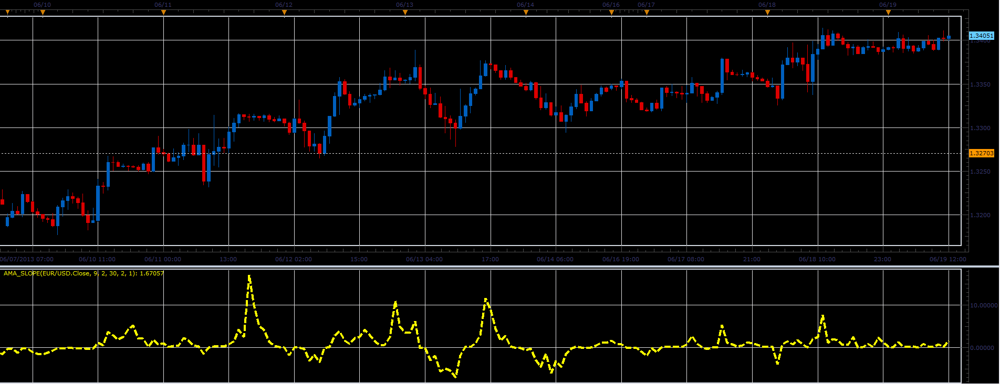

# AMA slope oscillator

> Source: https://fxcodebase.com/code/viewtopic.php?f=17&t=41449  
> Forum: 17 · Topic 41449 · 2 post(s)

---

## AMA slope oscillator

**Alexander.Gettinger** · Wed Jun 19, 2013 2:37 pm

This indicator is a ported MQL5 indicator from [http://www.mql5.com/ru/code/1740](http://www.mql5.com/ru/code/1740) (in Russian).

Formulas:
AMA_Slope[i] = AMA[i]-AMA[i-1], where
AMA[i] = AMA[i-1]+SSC[i]^G*(Price[i]-AMA[i-1]),
SSC[i] = ERSC[i]+slowSC,
ERSC[i] = ER[i]*(fastSC-slowSC),
ER[i] = signal[i]/noise[i],
signal[i] = Abs(Price[i]-Price[i-AMA_Period]),
noise[i] = sum(Abs(Price[i]-Price[i-1])),
fastSC = 2/(Fast_Period+1),
slowSC = 2/(Slow_Period+1).

 

Download:

 [AMA_Slope.lua](files/67697/AMA_Slope.lua)

The indicator was revised and updated

---

## Re: AMA slope oscillator

**Apprentice** · Sat May 27, 2017 12:10 pm

Indicator was revised and updated.
