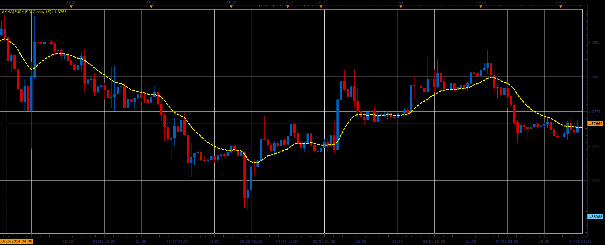

# AMMA indicator

> Source: https://fxcodebase.com/code/viewtopic.php?f=17&t=60494  
> Forum: 17 · Topic 60494 · 3 post(s)

---

## AMMA indicator

**Alexander.Gettinger** · Thu Apr 03, 2014 12:42 pm

Formula:
AMMA[i] = (AMMA[i-1]*(Period-2)+Price[i]+Price[i-1])/Period.

 

Download:

 [AMMA.lua](files/93361/AMMA.lua)

The indicator was revised and updated

---

## Re: AMMA indicator

**Alexander.Gettinger** · Thu Apr 03, 2014 12:47 pm

MQL4 version of AMMA indicator: [viewtopic.php?f=38&t=60495](https://fxcodebase.com/code/viewtopic.php?f=38&t=60495).

---

## Re: AMMA indicator

**Apprentice** · Fri Jun 16, 2017 6:52 am

The indicator was revised and updated.
