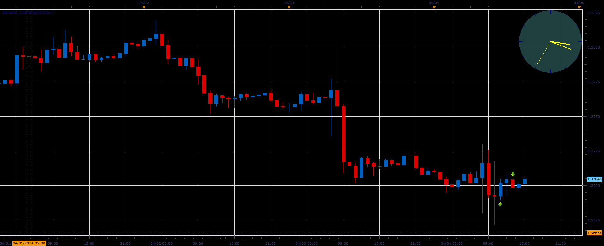

# Analog clock

> Source: https://fxcodebase.com/code/viewtopic.php?f=17&t=60501  
> Forum: 17 · Topic 60501 · 2 post(s)

---

## Analog clock

**Alexander.Gettinger** · Fri Apr 04, 2014 2:19 pm

The indicator shows the current time as analog clock.

 

Download:

 [Analog_Clock.lua](files/93383/Analog_Clock.lua)

The indicator was revised and updated

---

## Re: Analog clock

**Apprentice** · Fri Jun 16, 2017 6:48 am

The indicator was revised and updated.
