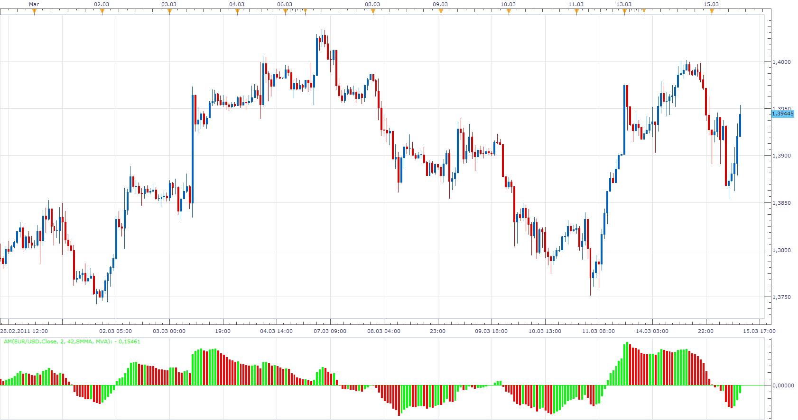

# Anchored Momentum

> Source: https://fxcodebase.com/code/viewtopic.php?f=17&t=3648  
> Forum: 17 · Topic 3648 · 6 post(s)

---

## Anchored Momentum

**Apprentice** · Tue Mar 15, 2011 10:00 am

The formula for the calculation of the oscillator.
If you choose, you can replace the first moving average with closing price.
Anchored Momentum [period] = 100*((MA_One /MA_Two)-1);

 [AM.lua](files/8801/AM.lua)

The indicator was revised and updated

---

## Re: Anchored Momentum

**jeisenm** · Tue Mar 15, 2011 11:48 am

how do you use this indicator? i see lots of red bars where the price is rising. does this indicate strength of trend only without regard to trend?

---

## Re: Anchored Momentum

**cyanidez** · Wed Mar 16, 2011 4:29 am

Hi Apprentice,

Very interesting indicator, thanks for the work!

Do you have any recommendations how to effectively use this? I can see that something like "if the bars are green and changes to red, sell" may work sometimes, but I assume it's definitely not as clear-cut as that.

Any thoughts?

Thanks

---

## Re: Anchored Momentum

**Apprentice** · Wed Mar 16, 2011 4:53 am

In this case, I'm primarily a programmer.

From my observation, it behaves like this.
A positive value suggests the existence of up trend.
A negative value suggests the existence of a down trend.
Zero Line Crossover generates signals.

Change in the color suggests a weakening trend, Possible change in trend.

---

## Re: Anchored Momentum

**Alexander.Gettinger** · Wed Nov 26, 2014 3:26 pm

MQL4 version of Anchored Momentum oscillator: [viewtopic.php?f=38&t=61551](https://fxcodebase.com/code/viewtopic.php?f=38&t=61551).

---

## Re: Anchored Momentum

**Apprentice** · Mon Jun 26, 2017 10:18 am

The indicator was revised and updated.
