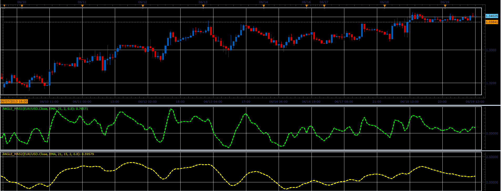

# Angle MA oscillators

> Source: https://fxcodebase.com/code/viewtopic.php?f=17&t=41446  
> Forum: 17 · Topic 41446 · 2 post(s)

---

## Angle MA oscillators

**Alexander.Gettinger** · Wed Jun 19, 2013 2:25 pm

This indicators is a ported MQL5 indicators from [http://www.mql5.com/en/code/1721](http://www.mql5.com/en/code/1721)

Formulas:
AngleMA1[i] = ArcTan(tang[i])*VisualFactor, where
ArcTan - arc tangent,
tang[i] = incr[i]/Coeff,
incr[i] = MA(i)-MA(i-Coeff).

AngleMA2 is smoothed AngleMA1.

 

Download:

 [Angle_MAs1.lua](files/67694/Angle_MAs1.lua)

 [Angle_MAs2.lua](files/67694/Angle_MAs2.lua)

For this indicator must be installed Averages indicator ([viewtopic.php?f=17&t=2430](https://fxcodebase.com/code/viewtopic.php?f=17&t=2430)).

The indicator was revised and updated

---

## Re: Angle MA oscillators

**Apprentice** · Sat May 27, 2017 12:07 pm

Indicator was revised and updated.
