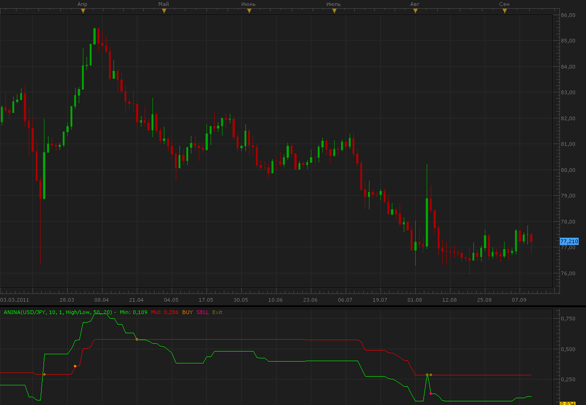

# ANina indicator

> Source: https://fxcodebase.com/code/viewtopic.php?f=17&t=6493  
> Forum: 17 · Topic 6493 · 4 post(s)

---

## ANina indicator

**Alexander.Gettinger** · Mon Sep 12, 2011 11:32 am

This indicator is a ported MQL4 indicator from [http://www.expertadvisordownloads.com/tag/anina-mq4/](http://www.expertadvisordownloads.com/tag/anina-mq4/)

 

Download:

 [aNina.lua](files/14833/aNina.lua)

The indicator was revised and updated

---

## Re: ANina indicator

**cash4u** · Wed Jun 11, 2014 6:39 am

HI,
MAY I REQUEST A STRATEGY BASED ON THIS INDICATOR AND STOCHASTIC INDICATOR

**STRATEGY NAME :** **ANINA - STOCHASTIC STRATEGY**

**INDICATOR USED HERE ARE:**
**1. ANINA INDICATOR WITH DEFAULT PARAMETERS**

BUY LEVEL: 0.5
SELL LEVEL:0.5
**2.STOCHASTIC INDICATOR WITH DEFAULT PARAMETERS**

OB LEVEL:80
OS LEVEL:20

**BUY:**

1.MIN LINE>MID LINE IN ANINA INDICATOR
2.MIN LINE > BUY LEVEL IN ANINA INDICATOR
3.STOCHASTIC D LINE CROSS OVER OS LEVEL

**SELL:**

1.MIN LINE < MID LINE IN ANINA INDICATOR
2.MIN LINE < SELL LEVEL IN ANINA INDICATOR
3.STOCHASTIC D LINE CROSS UNDER OB LEVEL

**EXIT BUY:**

1. MIN LINE CROSS UNDER MID LINE IN ANINA INDICATOR OR
2.STOCHASTIC K LINE CROSS UNDER D LINE AND D LINE > OB LEVEL

**EXIT SELL:**

1. MIN LINE CROSS OVER MID LINE IN ANINA INDICATOR OR
2. STOCHASTIC K LINE CROSS OVER D LINE AND D LINE < OS LEVEL

---

## Re: ANina indicator

**Apprentice** · Fri Jun 13, 2014 8:07 am

Requested can be found here.
[viewtopic.php?f=31&t=60818](https://fxcodebase.com/code/viewtopic.php?f=31&t=60818)

---

## Re: ANina indicator

**Apprentice** · Sat Jul 01, 2017 4:45 am

The indicator was revised and updated.
