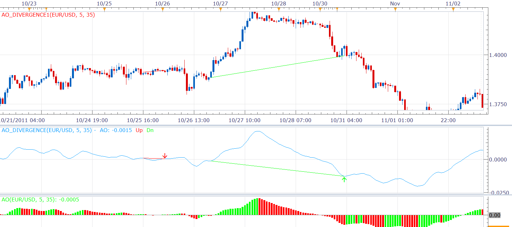

# AO divergence indicator

> Source: https://fxcodebase.com/code/viewtopic.php?f=17&t=8974  
> Forum: 17 · Topic 8974 · 2 post(s)

---

## AO divergence indicator

**Alexander.Gettinger** · Mon Dec 05, 2011 5:56 am

This indicator is similar to MACD divergence indicator ([viewtopic.php?f=17&t=869&p=7966](https://fxcodebase.com/code/viewtopic.php?f=17&t=869&p=7966)).

 

Download:
1. AO divergence indicator. Shows AO and AO divergence lines.

 [AO_Divergence.lua](files/19642/AO_Divergence.lua)

2) AO divergence Indicator. Shows trend lines on the prices. The AO_Divergence.lua must be also installed.

 [AO_Divergence1.lua](files/19642/AO_Divergence1.lua)

The indicator was revised and updated

---

## Re: AO divergence indicator

**Apprentice** · Sun Mar 19, 2017 11:05 am

Indicator was revised and updated.
