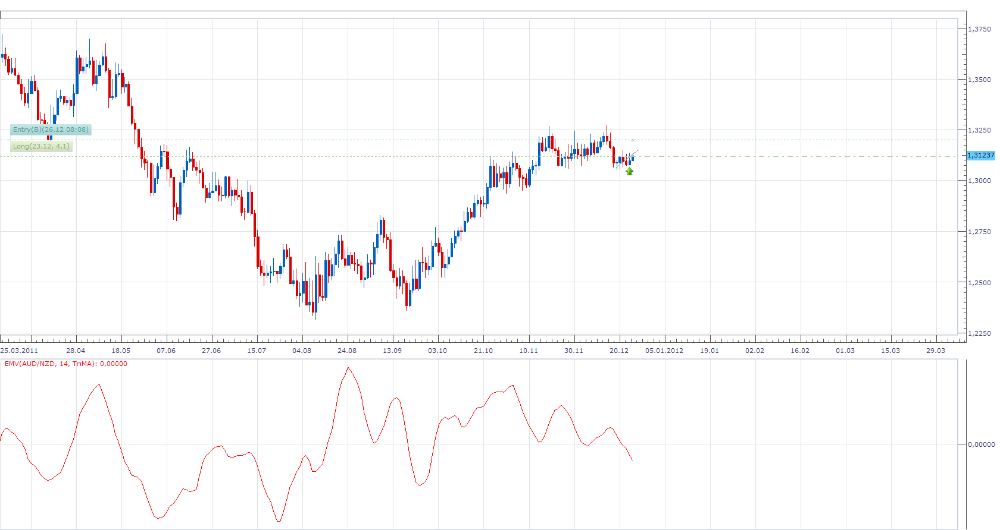

# Arm's Ease of Movement Value

> Source: https://fxcodebase.com/code/viewtopic.php?f=17&t=10454  
> Forum: 17 · Topic 10454 · 3 post(s)

---

## Arm's Ease of Movement Value

**Apprentice** · Mon Dec 26, 2011 8:30 am

The Arms' Ease of Movement Value (EMV) is a momentum indicator developed by Richard W. Arms, Jr. The indicator takes into account both volume and price changes to quantify the ease (or difficulty) of price movements.

EMV = (((CurrHigh + CurrLow)/2) - ((PrevHigh + PrevLow)/2)) / ((CurrVolume)/( CurrHigh - CurrLow)) ;

On Raw Data we apply Smoothing .

 [emv.lua](files/21691/emv.lua)

Please install Averages Indicator.
[viewtopic.php?f=17&t=2430](https://fxcodebase.com/code/viewtopic.php?f=17&t=2430)

The indicator was revised and updated

---

## Re: Arm's Ease of Movement Value

**Alexander.Gettinger** · Thu Apr 03, 2014 12:30 pm

MQL4 version of Arm's Ease of Movement Value: [viewtopic.php?f=38&t=60492](https://fxcodebase.com/code/viewtopic.php?f=38&t=60492).

---

## Re: Arm's Ease of Movement Value

**Apprentice** · Fri Jun 16, 2017 7:20 am

The indicator was revised and updated.
