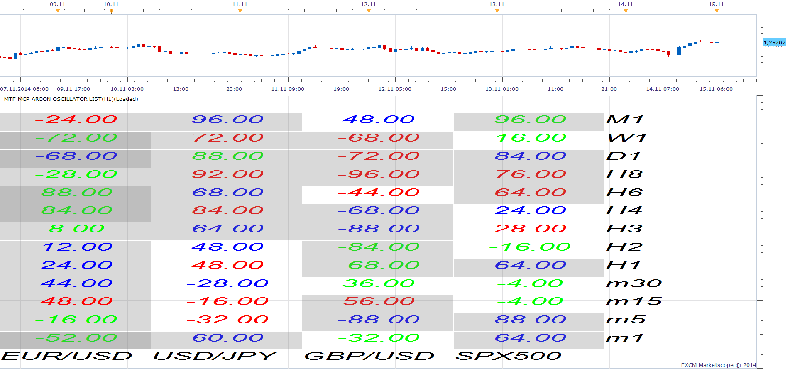

# Aroon Oscillator

> Source: https://fxcodebase.com/code/viewtopic.php?f=17&t=671  
> Forum: 17 · Topic 671 · 17 post(s)

---

## Aroon Oscillator

**Apprentice** · Fri Apr 16, 2010 11:46 am

*Aroon Oscillator*

Aroon Oscillator is calculated by Subtracting the Aroon Down from Aroon Up indicator component.

Aroon Oscillator, similar to the Aroon indicator is used to assist in determining the direction of the market, uptrending, downtrending, the absence of a trend.

Aroon Oscillator interpretation.
Strong UpTrend AROON >50
Consolidation AROON - 0
Strong Down Trend AROON < -50

Aroon Oscillator has similarities with Wilder's ADX line.

 [AROON Oscillator.lua](files/1211/AROON%20Oscillator.lua)

 

 [MTF MCP Aroon Oscillator List.lua](files/1211/MTF%20MCP%20Aroon%20Oscillator%20List.lua)

---

## Re: Aroon Oscillator

**wizardpro** · Mon Oct 25, 2010 5:10 am

Do you have arron osciallaro such as cross over buy or sell sigal ?

---

## Re: Aroon Oscillator

**Apprentice** · Mon Oct 25, 2010 7:34 am

No, but I can write it.

---

## Re: Aroon Oscillator

**wizardpro** · Mon Oct 25, 2010 12:20 pm

Great shall be looking forward .
I am wondering will be as good as Stoastic Chastic ,currently only provide signal sell and buy but not auto.

---

## Re: Aroon Oscillator

**wizardpro** · Wed Oct 27, 2010 1:30 pm

For email notification such as
1) Content to be send to emails content body instead of emails header as mobile phone such a Windows Mobile or Iphone let it be text or html is uanble to review the full email headers to seen the trade informations.
2) Auto Trade such as buying or selling with stop loss,take profit and trailing
This is other good indicator too

---

## Re: Aroon Oscillator

**Alexander.Gettinger** · Mon Nov 22, 2010 4:27 am

Strategy based on this oscillator you may find here: [viewtopic.php?f=31&t=2760](https://fxcodebase.com/code/viewtopic.php?f=31&t=2760)

---

## Re: Aroon Oscillator

**difrach** · Fri Dec 10, 2010 1:53 pm

Is it possible to put an alarm on this oscillator for exemple when it reach level +90 and -90?
Thanks

---

## Re: Aroon Oscillator

**difrach** · Mon Dec 20, 2010 12:02 pm

Is it possible or not to program a sound alarm if this indicator touch +90 or -90 level?
Thanks

---

## Re: Aroon Oscillator

**Apprentice** · Mon Dec 20, 2010 3:13 pm

Requested can be found here.
[viewtopic.php?f=29&t=2989](https://fxcodebase.com/code/viewtopic.php?f=29&t=2989)

---

## Re: Aroon Oscillator

**Infinity Trader** · Fri Nov 14, 2014 9:55 pm

Wondering if there is a Multi Time Frame (MTF)AROON indie out there... or if one could be made.

---

## Re: Aroon Oscillator

**Apprentice** · Sat Nov 15, 2014 6:05 am

Aroon Oscillator Update.

---

## Re: Aroon Oscillator

**Apprentice** · Sat Nov 15, 2014 6:53 am

> **Infinity Trader wrote:**
> Wondering if there is a Multi Time Frame (MTF)AROON indie out there... or if one could be made.

Something like the above, newly added MTF MCP Aroon Oscillator List.
If not can you refer to the desired presentation mode.
Is it for Aroon Indicator, or Aroon Oscillator.

---

## Re: Aroon Oscillator

**Infinity Trader** · Sat Nov 15, 2014 10:14 am

Hey Apprentice... Thanks for reply... I would like to have it as AROON INDICATOR... Say like have it adjustable to have it show for example the 4 hour AROON INDICATOR CROSS on a 15 min chart.... if possible!!! Thanks again...

---

## Re: Aroon Oscillator

**Apprentice** · Sat Nov 15, 2014 10:34 am

I'm still not sure which presentation is required.
Can you describe it, or better yet, provide a screen shot.
Is it an MTF or MCP, how cross will be presented.

---

## Re: Aroon Oscillator

**Infinity Trader** · Sat Nov 15, 2014 4:33 pm

Using just the regualr AROON INDICATOR with the line cross... The first pic is the 15min Aroon indie...

I would like to be able to have a Multi Time Frame AROON INDICATOR (not oscillator) Have the 4HR AROON INDICATOR (2nd pic) for example show on a 15 min chart...

---

## Re: Aroon Oscillator

**Apprentice** · Wed Nov 19, 2014 4:37 am

Try this Version.
[viewtopic.php?f=17&t=61481](https://fxcodebase.com/code/viewtopic.php?f=17&t=61481)
And in the future be more eloquent when are you going to defining the task.

---

## Re: Aroon Oscillator

**Apprentice** · Mon Apr 23, 2018 8:09 am

The indicator was revised and updated.
