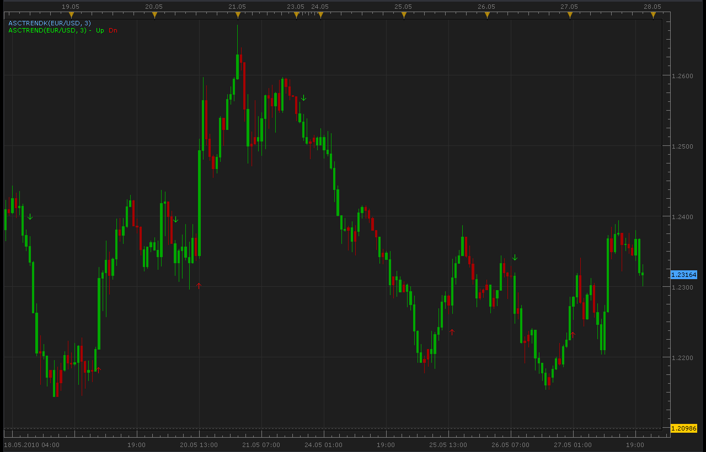

# ASCTrend indicator (Update)

> Source: https://fxcodebase.com/code/viewtopic.php?f=17&t=1169  
> Forum: 17 · Topic 1169 · 7 post(s)

---

## ASCTrend indicator (Update)

**Alexander.Gettinger** · Thu May 27, 2010 9:02 pm

[viewtopic.php?f=27&t=1079&p=2052#p2052](https://fxcodebase.com/code/viewtopic.php?f=27&t=1079&p=2052#p2052)

 

 [ASCTrend.lua](files/2239/ASCTrend.lua)

 [ASCTrendK.lua](files/2239/ASCTrendK.lua)

The indicator was revised and updated

---

## Re: ASCTrend indicator (Update)

**bonnevie** · Mon Oct 11, 2010 8:50 pm

Hi Alexander,

Is it possible to have a signal function for these indicators?

Thanks.

bonnevie

---

## Re: ASCTrend indicator (Update)

**Apprentice** · Mon Oct 11, 2010 11:40 pm

Added to development cue.

---

## Re: ASCTrend indicator (Update)

**Alexander.Gettinger** · Tue Nov 09, 2010 2:22 am

Indicator updated.
Added dot mode.

Code: [Select all](https://fxcodebase.com/code/)
`function Init()
    indicator:name("ASCTrend indicator");
    indicator:description("");
    indicator:requiredSource(core.Bar);
    indicator:type(core.Indicator);
   
    indicator.parameters:addInteger("RISK", "RISK", "No description", 3);
    indicator.parameters:addBoolean("DotMode", "DotMode", "No description", false);

    indicator.parameters:addColor("UP_color", "Color of UP", "Color of UP", core.rgb(0, 255, 0));
    indicator.parameters:addColor("DN_color", "Color of DN", "Color of DN", core.rgb(255, 0, 0));
    indicator.parameters:addColor("DotClr", "Dot color", "Dot color", core.rgb(0, 0, 255));
end

local first;
local RISK;
local source = nil;
local buffUp=nil;
local buffDn=nil;
local Table_value2;
local DotMode;
local buffDot=nil;

function Prepare()
    source = instance.source;
    RISK=instance.parameters.RISK;
    DotMode=instance.parameters.DotMode;
    first = source:first();
    Table_value2=instance:addInternalStream(0, 0);
    local name = profile:id() .. "(" .. source:name() .. ", " .. RISK .. ")";
    instance:name(name);
    buffUp = instance:createTextOutput ("Up", "Up", "Wingdings", 10, core.H_Center, core.V_Top, instance.parameters.UP_color, first);
    buffDn = instance:createTextOutput ("Dn", "Dn", "Wingdings", 10, core.H_Center, core.V_Bottom, instance.parameters.DN_color, first);
    buffDot = instance:addStream("buffDot", core.Dot, name .. ".ASCTrend", "ASCTrend", instance.parameters.DotClr, first);
end

function Update(period, mode)
    local value10=3*2*RISK;
    if (period>first+2+value10) then
     local x1=67+RISK;
     local x2=33-RISK;
     local value11=value10;
     local Range=0.;
     local AvgRange=0.;
     for i=period-9,period,1 do
      AvgRange=AvgRange+math.abs(source.high[i]-source.low[i]);
     end
     Range=AvgRange/10.;
     local TrueCount=0;
     local Counter=period;
     while Counter>period-9 and TrueCount<1 do
      if math.abs(source.open[Counter]-source.close[Counter-1])>=Range*2. then
       TrueCount=TrueCount+1;
      end
      Counter=Counter-1;
     end
     local MRO1;
     if TrueCount>=1 then
      MRO1=Counter;
     else
      MRO1=-1;
     end
     Counter=period;
     TrueCount=0;
     while Counter>period-6 and TrueCount<1 do
      if math.abs(source.close[Counter-3]-source.close[Counter])>Range*4.6 then
       TrueCount=TrueCount+1;
      end
      Counter=Counter-1;
     end
     local MRO2;
     if TrueCount>=1 then
      MRO2=Counter;
     else
      MRO2=-1;
     end
     if MRO1>-1 then
      value11=3;
     else
      value11=value10;
     end
     if MRO2>-1 then
      value11=4;
     else
      value11=value10;
     end
     local WPR=-(core.max(source.high,core.rangeTo(period,value11))-source.close[period])*100./(core.max(source.high,core.rangeTo(period,value11))-core.min(source.low,core.rangeTo(period,value11)));
     local value2=100-math.abs(WPR);
     Table_value2[period]=value2;
     value3=0;
     local i1;
     if value2<x2 then
      i1=1;
      while Table_value2[period-i1]>=x2 and Table_value2[period-i1]<=x1 do
       i1=i1+1;
      end
      if Table_value2[period-i1]>x1 then
       value3=source.high[period]+Range*0.5;
       if DotMode==false then
        buffUp:set(period, value3, "\226", "");
       else
        buffDot[period]=source.high[period];
       end
      end
     end
     if value2>x1 then
      i1=1;
      while Table_value2[period-i1]>=x2 and Table_value2[period-i1]<=x1 do
       i1=i1+1;
      end
      if Table_value2[period-i1]<x2 then
       value3=source.low[period]-Range*0.5;
       if DotMode==false then
        buffDn:set(period, value3, "\225", "");
       else
        buffDot[period]=source.low[period];
       end
      end
     end

    end
end`

---

## Re: ASCTrend indicator (Update)

**Alexander.Gettinger** · Tue Nov 09, 2010 2:26 am

Strategy on this indicator: [viewtopic.php?f=31&t=2633](https://fxcodebase.com/code/viewtopic.php?f=31&t=2633)

---

## Re: ASCTrend indicator (Update)

**adloule** · Sun Aug 09, 2015 5:35 am

hi,
thank you for this indi, can you please develop
"ASCTrend histogram 2TF" to use it with "Genesis System Heat Map"

thank you

---

## Re: ASCTrend indicator (Update)

**Gentle** · Thu Mar 16, 2017 12:33 pm

OK, if someone feels a strong desire to trade the Genesis system, here it is the indi ASCTrend-2TF. For this indi to work, you should install first ASCTrend2_histo.
