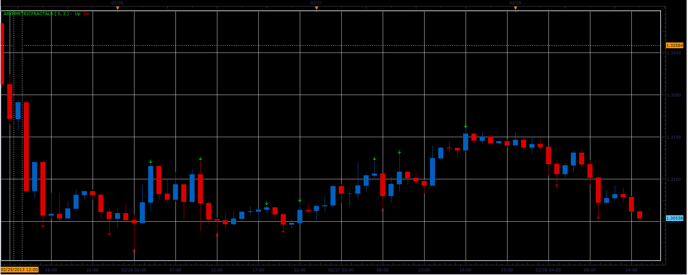
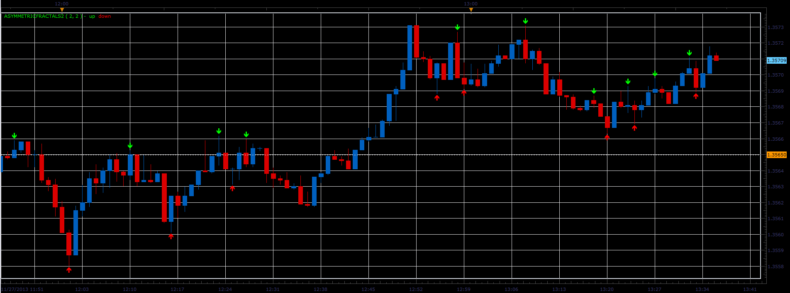

# Asymmetric fractals

> Source: https://fxcodebase.com/code/viewtopic.php?f=17&t=32544  
> Forum: 17 · Topic 32544 · 7 post(s)

---

## Asymmetric fractals

**Alexander.Gettinger** · Thu Feb 28, 2013 5:13 pm

Indicator similar to Advanced Fractal ([viewtopic.php?f=17&t=724](https://fxcodebase.com/code/viewtopic.php?f=17&t=724)), but number of bars before and after the fractal specified separately.

 

Download:

 [AsymmetricFractals.lua](files/55438/AsymmetricFractals.lua)

The indicator was revised and updated

---

## Re: Asymmetric fractals

**pigips** · Wed Mar 20, 2013 12:47 pm

Ciao,
for me it is the best indicator! You can put an audible alarm signal or email or sms if the indicator is activated?
it's possible to leave the arrow even if the market goes to the contrary?

thanks
Gianni

---

## Re: Asymmetric fractals

**Apprentice** · Thu Mar 21, 2013 5:31 am

Your request is added to the development list.

---

## Re: Asymmetric fractals

**pigips** · Thu Mar 21, 2013 6:28 am

very kind
thank you

---

## Re: Asymmetric fractals

**Alexander.Gettinger** · Wed Nov 27, 2013 1:42 pm

Version of the Asymmetric fractals, which uses the indicator buffers and can be easily used in strategies.

 

Download:

 [AsymmetricFractals2.lua](files/91176/AsymmetricFractals2.lua)

---

## Re: Asymmetric fractals

**elsigis** · Fri Jun 26, 2015 5:44 pm

Please can you also add the option to show or hide the price of the fractal levels.
Thanks so much for this indicator.

---

## Re: Asymmetric fractals

**Apprentice** · Tue Jul 04, 2017 9:11 am

The indicator was revised and updated.
