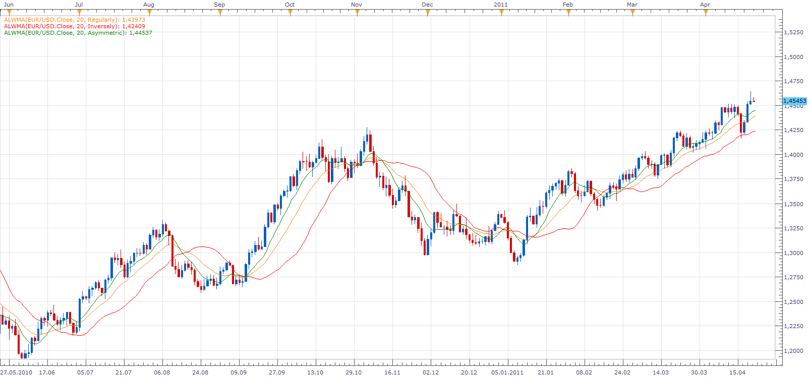

# Asymmetric Linear Weighted Moving Average

> Source: https://fxcodebase.com/code/viewtopic.php?f=17&t=4005  
> Forum: 17 · Topic 4005 · 4 post(s)

---

## Asymmetric Linear Weighted Moving Average

**Apprentice** · Sat Apr 23, 2011 9:32 am

This is not optimized in development version of indicator.

The indicator has three modes Regular, Inverse, Asymmetric.

Regular- Behaves as an ordinary LWMA.
Most of the weight is on the last period.

Inverse
Most of the weight is on the first period.

Asymmetric
Most of the weight is on Middle of observed period.
Beginning and end sections are less represented.

Inverse Asymmetric
Most of the weight is Beginning and end of observed period.
Middle section is less represented.

 [ALWMA.lua](files/9964/ALWMA.lua)

The indicator was revised and updated

---

## Re: Asymmetric Linear Weighted Moving Average

**Apprentice** · Sun Apr 24, 2011 3:32 pm

Inverse Asymmetric Added.

These strange indicator is examples, how boring moving averages can be flexible.

---

## Re: Asymmetric Linear Weighted Moving Average

**Alexander.Gettinger** · Tue Nov 25, 2014 11:07 am

MQL4 version of Asymmetric Linear Weighted Moving Average: [viewtopic.php?f=38&t=61536](https://fxcodebase.com/code/viewtopic.php?f=38&t=61536).

---

## Re: Asymmetric Linear Weighted Moving Average

**Apprentice** · Mon Jun 26, 2017 10:25 am

The indicator was revised and updated.
