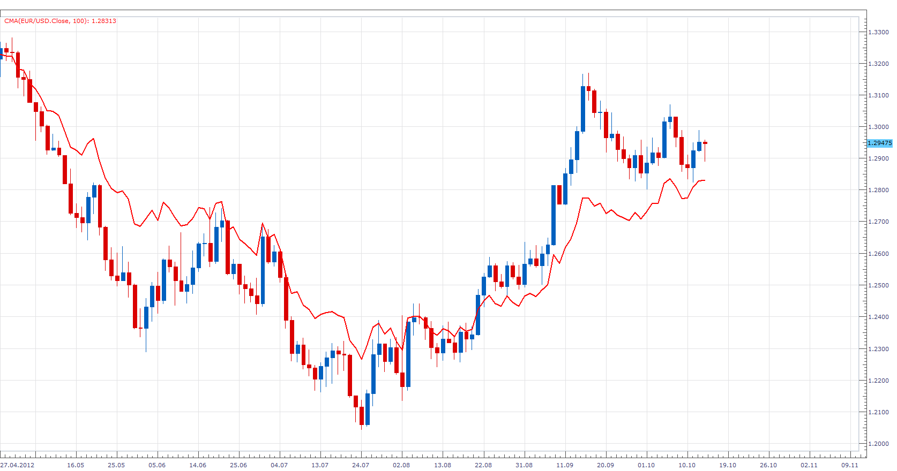

# Asymmetric Moving Average

> Source: https://fxcodebase.com/code/viewtopic.php?f=17&t=24459  
> Forum: 17 · Topic 24459 · 3 post(s)

---

## Asymmetric Moving Average

**Apprentice** · Mon Oct 15, 2012 2:42 am

Asymmetric Moving Average, in which, the last period has a weight of 50 percentage + one period.
For example, if we have a 10 periods Asymmetric moving average, the calculation would be.
[(17 + 18 + 19 + 18 + 17 )+( 17 + 17 + 17 + 17 + 17)] / 10 = 17.4

 [AMA.lua](files/42083/AMA.lua)

The indicator was revised and updated

---

## Re: Asymmetric Moving Average

**Alexander.Gettinger** · Thu Oct 23, 2014 10:19 am

MQL4 version of Asymmetric Moving Average: [viewtopic.php?f=38&t=61374&p=96714#p96714](https://fxcodebase.com/code/viewtopic.php?f=38&t=61374&p=96714#p96714).

---

## Re: Asymmetric Moving Average

**Apprentice** · Thu Jun 29, 2017 6:10 am

The indicator was revised and updated.
