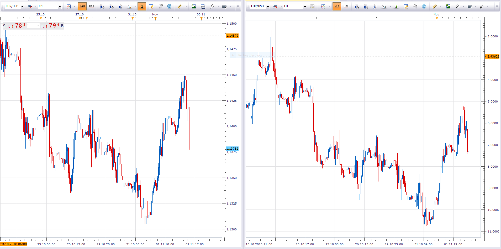

# ATR Adjusted Price Chart View

> Source: https://fxcodebase.com/code/viewtopic.php?f=17&t=66883  
> Forum: 17 · Topic 66883 · 1 post(s)

---

## ATR Adjusted Price Chart View

**Apprentice** · Fri Nov 02, 2018 1:36 pm

Open=Close[1];
Close=Open+(close -Open)/(ATR*Multiplier);
High=Open+(high -Open)/(ATR*Multiplier);
Low=Open+(low -Open)/(ATR*Multiplier);

Various alternative adjustments instead of ATR can be applied.
(Deviation, Moving averages, Channel percentage...)

 [ATR Adjusted Price Chart View.lua](files/121923/ATR%20Adjusted%20Price%20Chart%20View.lua)
