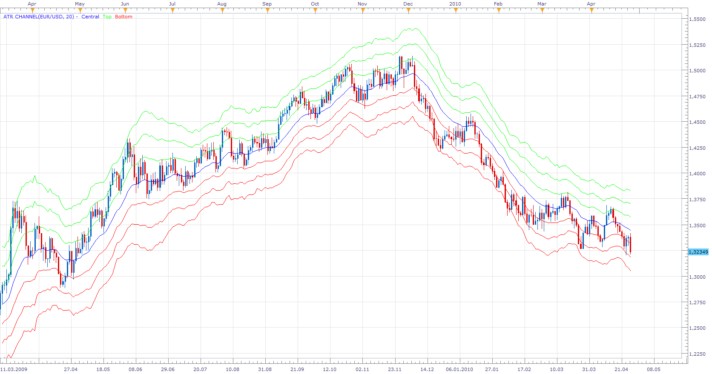
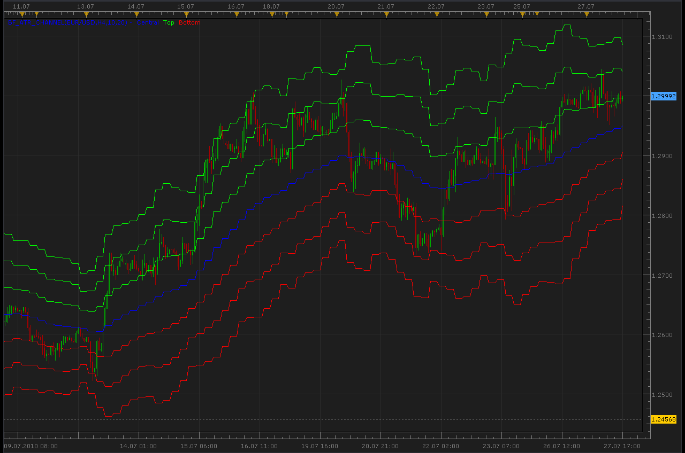
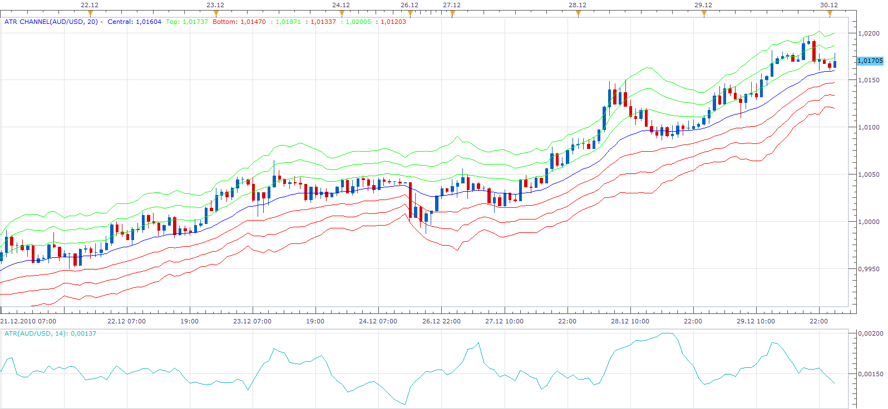

# ATR Channel

> Source: https://fxcodebase.com/code/viewtopic.php?f=17&t=858  
> Forum: 17 · Topic 858 · 16 post(s)

---

## ATR Channel

**Apprentice** · Tue Apr 27, 2010 11:50 am

*ATR Channel Custom*

On user request I made this version of the ATR Channel indicator.
Allows you to define the percentage of multiples, ATR-a period.

Quite volatile.

ATRC = Close +- Multiplier*ATR*Channel percentage

 [ATR Channel Custom.lua](files/1545/ATR%20Channel%20Custom.lua)

ATR Channels Indicator is also known as Keltner's channels is one of the most interesting “channel indicators” , which are based on ATR.

Keltner's channels, with a whole range of advanced features is available here.
[http://fxcodebase.com/code/viewtopic.php?f=17&t=280&start=0&hilit=Keltner#p449](https://fxcodebase.com/code/viewtopic.php?f=17&t=280&start=0&hilit=Keltner#p449)

MT4/MQ4 version.
[viewtopic.php?f=38&t=65681&p=117353#p117353](https://fxcodebase.com/code/viewtopic.php?f=38&t=65681&p=117353#p117353)

The indicator was revised and updated

---

## Re: ATR Channel

**Apprentice** · Tue Apr 27, 2010 11:53 am

*ATR Channel*

This version uses averaged closing price to get a smooth central line.

ATRC = MA of Close +- Multiplier*ATR

My interest in ATC was making the multi-channel version of the indicators.

 [ATR Channel.lua](files/1546/ATR%20Channel.lua)

I added a version that uses Averages indicator.
To enable you choice of moving average.

To use this version of the indicator,
You must install Averages Indivator
[viewtopic.php?f=17&t=2430&p=5705&hilit=averages#p5705](https://fxcodebase.com/code/viewtopic.php?f=17&t=2430&p=5705&hilit=averages#p5705)

---

## Re: ATR Channel

**Capie1** · Thu Jul 08, 2010 4:40 am

Hi

Is it possible to code the indicator to show other timeframe ATR Values,
say dayly on a 4 hr chart ?

Thank you

Regards

---

## Re: ATR Channel

**Apprentice** · Thu Jul 08, 2010 4:50 am

Added to development cue.

---

## Re: ATR Channel

**Capie1** · Thu Jul 08, 2010 5:16 am

Thank you, that will be great if you could amend it to the ATR Channel Custom please.
Also one more question/request please on ATR Channel Custom.

At the moment the ATR Custom channel indicator appears to show values based on the current bars close and changes throughout the formation of the current bar(dynamic)? If this is the case could you please change it to plotting the previous bars values in the current bars time window, thus showing a ATR Channel based on the for example 100 previous candles in the current timeframe. This would supposedly cause the channel to be static until current bar ( or other selected timeframe expires such as daily) and would more accurately show breakouts.

Thank you in advance.

Regards

---

## Re: ATR Channel

**Alexander.Gettinger** · Tue Jul 27, 2010 5:05 pm

ATR Channel for bigger timeframe:

 

Code: [Select all](https://fxcodebase.com/code/)
`-- todo: support week offset

function Init()
    indicator:name("Bigger timeframe ATR Channel");
    indicator:description("");
    indicator:requiredSource(core.Bar);
    indicator:type(core.Indicator);

    indicator.parameters:addGroup("Calculation");
    indicator.parameters:addString("BS", "Time frame to calculate ATR Channel", "", "D1");
    indicator.parameters:setFlag("BS", core.FLAG_PERIODS);
    indicator.parameters:addInteger("P1", "ATR Period", "ATR Period", 10);
    indicator.parameters:addInteger("P3", "EMA Period", "EMA Period", 20);
    indicator.parameters:addString("MORE", "Show additional lines", "Yes", "Yes");
    indicator.parameters:addStringAlternative("MORE", "Yes", "Show additional lines", "Yes");
    indicator.parameters:addStringAlternative("MORE", "No", "Show additional lines", "No");

    indicator.parameters:addGroup("Display");
    indicator.parameters:addColor("Central_color", "Central", "Color of Central", core.rgb(0, 0, 255));
    indicator.parameters:addColor("Top_color", "Top", "Color of Top", core.rgb(0, 255, 0));
    indicator.parameters:addColor("Bottom_color", "Bottom", "Color of Bottom", core.rgb(255, 0, 0));
end

local source;                   -- the source
local bf_data = nil;          -- the high/low data
local P1;
local P3;
local MORE;
local BS;
local bf_length;                 -- length of the bigger frame in seconds
local dates;                    -- candle dates
local host;
local S1,S2,S3,S4,S5,S6,S7;
local ATRch;
local day_offset;
local week_offset;
local extent;

function Prepare()
    source = instance.source;
    host = core.host;

    day_offset = host:execute("getTradingDayOffset");
    week_offset = host:execute("getTradingWeekOffset");

    BS = instance.parameters.BS;
    P1 = instance.parameters.P1;
    P3 = instance.parameters.P3;
    MORE = instance.parameters.MORE;
    extent = math.max(P1,P3)*2;

    local s, e, s1, e1;

    s, e = core.getcandle(source:barSize(), core.now(), 0, 0);
    s1, e1 = core.getcandle(BS, core.now(), 0, 0);
    assert ((e - s) <= (e1 - s1), "The chosen time frame must be bigger than the chart time frame!");
    bf_length = math.floor((e1 - s1) * 86400 + 0.5);

    local name = profile:id() .. "(" .. source:name() .. "," .. BS .. "," .. P1 .. "," .. P3 .. ")";
    instance:name(name);
    S1 = instance:addStream("Central", core.Line, name .. "Central", "Central", instance.parameters.Central_color, 0);
    S2 = instance:addStream("Top1", core.Line, name .. "Top", "Top", instance.parameters.Top_color, 0);
    S3 = instance:addStream("Bottom1", core.Line, name .. "Bottom", "Bottom", instance.parameters.Bottom_color, 0);
    S4 = instance:addStream("Top2", core.Line, name .. "Top", "",  instance.parameters.Top_color, 0);
    S5 = instance:addStream("Bottom2", core.Line, name .. "Bottom", "", instance.parameters.Bottom_color, 0);
    S6 = instance:addStream("Top3", core.Line, name .. "Top", "", instance.parameters.Top_color, 0);
    S7 = instance:addStream("Bottom3", core.Line, name .. "Bottom", "", instance.parameters.Bottom_color, 0);

end

local loading = false;
local loadingFrom, loadingTo;
local pday = nil;

-- the function which is called to calculate the period
function Update(period, mode)
    -- get date and time of the hi/lo candle in the reference data
    local bf_candle;
    bf_candle = core.getcandle(BS, source:date(period), day_offset, week_offset);

    -- if data for the specific candle are still loading
    -- then do nothing
    if loading and bf_candle >= loadingFrom and (loadingTo == 0 or bf_candle <= loadingTo) then
        return ;
    end

    -- if the period is before the source start
    -- the do nothing
    if period < source:first() then
        return ;
    end

    -- if data is not loaded yet at all
    -- load the data
    if bf_data == nil then
        -- there is no data at all, load initial data
        local to, t;
        local from;

        if (source:isAlive()) then
            -- if the source is subscribed for updates
            -- then subscribe the current collection as well
            to = 0;
        else
            -- else load up to the last currently available date
            t, to = core.getcandle(BS, source:date(period), day_offset, week_offset);
        end

        from = core.getcandle(BS, source:date(source:first()), day_offset, week_offset);
        S1:setBookmark(1, period);
        -- shift so the bigger frame data is able to provide us with the stoch data at the first period
        from = math.floor(from * 86400 - (bf_length * extent) + 0.5) / 86400;
        local nontrading, nontradingend;
        nontrading, nontradingend = core.isnontrading(from, day_offset);
        if nontrading then
            -- if it is non-trading, shift for two days to skip the non-trading periods
            from = math.floor((from - 2) * 86400 - (bf_length * extent) + 0.5) / 86400;
        end
        loading = true;
        loadingFrom = from;
        loadingTo = to;
        bf_data = host:execute("getHistory", 1, source:instrument(), BS, loadingFrom, to, source:isBid());
        ATRch = core.indicators:create("ATR CHANNEL", bf_data, P1,P3,"Yes");
        return ;
    end

    -- check whether the requested candle is before
    -- the reference collection start
    if (bf_candle < bf_data:date(0)) then
        S1:setBookmark(1, period);
        if loading then
            return ;
        end
        -- shift so the bigger frame data is able to provide us with the stoch data at the first period
        from = math.floor(bf_candle * 86400 - (bf_length * extent) + 0.5) / 86400;
        local nontrading, nontradingend;
        nontrading, nontradingend = core.isnontrading(from, day_offset);
        if nontrading then
            -- if it is non-trading, shift for two days to skip the non-trading periods
            from = math.floor((from - 2) * 86400 - (bf_length * extent) + 0.5) / 86400;
        end
        loading = true;
        loadingFrom = from;
        loadingTo = bf_data:date(0);
        host:execute("extendHistory", 1, bf_data, loadingFrom, loadingTo);
        return ;
    end

    -- check whether the requested candle is after
    -- the reference collection end
    if (not(source:isAlive()) and bf_candle > bf_data:date(bf_data:size() - 1)) then
        S1:setBookmark(1, period);
        if loading then
            return ;
        end
        loading = true;
        loadingFrom = bf_data:date(bf_data:size() - 1);
        loadingTo = bf_candle;
        host:execute("extendHistory", 1, bf_data, loadingFrom, loadingTo);
        return ;
    end

    ATRch:update(mode);
    local p;
    p = findDateFast(bf_data, bf_candle, true);
    if p == -1 then
        return ;
    end
    if ATRch:getStream(0):hasData(p) then
        S1[period] = ATRch:getStream(0)[p];
    end
    if ATRch:getStream(1):hasData(p) then
        S2[period] = ATRch:getStream(1)[p];
    end
    if ATRch:getStream(2):hasData(p) then
        S3[period] = ATRch:getStream(2)[p];
    end
    if ATRch:getStream(3):hasData(p) then
        S4[period] = ATRch:getStream(3)[p];
    end
    if ATRch:getStream(4):hasData(p) then
        S5[period] = ATRch:getStream(4)[p];
    end
    if ATRch:getStream(5):hasData(p) then
        S6[period] = ATRch:getStream(5)[p];
    end
    if ATRch:getStream(6):hasData(p) then
        S7[period] = ATRch:getStream(6)[p];
    end
end

-- the function is called when the async operation is finished
function AsyncOperationFinished(cookie)
    local period;

    pday = nil;
    period = S1:getBookmark(1);

    if (period < 0) then
        period = 0;
    end
    loading = false;
    instance:updateFrom(period);
end

function findDateFast(stream, date, precise)
    local datesec = nil;
    local periodsec = nil;
    local min, max, mid;

    datesec = math.floor(date * 86400 + 0.5)

    min = 0;
    max = stream:size() - 1;

    while true do
        mid = math.floor((min + max) / 2);
        periodsec = math.floor(stream:date(mid) * 86400 + 0.5);
        if datesec == periodsec then
            return mid;
        elseif datesec > periodsec then
            min = mid + 1;
        else
            max = mid - 1;
        end
        if min > max then
            if precise then
                return -1;
            else
                return min - 1;
            end
        end
    end
end`

---

## Re: ATR Channel

**wrighj03** · Sun Dec 12, 2010 4:02 pm

what are the classical values to make the keltner channel appear as it does on freestockcharts.com or stockcharts.com

Thank you

---

## Re: ATR Channel

**Apprentice** · Mon Dec 13, 2010 6:30 am

In my experience, there does not exist, the right option,
You can adjust it to the current state of the market,
to suits your style of trading, trading strategy.

---

## Re: ATR Channel

**wrighj03** · Tue Dec 14, 2010 11:32 am

> **Apprentice wrote:**
> In my experience, there does not exist, the right option,
> You can adjust it to the current state of the market,
> to suits your style of trading, trading strategy.

I didn't describe that well. I pair the keltner channel and the bollinger band to gauge volatility. When the BB goes inside the Kelt that is the set-up.

How do I just make the lines straighter.

---

## Re: ATR Channel

**momo721** · Wed Dec 29, 2010 11:52 pm

I am new to forex. Where I can read about how to use ATR Channel indicator? I understand what the middle line is, but what are the green lines above and below? Instructors at DailyFX use ATR indicator, but it looks somewhat different. Please advise. Thank you.

---

## Re: ATR Channel

**Apprentice** · Thu Dec 30, 2010 1:56 am

First you must distinguish ATR indicator and ATR Channel indicator.

In this case, ATR indicator is used as an alternative to the standard deviation.
Standard deviation we use when calculating Bullinger Bands.

Simply put, ATR Channel indicator, is in every respect, a derivative of Bullinger Bands indicators, and as such, can be used in the same way.

 

On this chart you can see simultaneously both indicators.
You may notice that the ATR channel indicator narrows
when the value of ATR Indicator, drops.

---

## Re: ATR Channel

**Apprentice** · Fri Mar 11, 2011 5:00 am

I added a version that uses Averages indicator.
To enable you choice of moving average.

 [ATR Channel.lua](files/8742/ATR%20Channel.lua)

To use this version of the indicator,
You must install Averages Indivator
[viewtopic.php?f=17&t=2430&p=5705&hilit=averages#p5705](https://fxcodebase.com/code/viewtopic.php?f=17&t=2430&p=5705&hilit=averages#p5705)

---

## Re: ATR Channel

**Apprentice** · Sat Feb 18, 2017 5:21 am

Indicator was revised and updated.

---

## Re: ATR Channel

**ksalex** · Tue May 26, 2020 5:22 am

hi!
there seems to be a slight problem with BF-ATR Channel indicator posted on 28 July 2010. Even though I choose no additional lines it always shows 3 lines. Could you fix this?
Even better if it's possible can we have an option on how many lines to appear (1,2 or 3 lines)?
Also, is it possible to add an alert feature with arrow whenever price crosses the centerline, like in 4moving average indicator?
Last but not least, is it possible to have an option where the top line is calculated with different ATR multiplier than the bottom? (for example top line= centerline+2xATR & bottom line=centerline-1,5xATR / the calculation period for the ATR will be the same for both lines)
I know that all the above are much to ask, so I will be pleased if you develop any of them.

Thank you,
Alex

---

## Re: ATR Channel

**Apprentice** · Tue May 26, 2020 8:04 am

Your request is added to the development list.
Development reference 1356.

---

## Re: ATR Channel

**Apprentice** · Wed May 27, 2020 7:17 am

[BF_ATR_Channel.lua](files/134366/BF_ATR_Channel.lua)

visibility of each line could be managed by the line style parameter
