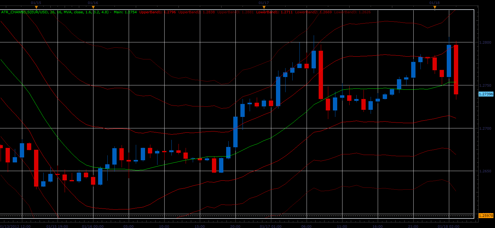

# ATR channels indicator

> Source: https://fxcodebase.com/code/viewtopic.php?f=17&t=11900  
> Forum: 17 · Topic 11900 · 5 post(s)

---

## ATR channels indicator

**Alexander.Gettinger** · Wed Jan 18, 2012 3:46 am

Indicators shows moving average and 3 ATR bands.

 

Download:

 [ATR_Channels.lua](files/23752/ATR_Channels.lua)

For this indicator must be installed Averages indicator ([viewtopic.php?f=17&t=2430](https://fxcodebase.com/code/viewtopic.php?f=17&t=2430)).

The indicator was revised and updated

---

## Re: ATR channels indicator

**FxGump** · Fri Nov 30, 2012 5:29 am

Excellent indicator!!! I love it!

Would it be possible to specify different line style for each band?

And also specify different color for the bands that are above the moving average and for the bands that are below the moving average?

---

## Re: ATR channels indicator

**Apprentice** · Sat Dec 01, 2012 5:30 am

Your request is added to the development list.

---

## Re: ATR channels indicator

**Apprentice** · Sun Dec 02, 2012 6:32 am

Required Style options added.

---

## Re: ATR channels indicator

**Apprentice** · Mon Apr 17, 2017 6:48 am

Indicator was revised and updated.
