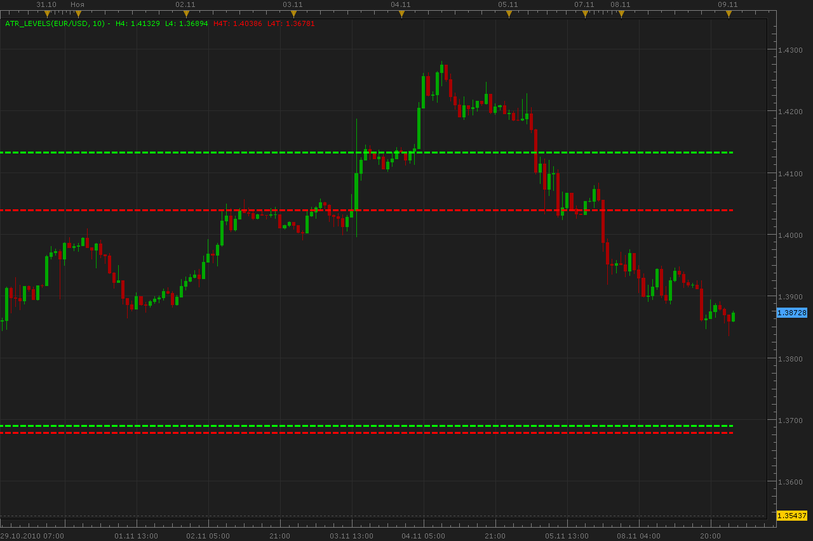

# ATR Levels indicator

> Source: https://fxcodebase.com/code/viewtopic.php?f=17&t=2635  
> Forum: 17 · Topic 2635 · 2 post(s)

---

## ATR Levels indicator

**Alexander.Gettinger** · Tue Nov 09, 2010 2:38 am

Formulas:
H4T line=maximum price for current day+ATR,
L4T line=minimum price for current day-ATR,
H4 line=maximum price for previous day+ATR,
L4 line=minimum price for previous day-ATR,
where ATR=ATR with ATRPeriod for previous day.

 

For this indicator must be installed indicator BF_ATR from [viewtopic.php?f=17&t=2634](https://fxcodebase.com/code/viewtopic.php?f=17&t=2634)

 [ATR_Levels.lua](files/5937/ATR_Levels.lua)

MT4/MQ4 Version
[viewtopic.php?f=38&t=64208](https://fxcodebase.com/code/viewtopic.php?f=38&t=64208)

The indicator was revised and updated

---

## Re: ATR Levels indicator

**Apprentice** · Thu Feb 02, 2017 4:06 pm

Indicator was revised and updated.
