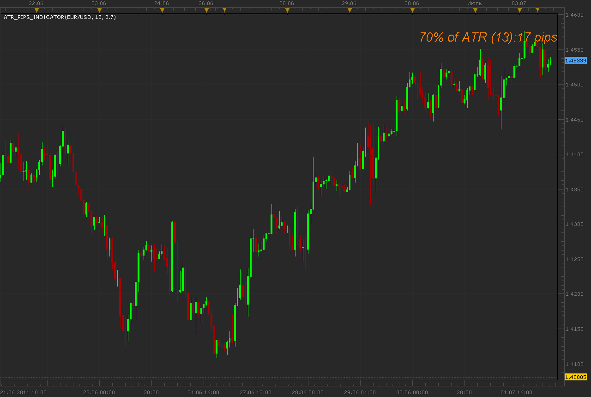
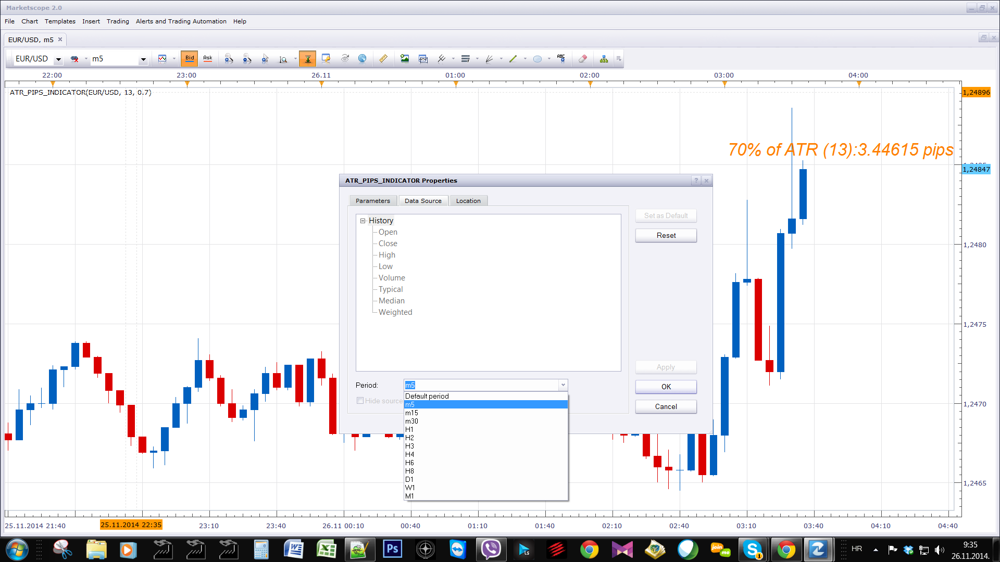
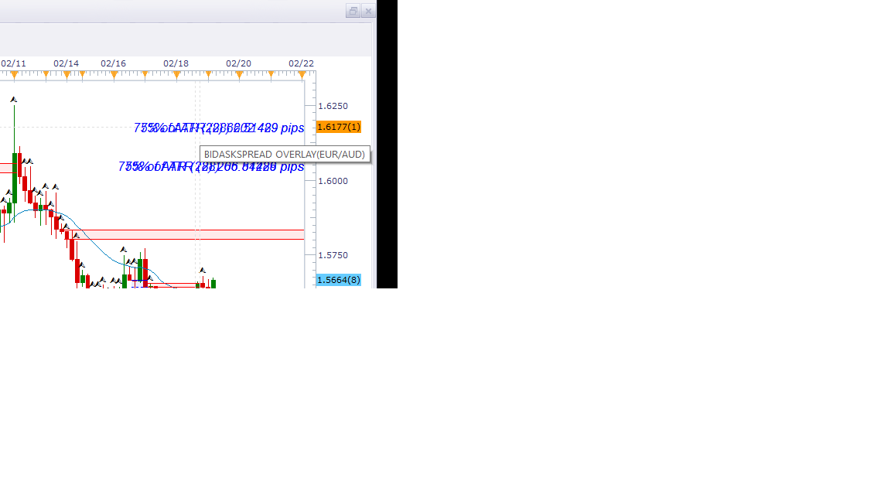

# ATR pips indicator

> Source: https://fxcodebase.com/code/viewtopic.php?f=17&t=4971  
> Forum: 17 · Topic 4971 · 84 post(s)

---

## ATR pips indicator

**Alexander.Gettinger** · Mon Jul 04, 2011 4:05 am

Oscillator is a port of MT4 indicator ([http://www.forexfactory.com/showthread.php?p=2216448](http://www.forexfactory.com/showthread.php?p=2216448)).

 

Download:

 [ATR_pips_Indicator.lua](files/12287/ATR_pips_Indicator.lua)

Will give simple audio alert when ATR meets a determined level (condition)

 [ATR_pips_Indicator with Alert.lua](files/12287/ATR_pips_Indicator%20with%20Alert.lua)

 [Tick ATR_pips_Indicator.lua](files/12287/Tick%20ATR_pips_Indicator.lua)

 [Tick ATR_pips_Indicator with Alert.lua](files/12287/Tick%20ATR_pips_Indicator%20with%20Alert.lua)

Tick ATR is available here.
[viewtopic.php?f=17&t=34094&p=94374&hilit=Tick+ATR#p94374](https://fxcodebase.com/code/viewtopic.php?f=17&t=34094&p=94374&hilit=Tick+ATR#p94374)

The indicator was revised and updated

---

## Re: ATR pips indicator

**porschefan** · Tue Aug 09, 2011 1:46 pm

> **Alexander.Gettinger wrote:**
> Oscillator is a port of MT4 indicator ([http://www.forexfactory.com/showthread.php?p=2216448](http://www.forexfactory.com/showthread.php?p=2216448)).
>
>
>
> ATR_pips_indicator.png
>
>
>
> Download:
>
>
> ATR_pips_Indicator.lua

Hello mr Gettinger
You can say what makes this indicator?

Thanks

---

## Re: ATR pips indicator

**sunshine** · Thu Aug 11, 2011 10:56 pm

The indicator displays the current value of the ATR indicator multiplied by the value set in indicator parameters, in pips.
Please read this article about usage of the ATR indicator:
[Average True Range (ATR)](http://www.fxcodebase.com/wiki/index.php/Average_True_Range_%28ATR%29)

---

## Re: ATR pips indicator

**porschefan** · Sun Aug 14, 2011 10:30 am

thank you

---

## Re: ATR pips indicator

**JPNWV7** · Thu Sep 22, 2011 2:45 pm

> **Alexander.Gettinger wrote:**
> Oscillator is a port of MT4 indicator ([http://www.forexfactory.com/showthread.php?p=2216448](http://www.forexfactory.com/showthread.php?p=2216448)).
>
>
>
> ATR_pips_indicator.png
>
>
>
> Download:
>
>
> ATR_pips_Indicator.lua

Just trying to figure out how to read this indicator. On one of my charts it says

70% of ATR(13) : 41 pips

What is the 41 pips? Profit? Stop/Loss?

I'm New to Forex Trading Just trying to learn.

Thanks

---

## Re: ATR pips indicator

**sunshine** · Mon Sep 26, 2011 7:11 am

> **JPNWV7 wrote:**
> Just trying to figure out how to read this indicator. On one of my charts it says
>
> 70% of ATR(13) : 41 pips
>
> What is the 41 pips? Profit? Stop/Loss?
>
> I'm New to Forex Trading Just trying to learn.

41 pips is 70% from the current ATR value. ATR is the Average True Range indicator which measures [volatility](http://www.fxcodebase.com/wiki/index.php/Volatility). The ATR indicator is included in the standard set of Marketscope indicators.

How this value can be used (a few popular interpretations):

- To determine stop and limit levels.
Use the indicator value to determine the distance for your stop and limit levels. Such stops/limits will take into account the current market volatility because they will be based on the ATR indicator. Generally, a two times ATR value is used. That is, you should set the Multiplier parameter of the indicator to 2 and use the received value as the distance for your stop order.
Note that when the volatility is high, wider stops should be used in order to avoid execution of stops by a random market movement. When the volatility is low, tighter stops should be used in order to have better protection for trades. So the value of Multiplier should depend on market volatility.
- To determine the best position to buy/sell based on Support/Resistance levels. The ATR indicator can be used as a filter when trading with support/resistance levels. In this case you should:

 1. Determine the support and resistance levels. For example, the resistance level is at 1.4000.
 2. Then, watch for price movement. Once the price hits the resistance level, buy at 20% ATR above the line. The idea is to do not buy at the resistance level but above the level to avoid entering on false hitting of the level.
For example, when the market hits the resistance level, the current ATR value for EUR/USD is 0.0110 (110 pips). You should enter the market at 20% ATR above the line:
 20% of ATR(14) = 110 pips * 0.2 = 22 pips
So, buy at 1.4022 level (1.4022 = 1.4000 (resistance level) + 22 pips)
Note that for this example you should set the Multiplier parameter of the indicator to 0.2.
See also [Average True Range](http://www.fxcodebase.com/wiki/index.php/Average_True_Range_%28ATR%29)

Hope this will help.

---

## Re: ATR pips indicator

**JPNWV7** · Mon Sep 26, 2011 5:58 pm

Thanks for the info, yes it helped. Thanks

---

## Re: ATR pips indicator

**rose123** · Thu Feb 09, 2012 7:04 pm

i request mtf mcp atr pips indicator as mtf mcp gmmacd incidcator

[viewtopic.php?f=17&t=12958](http://www.fxcodebase.com/code/viewtopic.php?f=17&t=12958)

---

## Re: ATR pips indicator

**TheEdge** · Fri Feb 10, 2012 11:19 am

Hello,

Can some one tell me how to position this in a different location on the chart, I have a PIP spread indicator in the top right corner and this indicator also in the same location. I would like to have it positioned at the top but to the left of the PIP indicator.

---

## Re: ATR pips indicator

**Apprentice** · Fri Feb 10, 2012 3:56 pm

MTF MCP ATR u can find here.
[viewtopic.php?f=17&t=2723&p=24311&hilit=mtf+atr#p24311](https://fxcodebase.com/code/viewtopic.php?f=17&t=2723&p=24311&hilit=mtf+atr#p24311)

---

## Re: ATR pips indicator

**TheEdge** · Fri Feb 10, 2012 4:12 pm

Hello Apprentice,

Not what I'm looking for Thanks thou, I want to know how to set the position of an indicator so the indicators that are posting to the top right corner are not covering each other up.

In some other platforms the indicators have an X and Y axises so you can move them around the chart. Is this possible with these indicators?

---

## Re: ATR pips indicator

**Apprentice** · Sun Feb 12, 2012 4:30 am

Although this is not my work.
We will prepare an update.

---

## Re: ATR pips indicator

**Alexander.Gettinger** · Fri Feb 17, 2012 2:50 pm

> **TheEdge wrote:**
> Hello Apprentice,
>
> Not what I'm looking for Thanks thou, I want to know how to set the position of an indicator so the indicators that are posting to the top right corner are not covering each other up.
>
> In some other platforms the indicators have an X and Y axises so you can move them around the chart. Is this possible with these indicators?

Version of indicator with shift:

 [ATR_pips_Indicator.lua](files/26230/ATR_pips_Indicator.lua)

---

## Re: ATR pips indicator

**JPNWV7** · Fri Mar 09, 2012 6:08 am

> **Alexander.Gettinger wrote:**
>
>
> > **TheEdge wrote:**
> > Hello Apprentice,
> >
> > Not what I'm looking for Thanks thou, I want to know how to set the position of an indicator so the indicators that are posting to the top right corner are not covering each other up.
> >
> > In some other platforms the indicators have an X and Y axises so you can move them around the chart. Is this possible with these indicators?
>
>
>
> Version of indicator with shift:
>
>
> ATR_pips_Indicator.lua

Probably wanting to position it in another corner of the chart?

---

## Re: ATR pips indicator

**Alexander.Gettinger** · Fri Mar 09, 2012 10:18 am

> **JPNWV7 wrote:**
> Probably wanting to position it in another corner of the chart?

Yes, use the shift parameters.

---

## Re: ATR pips indicator

**TheEdge** · Thu Apr 05, 2012 2:55 am

Thanks Exactly what I wanted,

I wonder why the regular shift function doesn't work on indicators like this or the Spread list indicator?

---

## Re: ATR pips indicator

**Apprentice** · Fri Apr 06, 2012 4:29 am

Shift, will only work for those indicators, which rely on the chart.
Spread List, receives data directly from FXCM servers,
works only for the current state, do not supported historical overview.

---

## Re: ATR pips indicator

**toxl89** · Thu Apr 12, 2012 3:50 am

Hi Alex
Most of your indicators are coded in lua, pls is there a way they can be transformed in a language acceptable on MT4.Please i will like to know.
Thanks

---

## Re: ATR pips indicator

**Alexander.Gettinger** · Thu Apr 12, 2012 4:25 pm

> **toxl89 wrote:**
> Most of your indicators are coded in lua, pls is there a way they can be transformed in a language acceptable on MT4.Please i will like to know.

As for this indicator, its MQL4 source code you may find in first post of this topic.

---

## Re: ATR pips indicator

**toxl89** · Fri Apr 13, 2012 3:10 pm

Thanks for your reply.There is a particular indicator am interested in and would like it in MT4, that is the two MA-Crossover.Please i want to know where I can the MLQ4 code.thanks so much,,

---

## Re: ATR pips indicator

**Apprentice** · Mon Apr 16, 2012 3:50 am

Contact Alex or our premium development team.
Unfortunately, this service is not free.

---

## Re: ATR pips indicator

**jefffxcb** · Tue Mar 12, 2013 9:34 pm

Is there a download link for the ATR pips lua indicator that displays the values on the upper part of the chart ... such as "10% of ATR (14): 8 pips".

The version I downloaded from an older post (ATR_pips_Indicator.lua) displays it at the bottom as a line indicator.

---

## Re: ATR pips indicator

**Apprentice** · Wed Mar 13, 2013 8:10 am

Bottom indicator is standard ATR indicator, there is no need to download it.
As for the ATR indicator pips, you can find it at the topmost, first post of this topic.
[viewtopic.php?f=17&t=4971](https://fxcodebase.com/code/viewtopic.php?f=17&t=4971)

---

## Re: ATR pips indicator

**Jabez3** · Tue Mar 19, 2013 5:38 am

Currently this indicator puts the values in the upper right hand of the chart. Can this information be displayed in the upper left of the chart so it does not get in the way of current price action?

Thank You

---

## Re: ATR pips indicator

**Apprentice** · Tue Mar 19, 2013 9:38 am

Your request is added to the developmental list.

---

## Re: ATR pips indicator

**Alexander.Gettinger** · Tue Apr 30, 2013 4:57 pm

> **Jabez3 wrote:**
> Currently this indicator puts the values in the upper right hand of the chart. Can this information be displayed in the upper left of the chart so it does not get in the way of current price action?

The indicator has been updated.

---

## Re: ATR pips indicator

**TheLight** · Wed Sep 11, 2013 9:17 pm

I use your indicator every day and was wondering if a calculation could be added and then displayed on the indicator? After the # pips I would like it to also show (the pips as a %). GBPJPY example say 100% of ATR (20): 160 pips and GBPJPY previous bar close was 150.00. So it would display as 100% of ATR (20): 150 pips 1.07% Thank you.

---

## Re: ATR pips indicator

**Apprentice** · Fri Sep 13, 2013 12:42 am

Your request is added to the development list.

---

## Re: ATR pips indicator

**mdwxl3** · Thu Oct 31, 2013 12:06 pm

Howdy,

Great indicator!!! Just wondering if this could be added... could we have an option to not include the current day into the ATR calculation? When I use my ART, I'm just looking at the previous days and not the current day. Since the current day isn't over and changing per minute, this ever changing ATR does not work with my calculating the previous days.

Thanks,
Mark

---

## Re: ATR pips indicator

**Apprentice** · Sun Nov 09, 2014 8:08 am

Try this Version.
I have adjusted rounding a bit.

Please test it with a multiplier of 0.0001 EUR / USD.
You will see the values are consistent.

---

## Re: ATR pips indicator

**Poupouille** · Tue Nov 25, 2014 1:21 pm

Hello, is it possible to create the ATR pips indicator with a selection of the desired time frame ?
I would like to install this indicator on an hourly graph but what the atr in pips is to calculate on the value Daily.
Tyvm

---

## Re: ATR pips indicator

**Apprentice** · Wed Nov 26, 2014 3:33 am

Please use Data Source Period selector drop down menu to select higher time frame source.

---

## Re: ATR pips indicator

**[email protected]** · Tue Sep 15, 2015 9:05 pm

Hi,

 I am unable to figure how where exactly it is that I get the download for this indicator?

---

## Re: ATR pips indicator

**Apprentice** · Fri Sep 18, 2015 2:31 am

First post in this topic.
[viewtopic.php?f=17&t=4971](https://fxcodebase.com/code/viewtopic.php?f=17&t=4971)

---

## Re: ATR pips indicator

**Paul W** · Sun Nov 29, 2015 1:28 pm

is it possible to add some flexibility on the Indicator placement ?

Thanks

---

## Re: ATR pips indicator

**Apprentice** · Tue Dec 01, 2015 6:03 am

As it is, You can choose corner, vertical and horizontal shift.

---

## Re: ATR pips indicator

**Paul W** · Tue Dec 01, 2015 7:07 am

my apologizes, appears I have an older version

---

## Re: ATR pips indicator

**mechanicjon** · Sun Feb 21, 2016 11:31 pm

I've been having corrupted results when combining this indicator. Combined with any other indicator. Changing TF's and symbol's seems to cause it, usually within the first 2 minutes.
Environment: Win10, FXCM TS ver.01.14.112415 desktop and Win8.1 same FXCM on laptop
Different scenario's I've tried:
New marketscope 2.0 insert just the ATR pips indicator switch one chart TF's and symbols = ok
Add in boring and exciting indicator and repeat switching TF's and symbols = corrupted info (see pic)
Also the information when hovering over the chart info appears to take on that of the other indicators. (see pic) Any other indicator combined with it has the same results.
Adjusted location, fonts and every other setting with same results. Downloaded new indicators and reimported them overwriting old ones. No change. I'm unsure if it was TS update or the ATR pips indicator that caused it. I started using both at the same time.

 

*With indicator and boring excited only*

 

*backspread overlay is in the bottom right corner*

After this happens all the indicators have to be removed to remove ATR pips. It seems to join the other indicator file.

Also tried same scenario's on my laptop with the same results.
Thx for all you time.
Jon

---

## Re: ATR pips indicator

**Paul W** · Tue Jun 21, 2016 7:12 am

Could you add a simple audio alert - when ATR meets a determined level (condition)

have been using ATR pips indicator in my scalping set-up - works well imo

helps identify possible momentum

thanks

---

## Re: ATR pips indicator

**Apprentice** · Thu Jun 23, 2016 4:04 am

ATR_pips_Indicator with Alert added.

---

## Re: ATR pips indicator

**Paul W** · Thu Jun 23, 2016 8:04 am

thanks for the fast turn-around

but unable to locate user parameter/variable for setting ATR trigger level ?

---

## Re: ATR pips indicator

**Apprentice** · Fri Jun 24, 2016 3:21 am

Try it now.
Alert Level added.

---

## Re: ATR pips indicator

**Paul W** · Fri Jun 24, 2016 10:02 am

closer

works fine when “cross over” condition is met

Crashes (and indicator disappears) when “cross under” condition met

can see this being very handy

---

## Re: ATR pips indicator

**Apprentice** · Sat Jun 25, 2016 3:32 am

Fixed.

---

## Re: ATR pips indicator

**Paul W** · Mon Jun 27, 2016 11:35 am

really close

Found a bug – appears “Play Sound” feature is not working

---------------

Alert function working properly – user error .. Doh

Try this

Have added a second ATR pips

The first (in Blue, top) has the alert set to 6 pips – (FAST)
- Data source – 1 minute
- Period = 5

The second (black) – no alert – (SLOW)
- Data source – 1 minute
- Period = 15

The (FAST) Alert triggers as ATR increases – which may indicate some momentum is developing
I use the second (SLOW) ATR pips (black) as a reference to the longer established ATR

I have incorporated into my Scalping Strategy, and it seems to work pretty well – you will need to adjust the settings to suit the particular Instrument you are trading

---

## Re: ATR pips indicator

**Paul W** · Thu Aug 18, 2016 12:32 pm

just curious,

is it possible to create an ATR list indicator of the various pairs, including CFDs

for use in a day trading strategy - to help identify possible developing momentum, on a timely basis ?

thanks

---

## Re: ATR pips indicator

**Apprentice** · Fri Aug 19, 2016 2:36 am

Try this version.
[viewtopic.php?f=17&t=31923&p=54411#p54411](https://fxcodebase.com/code/viewtopic.php?f=17&t=31923&p=54411#p54411)
Also U can find MTF MCP ATR here.
[viewtopic.php?f=17&t=2723&p=24311&hilit=mtf+atr#p24311](https://fxcodebase.com/code/viewtopic.php?f=17&t=2723&p=24311&hilit=mtf+atr#p24311)

---

## Re: ATR pips indicator

**Paul W** · Tue Nov 01, 2016 12:06 pm

appears Font selection feature is not working ?

is it possible to permit / enable ATR pips to be displayed on a Tick chart ?

thanks

---

## Re: ATR pips indicator

**Apprentice** · Fri Nov 04, 2016 4:06 am

> appears Font selection feature is not working ?

I can not confirm this.
Can you specify the exact indicator version / Web reference.

> is it possible to permit / enable ATR pips to be displayed on a Tick chart ?

Usually ATR requires bar source.
[viewtopic.php?f=17&t=34094&p=94374&hilit=Tick+ATR#p94374](https://fxcodebase.com/code/viewtopic.php?f=17&t=34094&p=94374&hilit=Tick+ATR#p94374)
Tick ATR is possible, however the value may vary.

---

## Re: ATR pips indicator

**Paul W** · Fri Nov 25, 2016 3:12 pm

*DAX Nov 25, 2016 (ET)*

apologies for the delayed response

appears I was using an older version - Font sizing works fine with most recent

was hoping to include ATR pips indicator on a tick chart - am currently using a MTF (customized) version to identify momentum on a 1 minute chart (side by side with Tick-chart) - works pretty good imo

it would be easier/nicer/cleaner if the tick chart could also support ATR pips indicator

ATR (MTF) calculations are set to a 1 minute timeframe - when shorter period ATR exceeds slower/longer, it may indicate gathering momentum

your help would be appreciated

Thanks

---

## Re: ATR pips indicator

**Apprentice** · Sat Nov 26, 2016 7:07 am

Tick ATR_pips_Indicator.lua added.

---

## Re: ATR pips indicator

**Paul W** · Sat Nov 26, 2016 11:04 am

apologizes

should have mentioned/asked if the tick-chart support feature could be added to - ATR_pips_Indicator with Alert.lua ?

added Tick ATR_pips_Indicator to tick-chart - really cool

and will definitely help - make entries a little easier to identify - using a scalping strategy

thanks

---

## Re: ATR pips indicator

**Paul W** · Sat Mar 11, 2017 4:02 pm

could you add the same alert feature to "Tick ATR_pips_Indicator.lua"

as "ATR_PIPS_INDICATOR WITH ALERT"

thanks

---

## Re: ATR pips indicator

**Apprentice** · Sun Mar 12, 2017 4:19 pm

Tick ATR_pips_Indicator with Alert.lua added.

---

## Re: ATR pips indicator

**Paul W** · Wed Nov 21, 2018 10:53 am

good indicator

I use to help identify momentum

if you could add a colour change option, for when "Alert Level" condition has been met

which then returns to default when condition has not been met

that would help

thx

---

## Re: ATR pips indicator

**Apprentice** · Thu Nov 22, 2018 6:26 am

Change label color based on ATR_pips_Indicator with Alert indication?

---

## Re: ATR pips indicator

**Paul W** · Thu Nov 22, 2018 10:55 am

If possible would like the indicator "Style" colour to change, during Alert level condition being met

and return back to default colour when condotion is not met - below "Alert Level"

thx

---

## Re: ATR pips indicator

**Apprentice** · Sat Nov 24, 2018 7:01 am

Try an updated version of ATR_pips_Indicator with Alert.

---

## Re: ATR pips indicator

**Paul W** · Sat Nov 24, 2018 12:48 pm

Thanks

and appreciated,

could you add Style Change feature to - "Tick ATR_pips_Indicator with Alert.lua"

thx

---

## Re: ATR pips indicator

**Apprentice** · Sun Nov 25, 2018 5:07 am

Added.

---

## Re: ATR pips indicator

**minifire18** · Tue Jun 11, 2019 7:09 am

Hey Apprentice,
Can yo code ATR_PIPS_INDICATOR WITH ALERT for MT4
thanks
minifire

---

## Re: ATR pips indicator

**Apprentice** · Wed Jun 12, 2019 6:36 am

Your request is added to the development list under Id Number 4716

---

## Re: ATR pips indicator

**Apprentice** · Thu Jun 13, 2019 7:10 am

MT4/MQ4 version.
[viewtopic.php?f=38&t=68572](https://fxcodebase.com/code/viewtopic.php?f=38&t=68572)

---

## Re: ATR pips indicator

**douvanik** · Fri Jun 28, 2019 4:43 pm

Hi excellent indicator. Can you modified to indicates precept??? Regards Nick

---

## Re: ATR pips indicator

**Apprentice** · Sun Jun 30, 2019 5:44 pm

Can you specify exact indicator name and trading station?

---

## Re: ATR pips indicator

**douvanik** · Mon Jul 01, 2019 9:46 am

ATR pips indicator and FXCM Trading Station / Marketscope.

---

## Re: ATR pips indicator

**Apprentice** · Mon Jul 01, 2019 12:59 pm

Your request is added to the development list under Id Number 4766

---

## Re: ATR pips indicator

**Apprentice** · Tue Jul 02, 2019 4:47 am

Can't figure out what needs to be done. This indicator already shows the percentage.
Can you provide more information and provide an indicator name.

---

## Re: ATR pips indicator

**douvanik** · Fri Jul 05, 2019 8:51 am

Hi the indicator shows Pips volatility, this pips can be showing on percentage, for ex. xauusd 100%ATR(12):5222.75 PIPS, this pips volatility can be showing in percentage.ATR calculation in percentage i think is (Last(high-low)+prev(high-low)/2)/prev.Open. Regards Nick

---

## Re: ATR pips indicator

**Apprentice** · Mon Jul 08, 2019 6:47 am

Try this version.

 [ATR_percentage_Indicator.lua](files/127273/ATR_percentage_Indicator.lua)

---

## Re: ATR pips indicator

**douvanik** · Thu Nov 21, 2019 7:46 pm

Hi can you add a start and end time to the indicator? .Thanks, regards Nick.

---

## Re: ATR pips indicator

**Apprentice** · Fri Nov 22, 2019 5:07 am

Can you please clarify.
With an example.

---

## Re: ATR pips indicator

**douvanik** · Fri Nov 22, 2019 12:28 pm

Ok eurusd 24h clock start count pips 03:00 o clock and stop count 23:00.

---

## Re: ATR pips indicator

**Apprentice** · Sun Nov 24, 2019 8:48 am

We calculate indicator as
Current chart / time frame / candle (ATR*Multiplier)/pipSize

It will basically convert ATP currencies to pips.
How we will incorporate the start/stop time?

Do you want to calculate the average ATR for selected period?

---

## Re: ATR pips indicator

**douvanik** · Mon Nov 25, 2019 6:53 pm

YES.Ok. Thanks.

---

## Re: ATR pips indicator

**Paul W** · Fri Jun 19, 2020 10:15 am

Hello,

noticed an issue with **Tick ATR_pips_Indicator with Alert.lua**

am unable to get the Alert Feature to work with FX pairs - have been using on CFD's previously, works ok

could you take a look pls

thx

---

## Re: ATR pips indicator

**Apprentice** · Sun Jun 21, 2020 4:01 am

Can you please share the parameters used?

---

## Re: ATR pips indicator

**Paul W** · Sun Jun 21, 2020 1:45 pm

Re: **Tick ATR_pips_Indicator with Alert.lua**

Apologies,

should have included:
- the Alert "Play Sound" feature does not play
- the Alert change colour feature works ok

tested parameters:
USD/CAD - Tick and minute charts
Alert Level = 2.0

also, "Show Dialog box Alert" appears not to work as well - but I do not use

Thx

---

## Re: ATR pips indicator

**Apprentice** · Sun Jun 21, 2020 6:43 pm

Try it now.

---

## Re: ATR pips indicator

**Paul W** · Mon Jun 22, 2020 12:43 pm

Re: **Tick ATR_pips_Indicator with Alert.lua**

Colour Display Alert - USD/CAD (FX pairs) ok
Play Sound - USD/CAD (FX pairs) ok
Show Dialog box Alert - USD/CAD (FX pairs) ok

Level Cross Over Sound - USD/CAD (FX pairs) works - but is inconsistent with Color Display Alert

meaning:
When Alert Level triggers and Colour alert triggers (consistent) ok
Level Cross Over Sound should also trigger - but does not always (inconsistent) ?

"Play Sound" should trigger only on "Level Cross Over" - and not "Level Cross Under"

THX for taking a look

---

## Re: ATR pips indicator

**Apprentice** · Tue Jun 23, 2020 3:31 am

Try it now.

---

## Re: ATR pips indicator

**Paul W** · Thu Jun 25, 2020 1:24 pm

Hello,

**Re: "Alert play-sound" feature**

have been testing latest version - **by Apprentice » Tue Jun 23, 2020 3:31 am**
and
previous - **by Apprentice » Sun Jun 21, 2020 6:43 pm**
(this version I think is a little better/more-consistent)

both work "Alert play-sound" (tick-charts) - however both versions still have issues and are not consistent/synchronized with "Alert change-colour" (works perfectly)

I may be oversimplifying - cannot "Alert play-sound" be added directly to the "Alert change-colour" routine ? (I am not a programmer) - but they should both trigger at the same time

again, I appreciate you taking a look

Thx

note: previous version **"by Apprentice » Sun Jun 21, 2020 6:43 pm"** is usable

---

## Re: ATR pips indicator

**Apprentice** · Thu Jun 25, 2020 1:32 pm

Your request is added to the development list.
Development reference 1557.

---

## Re: ATR pips indicator

**Apprentice** · Wed Jul 08, 2020 5:19 am

Try it now.
