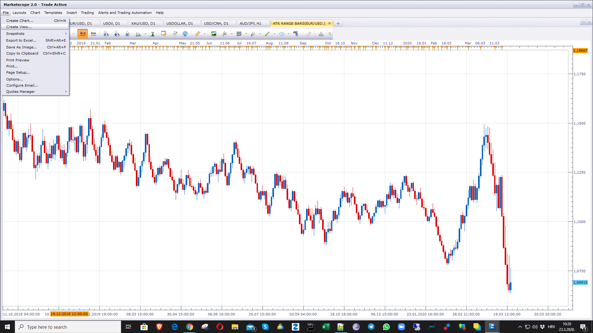

# ATR Range Bars

> Source: https://fxcodebase.com/code/viewtopic.php?f=17&t=69563  
> Forum: 17 · Topic 69563 · 31 post(s)

---

## ATR Range Bars

**Apprentice** · Mon Mar 23, 2020 6:12 am

 

Based on request.
[viewtopic.php?f=27&t=69559](https://fxcodebase.com/code/viewtopic.php?f=27&t=69559)

To follow market volatility, a range bar whose size would depend on the ATR value.

 [ATR Range Bars.lua](files/132191/ATR%20Range%20Bars.lua)

---

## Re: ATR Range Bars

**damso4998** · Mon Mar 30, 2020 11:21 am

Hello Apprentice,

The indicator is perfect and i thank you for the work.

I have an idea to add an option:

Can you add the possibility to add a moving average to smooth the ATR please ?

For example : For example i have a fast ATR set on 2 periods. So to smooth it i add a moving average set on x periods from the ATR.

Thanks again for all the work

---

## Re: ATR Range Bars

**Apprentice** · Tue Mar 31, 2020 5:13 am

Your request is added to the development list.
Development reference 970.

---

## Re: ATR Range Bars

**Apprentice** · Tue Mar 31, 2020 6:38 am

[ATR Range Bars.lua](files/132417/ATR%20Range%20Bars.lua)

Something like this?

---

## Re: ATR Range Bars

**damso4998** · Wed Apr 01, 2020 4:00 pm

Thank you so much Apprentice !!

it works well

I hope this indicator will hel p a lot of people

---

## Re: ATR Range Bars

**damso4998** · Sun Apr 26, 2020 6:18 am

Hello Apprentice,

I am back again with a new idea

is it possible to add a condition betwenn the ATR value and the smoothed (MA period) value of the ATR.

**I would like:**

**When the ATR value is inferior to value the MA period, the indicator will use The ATR value without the moving average

But when The ATR value is superior to value of the Moving average, the indicator will use the value of the Moving average**

**So in summary:**

**ATR value < Moving average = we use only the ATR value
ATR value > Moving average = we use the value of the Moving average**

I don't know if i'm clear (English is not my native langage )

And since i don't have an answer in the premium section i want to ask if it's possible to convert this this indicator for prorealtime (of course i'm willing to support your work with money)

---

## Re: ATR Range Bars

**Apprentice** · Mon Apr 27, 2020 4:29 am

Your request is added to the development list.
Development reference 1151.

---

## Re: ATR Range Bars

**Apprentice** · Tue Apr 28, 2020 10:29 am

[ATR Range Bars.lua](files/133292/ATR%20Range%20Bars.lua)

Try this version.

---

## Re: ATR Range Bars

**damso4998** · Thu May 07, 2020 4:25 pm

Hello Apprentice,

I have an issue with the view it's works well but it's looks like it doesn't refresh (i learnt that marketscope 2 doesn't automatically refresh is it true ?) when new bars are created so when i refresh the view it gives me different candles

Is there a way to fix it please ?

---

## Re: ATR Range Bars

**Apprentice** · Fri May 08, 2020 5:19 am

Is "Thill now" marked or not?

---

## Re: ATR Range Bars

**damso4998** · Fri May 08, 2020 11:43 am

Sorry but i don't understand what you mean

---

## Re: ATR Range Bars

**damso4998** · Fri May 08, 2020 12:13 pm

Sorry if i don't understand verry well my native langage is French

But the isssue is that i have to refresh the view in order to have the right bars each time a bar is created So i want to find a way to fix it.

But what do you mean by "Thill now" ?

---

## Re: ATR Range Bars

**damso4998** · Fri May 08, 2020 2:38 pm

I just understood you question because the plateform is in french i didn't understood.

So "till now" is not market. But i have to precise that i used the indicator in the "simulation mode" and not demo.

---

## Re: ATR Range Bars

**damso4998** · Sat May 16, 2020 9:19 am

Hello apprentice,

I come because my problem is not solved. It's still about the view when i refresh it it changes the candle so that's complicate my analysis . I join 2 images of a same graph before refresh and after refresh. Wich one is the good one ? And also is there a way to fix it please ?

And also is there a way to get more data in 1 minute please ?

---

## Re: ATR Range Bars

**Apprentice** · Sat May 16, 2020 3:46 pm

Try to use the same date range.

Your request is added to the development list.
Development reference 1302.

---

## Re: ATR Range Bars

**damso4998** · Sun May 17, 2020 4:23 pm

Thanks for the help. I didn't express myself very well about the data. What i want to say is that i want to load more historical data on a graph because I'm limited in demo and real account. Is there a way ? Because since i use 1 mn timeframe to draw the range bars from the ATR of big timeframes such as daily it's compress a lot the graph and i don't have enough candles to analyse.

I saw on your website that you sell price history in 1 minute for fx markets. Is tthis a way to get more data ?

---

## Re: ATR Range Bars

**Apprentice** · Mon May 18, 2020 7:19 am

The mentioned date will not work with this View.
A brand new View that will use external data should be written.

---

## Re: ATR Range Bars

**Apprentice** · Mon May 18, 2020 8:05 am

[ATR Range Bars.lua](files/134041/ATR%20Range%20Bars.lua)

Try this version.

---

## Re: ATR Range Bars

**damso4998** · Tue May 19, 2020 8:06 am

> **Apprentice wrote:**
> The mentioned date will not work with this View.
> A brand new View that will use external data should be written.

Okay i approximately understand

Do you do it for free ? or do you want to talk it in priviate ?

---

## Re: ATR Range Bars

**Apprentice** · Wed May 20, 2020 7:14 am

It is up to you.
Post your free of charge request here
[viewforum.php?f=27](https://fxcodebase.com/code/viewforum.php?f=27)
For private contact me via email.
mario(.)jemic(@)gmail(.)com

---

## Re: ATR Range Bars

**damso4998** · Sat May 23, 2020 11:17 am

> **Apprentice wrote:**
> It is up to you.
> Post your free of charge request here
> [viewforum.php?f=27](https://fxcodebase.com/code/viewforum.php?f=27)
> For private contact me via email.
> mario(.)jemic(@)gmail(.)com

Okay thank you

So i come back again with new ideas

1) Add the possibilty to use custom timeframe (like the Custom timeframe candle view = [viewtopic.php?f=17&t=60537](https://fxcodebase.com/code/viewtopic.php?f=17&t=60537))

2) Add the possbility to use Sub minute (like the Sub minute candle view = [viewtopic.php?f=17&t=63442](https://fxcodebase.com/code/viewtopic.php?f=17&t=63442))

3) Add the option "yes/No" if i want to use the condition below already interated to the view:

**When the ATR value is inferior to value the MA period, the indicator will use The ATR value without the moving average

But when The ATR value is superior to value of the Moving average, the indicator will use the value of the Moving average

So in summary:

ATR value < Moving average = we use only the ATR value
ATR value > Moving average = we use the value of the Moving average**

Thanks again for all your hard work

---

## Re: ATR Range Bars

**damso4998** · Sat May 23, 2020 12:33 pm

Also can you update the indicator and put the latest version in the first page please ? Since there was a lot of uptdate of the view

Thanks again for all your hard work

---

## Re: ATR Range Bars

**Apprentice** · Mon May 25, 2020 5:36 am

Your request is added to the development list.
Development reference 1342.

---

## Re: ATR Range Bars

**Apprentice** · Tue May 26, 2020 8:56 am

[ATR Range Bars.lua](files/134309/ATR%20Range%20Bars.lua)

 [ATR Range Bars Subminute.lua](files/134309/ATR%20Range%20Bars%20Subminute.lua)

Try this version.

---

## Re: ATR Range Bars

**damso4998** · Tue May 26, 2020 7:13 pm

> **Apprentice wrote:**
>
>
> ATR Range Bars.lua
>
>
>
>
> ATR Range Bars Subminute.lua
>
>
> Try this version.

Sorry but this not exactly what i want

I want to have possibilty to chose a custom timeframe (for exemple m99, H7, m45etc...) and the subminute timeframe in the "Timeframe" section in "Price parameters

Also can you add the parameter "closed bars only" so i don't have the refresh problem

Hope i explained well

---

## Re: ATR Range Bars

**Apprentice** · Wed May 27, 2020 4:57 am

Your request is added to the development list.
Development reference 1367.

---

## Re: ATR Range Bars

**damso4998** · Sun Jun 07, 2020 2:42 pm

Hello apprentice,

I hope you are fine

So i come again with a new idea again

So this time i want the same indicator but this time :

1) we will use two different values : The true range (TR) And The Average True Range (ATR)

- So when the value of the True range is inferior to the the ATR = We use the value of the true range to draw bars

- When the value of the true range is superior to the ATR = We use the value of the ATR to draw bars

2) Also I want to have possibilty to chose a custom timeframe (for exemple m99, H7, m45 etc...) and the subminute timeframe in the "Timeframe" and "ATR Timeframe" sections in "Price parameters"

3) Also can you add the parameter "closed bars only" so i don't have the refresh problem

Thanks for all the hard work

---

## Re: ATR Range Bars

**Apprentice** · Sun Jun 07, 2020 7:38 pm

Define superior?
Greater then?

---

## Re: ATR Range Bars

**damso4998** · Mon Jun 08, 2020 6:36 am

> **Apprentice wrote:**
> Define superior?
> Greater then?

Yes when i say superior it's mean greater

---

## Re: ATR Range Bars

**Apprentice** · Tue Jun 09, 2020 6:12 am

Your request is added to the development list.
Development reference 1443.

---

## Re: ATR Range Bars

**Apprentice** · Tue Jun 09, 2020 7:09 am

[ATR Range Bars.lua](files/134720/ATR%20Range%20Bars.lua)

 [ATR Range Bars Subminute.lua](files/134720/ATR%20Range%20Bars%20Subminute.lua)
