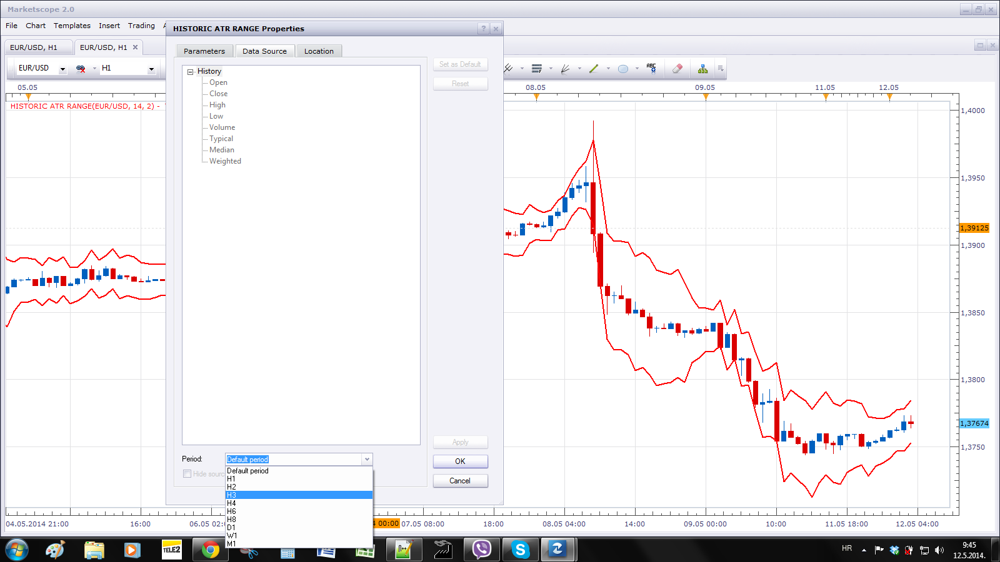

# ATR Range

> Source: https://fxcodebase.com/code/viewtopic.php?f=17&t=3415  
> Forum: 17 · Topic 3415 · 8 post(s)

---

## ATR Range

**Apprentice** · Tue Feb 15, 2011 5:14 am

This indicator draw ATR Based Range.
The user selects the time frame.
Range line distant from the opening price, are at selected percentage of the ATR, for that Time Frame.

 [ATR Range.lua](files/8145/ATR%20Range.lua)

 [Historic ATR Range.lua](files/8145/Historic%20ATR%20Range.lua)

---

## Re: ATR Range

**Apprentice** · Sat Mar 30, 2013 6:02 am

Historic ATR Range Added.

---

## Re: ATR Range

**plkdtm** · Sun Apr 07, 2013 11:55 am

thans a lot!!! great

---

## Re: ATR Range

**Jeffreyvnlk** · Sun Mar 30, 2014 2:40 pm

> **Apprentice wrote:**
>
>
> ATR Range.png
>
>
>
> This indicator draw ATR Based Range.
> The user selects the time frame.
> Range line distant from the opening price, are at selected percentage of the ATR, for that Time Frame.
>
>
>
> ATR Range.lua
>
>
>
>
> Historic ATR Range.lua

It could be appreciated if you offers an option for a close price

---

## Re: ATR Range

**Apprentice** · Mon Mar 31, 2014 2:29 am

We have a problem here.
To calculate the ATR requests a full bar. (open, close, high, low ...)
If u can provide Tick Based ATR calculations we can do this.

---

## Re: ATR Range

**kingos497** · Mon May 12, 2014 2:29 am

Apprentice, is it possible to code quicklly same input than atr range for historic range with timeframe and multiple factor please?

---

## Re: ATR Range

**Apprentice** · Mon May 12, 2014 2:45 am

If I understood you correctly.
You can not have this functionality already.
Simply select the desired Time Frame From Data Source.

---

## Re: ATR Range

**Apprentice** · Mon Aug 06, 2018 1:52 pm

The indicator was revised and updated.
