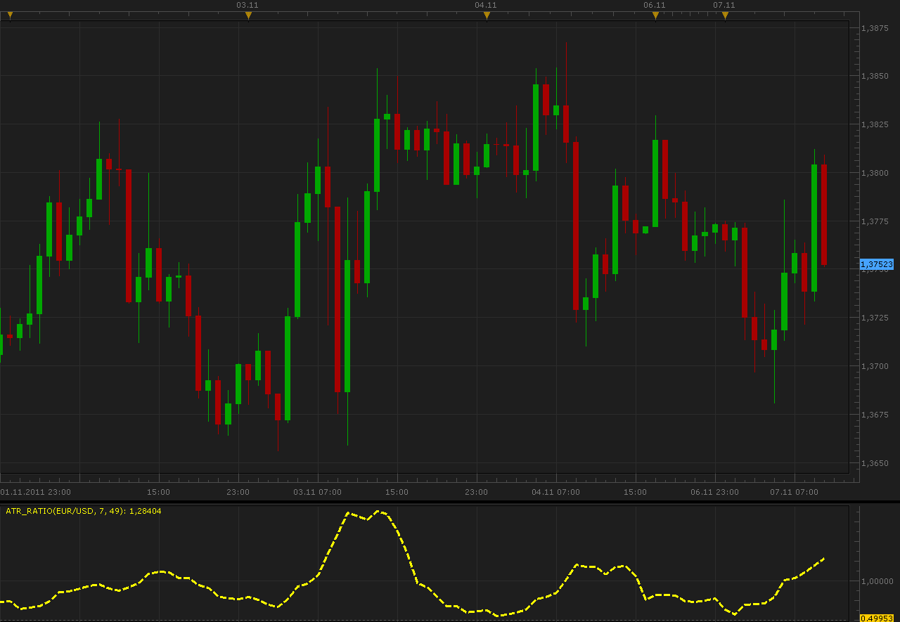

# ATR ratio indicator

> Source: https://fxcodebase.com/code/viewtopic.php?f=17&t=7884  
> Forum: 17 · Topic 7884 · 2 post(s)

---

## ATR ratio indicator

**Alexander.Gettinger** · Mon Nov 07, 2011 10:48 am

This indicator is a ported MQL5 indicator from [http://www.mql5.com/en/code/495#](http://www.mql5.com/en/code/495#)

Formulas:
ATR ratio=ATR(Short period)/ATR(Long period).

 

Download:

 [ATR_Ratio.lua](files/17486/ATR_Ratio.lua)

The indicator was revised and updated

---

## Re: ATR ratio indicator

**Apprentice** · Sun Mar 19, 2017 10:42 am

Indicator was revised and updated.
