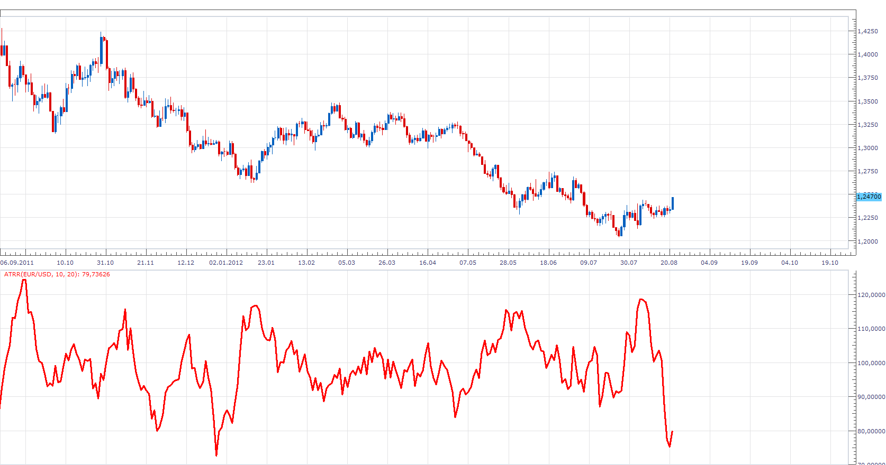

# ATR Ratio

> Source: https://fxcodebase.com/code/viewtopic.php?f=17&t=22601  
> Forum: 17 · Topic 22601 · 6 post(s)

---

## ATR Ratio

**Apprentice** · Tue Aug 21, 2012 8:58 am

Ratio = (ShortATR / LongATR)*100

 [ATRR.lua](files/38994/ATRR.lua)

The indicator was revised and updated

---

## Re: ATR Ratio

**Apprentice** · Sat Sep 01, 2012 3:23 am

MQ4 version can be found here.
[viewtopic.php?f=38&t=22879](https://fxcodebase.com/code/viewtopic.php?f=38&t=22879)

---

## Re: ATR Ratio

**Jeffreyvnlk** · Wed Apr 10, 2013 6:51 pm

Appreciated if you could add 2 levels for marking low and high .Thanks

---

## Re: ATR Ratio

**Apprentice** · Fri Apr 12, 2013 4:21 am

Min, Max should be set by user, or is it automatic.

---

## Re: ATR Ratio

**Jeffreyvnlk** · Thu Apr 25, 2013 4:30 am

> **Apprentice wrote:**
> Min, Max should be set by user, or is it automatic.

By user, thank you

---

## Re: ATR Ratio

**Apprentice** · Tue May 23, 2017 9:39 am

Indicator was revised and updated.
