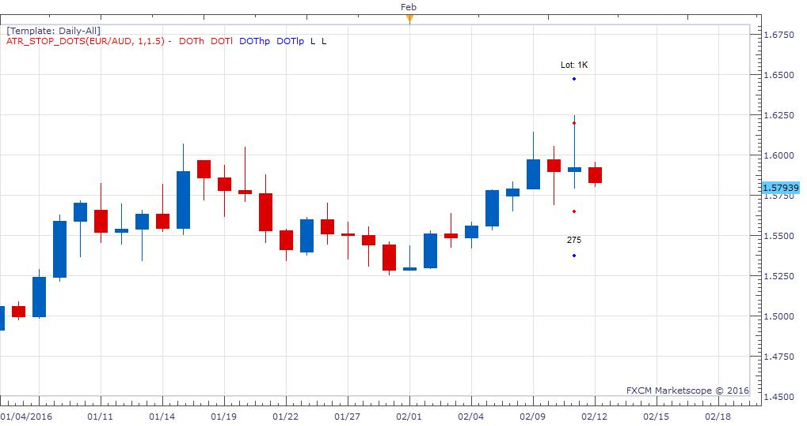

# ATR Stop Dots

> Source: https://fxcodebase.com/code/viewtopic.php?f=17&t=63153  
> Forum: 17 · Topic 63153 · 9 post(s)

---

## ATR Stop Dots

**igillman** · Sun Feb 14, 2016 5:31 pm

This is an indicator that I have written which is based on code from lots of other indicators. I have never written LUA code before so it might not be as clean as it should be but it does the job. It allows you to see where to place stops and how many lots you can buy/sell in order not to go over a certain percentage risk for the trade. Almost everything is adjustable including the risk percentage, ATR multiplier and profit multiplier.

A lot of people will place their stops at 1.5x the current ATR value in order to avoid getting stopped out but they do not want to risk more than 1% of their account on any one trade. This indicator will place a red dot above and below the closing value of a candle which represents either 1.5x ATR or 1% risk level whichever is less. It also places a blue dot at twice the distance so that you can see the 2:1 risk ratio point for the trade. I use the blue dots to eyeball the size of the channel to see if it is worthwhile trading and the red dots to place my stops.

The indicator will also show the distance in pips to the red dots (below the candle) and the number of lots you can trade and still stay under 1% (above the candle). The number of pips is useful to set trailing stops and the lot size does the calculation for you to enable you to maximise the trade without risking more than you want to risk.

All of the numbers and colours are adjustable parameters so you could have 2x ATR and 3% risk with a 1.5x profit target if you wanted. The ATR parameters are also adjustable so you can use the last 14 days or 5 days or anything you want. You can also specify if you want it over just one candle or multiple candles to spot trends. The ability to have it over the last candle (still forming) is also a parameter.

I find it very useful for me, I hope someone else finds it useful as well.

 [ATR_Stop_Dots.lua](files/104815/ATR_Stop_Dots.lua)

MT4/MQ4 version.
[viewtopic.php?f=38&t=68583](https://fxcodebase.com/code/viewtopic.php?f=38&t=68583)

---

## Re: ATR Stop Dots

**Apprentice** · Thu Aug 24, 2017 8:53 am

The indicator was revised and updated.

---

## Re: ATR Stop Dots

**spinemaligna** · Fri Jan 19, 2018 4:13 pm

Hi Apprentice,

I am amazed no one has requested a strategy to be based on this indicator so here goes.
The rules are:
The strategy runs in the background and on detecting a new open position will place stop and limit values based on the position of the red and blue dots of the previous candle. An option to trail the stop will be offered. The lot size will be governed by the value returned from the indicator.

Thanks

Ross

---

## Re: ATR Stop Dots

**Apprentice** · Sat Jan 20, 2018 3:18 pm

Your request is added to the development list under Id Number 4013

> The lot size will be governed by the value returned from the indicator.

We can not do this bit.
The position size cannot be adjusted after the position is open.
We have to implement this logic in a particular strategy.

---

## Re: ATR Stop Dots

**Apprentice** · Sun Jan 21, 2018 6:01 am

Try this version.
[viewtopic.php?f=31&t=65654&p=117161#p117161](https://fxcodebase.com/code/viewtopic.php?f=31&t=65654&p=117161#p117161)

---

## Re: ATR Stop Dots

**spinemaligna** · Mon Jan 22, 2018 6:09 am

Great work,

Testing now.

Many thanks

---

## Re: ATR Stop Dots

**minifire18** · Fri Jun 14, 2019 11:42 am

Apprentice
Can you code for MT4
thanks
minifire

---

## Re: ATR Stop Dots

**Apprentice** · Mon Jun 17, 2019 7:37 am

Your request is added to the development list under Id Number 4727

---

## Re: ATR Stop Dots

**Apprentice** · Tue Jun 18, 2019 4:02 am

MT4/MQ4 version.
[viewtopic.php?f=38&t=68583](https://fxcodebase.com/code/viewtopic.php?f=38&t=68583)
