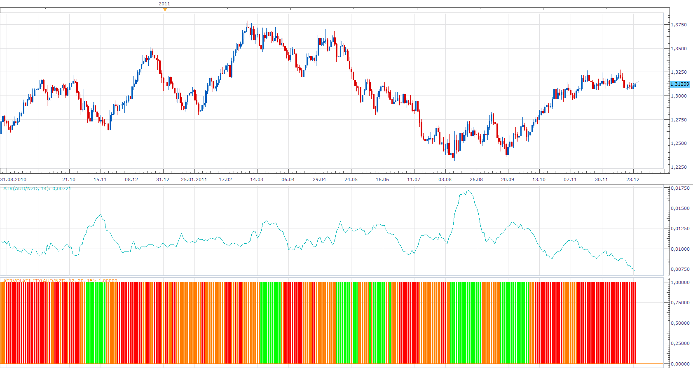

# Atr Volatility

> Source: https://fxcodebase.com/code/viewtopic.php?f=17&t=10451  
> Forum: 17 · Topic 10451 · 5 post(s)

---

## Atr Volatility

**Apprentice** · Mon Dec 26, 2011 7:16 am

The indicator shows when the ATR value is higher / lower than the default, in pips.
I added the percentage mode.
Shows the position of the ATR values ​​within the range of ATR values
From minimum to maximum, it is calculated for all on on Chart data.

 [AtrVolatility.lua](files/21685/AtrVolatility.lua)

The indicator was revised and updated

---

## Re: Atr Volatility

**Apprentice** · Mon Dec 26, 2011 7:34 am

This version shows the relationship between ATR and the total length of each candle.
High Volatility
Atr * High Multiplier> (High-Low)
Low Volatility
Atr * Low Multiplier <(High-Low)
else
Moderate Volatility

 [Atr Bar Volatility.lua](files/21689/Atr%20Bar%20Volatility.lua)

---

## Re: Atr Volatility

**Greggs66** · Wed Dec 28, 2011 11:57 am

Hi Apprentice, thats great. Thank you very much. Happy upcoming new year to all!

---

## Re: Atr Volatility

**Alexander.Gettinger** · Thu Nov 20, 2014 10:17 am

MQL4 version of ATR Volatility indicator: [viewtopic.php?f=38&t=61494](https://fxcodebase.com/code/viewtopic.php?f=38&t=61494).

---

## Re: Atr Volatility

**Apprentice** · Wed Jun 28, 2017 5:13 am

The indicator was revised and updated.
