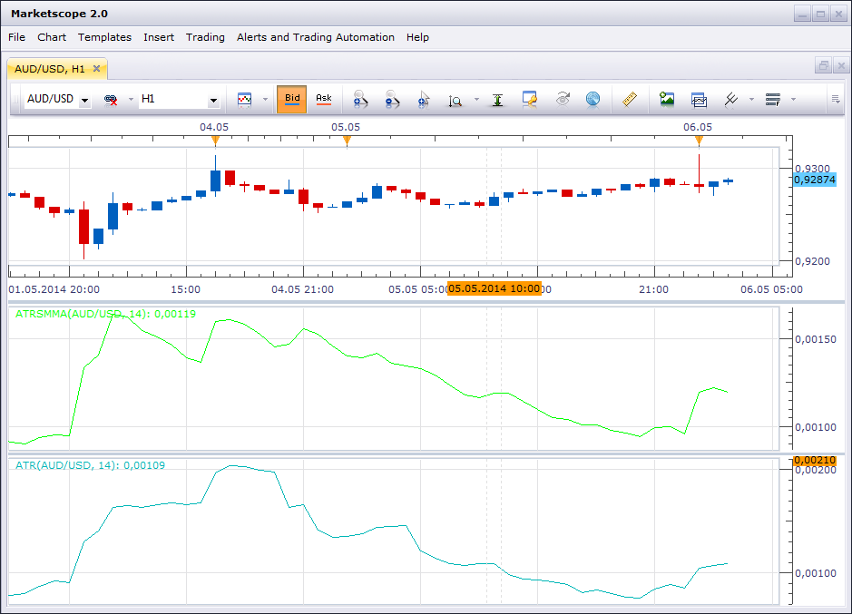
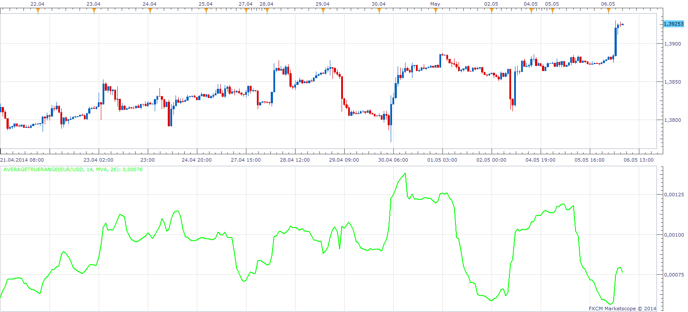

# ATR with SMMA

> Source: https://fxcodebase.com/code/viewtopic.php?f=17&t=60655  
> Forum: 17 · Topic 60655 · 3 post(s)

---

## ATR with SMMA

**Alexey.Pechurin** · Tue May 06, 2014 2:09 am

In MT4 and Trading Station, ATR uses a simple MA of the true ranges.

But there is another approach: a Wikipedia article ([http://en.wikipedia.org/wiki/Average_true_range](https://en.wikipedia.org/wiki/Average_true_range)) contains a formula with SMMA of the true ranges.

The attached indicator uses the following method.

Compare the look of the standard ATR and ATR with SMMA on the snapshot below.

 [ATRSMMA.lua](files/93861/ATRSMMA.lua)

The indicator was revised and updated

---

## Re: ATR with SMMA

**Apprentice** · Tue May 06, 2014 5:11 am

Why stop at SMMA.
This version will privide up to eight True Range smoothing method.
True Range and Smoothing period may vary.

 [AverageTrueRange.lua](files/93863/AverageTrueRange.lua)

---

## Re: ATR with SMMA

**Apprentice** · Tue Jul 18, 2017 6:33 am

The indicator was revised and updated.
