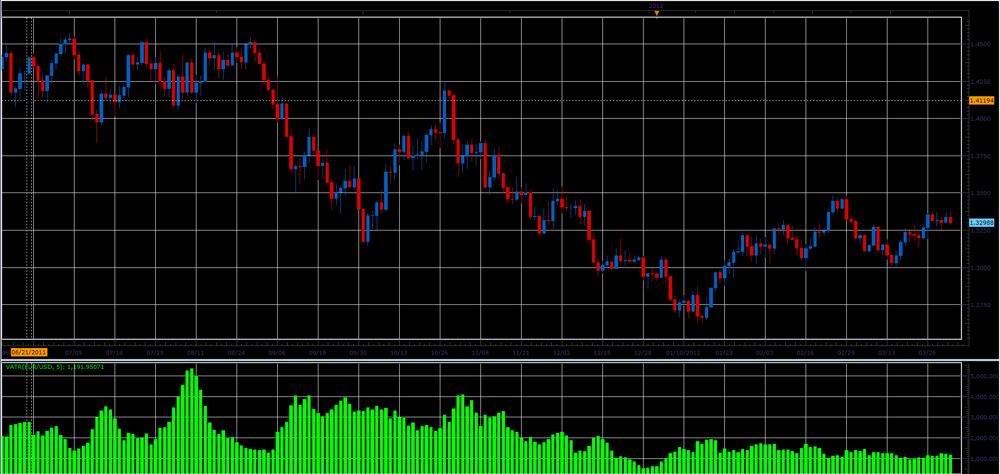

# ATR with volume (VATR)

> Source: https://fxcodebase.com/code/viewtopic.php?f=17&t=15506  
> Forum: 17 · Topic 15506 · 5 post(s)

---

## ATR with volume (VATR)

**Alexander.Gettinger** · Mon Apr 02, 2012 9:57 am

Formulas:
VATR=Average(TR[i]*Volume[i]), where
TR - true range, TR[i]=Max(High[i]-Low[i], High[i]-Close[i-1], Close[i-1]-Low[i]).

 

Download:

 [VATR.lua](files/29210/VATR.lua)

The indicator was revised and updated

---

## Re: ATR with volume (VATR)

**Alexander.Gettinger** · Tue May 08, 2012 5:22 pm

MQL4 version of indicator: [viewtopic.php?f=38&t=17981](https://fxcodebase.com/code/viewtopic.php?f=38&t=17981)

---

## Re: ATR with volume (VATR)

**Jeffreyvnlk** · Wed Oct 31, 2012 1:22 pm

seems nice indicator but could you explain the idea behind it. ATR + volume ?

---

## Re: ATR with volume (VATR)

**Apprentice** · Thu Nov 01, 2012 3:02 am

This is a simplified formula.
VATR = AVG of (TrueRange * volume )
ATR = AVG of TrueRange

The difference between these two versions.
VATR giving greater weight to price differences on High Volume.

---

## Re: ATR with volume (VATR)

**Apprentice** · Mon Apr 17, 2017 7:07 am

Indicator was revised and updated.
