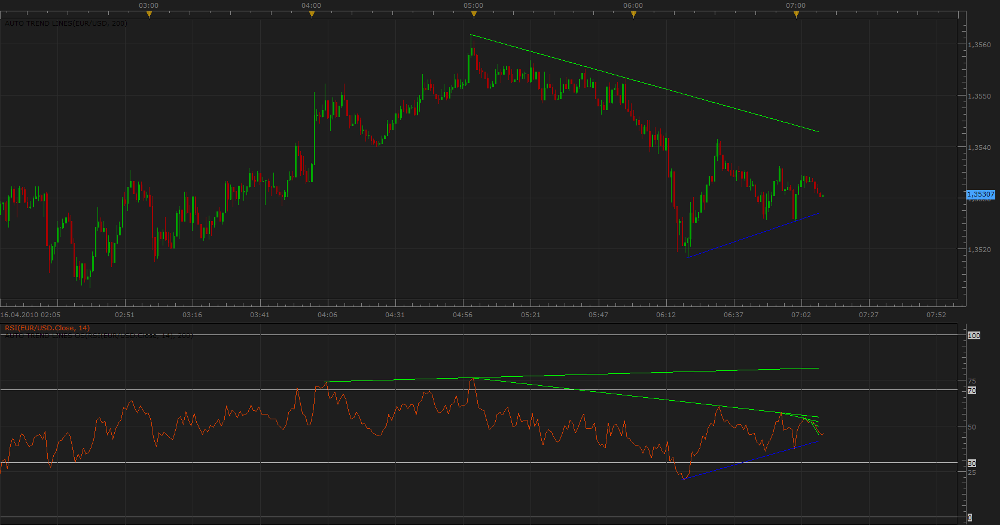
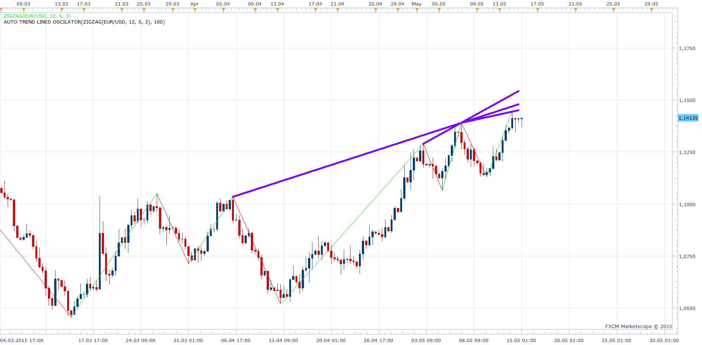

# Auto Trend Lines

> Source: https://fxcodebase.com/code/viewtopic.php?f=17&t=647  
> Forum: 17 · Topic 647 · 85 post(s)

---

## Auto Trend Lines

**Apprentice** · Thu Apr 15, 2010 3:51 am


*Auto Tend Lines*

I give you, Auto Trend Lines Indicator.

 


*Auto Tend Lines options*

The indicator has several options.

**Tolerated** - How many candles that does not respect the line is tolerated (predefined value 0)

**Test whole** - Test whole frame, do, the market respects the trend line.

**Frame Size** - How many periods before the last candle, indicator starts drawing the lines.

**Fractal** - As a starting point for the trend lines indicator use fractals, otherwise may use any candle.

**Close or High and Low**- Ignore the line if the High / Low value of the period exceeded the trend line, otherwise, it uses closing price, when checking.

**Divergence / Convergence** (0-100)
 0 -The trend lines are moving away from the closing price
 100 - The trend line are Convergencing

Recommendations, use fractals, fractals are simpler for the computer to calculate.

Suggestions are welcome, bugs, are possible.

**Request**
Please try out the options, share with us the settings that give you the best results,
so i could make a lite version, auto version.

---

## Re: Auto Trend Lines

**Apprentice** · Fri Apr 16, 2010 3:11 am

[Auto Trend Lines.lua](files/1198/Auto%20Trend%20Lines.lua)

---

## Re: Auto Trend Lines

**Apprentice** · Fri Apr 16, 2010 3:20 am

Thank you, Nikolay, on your help with code optimization, I would not succeed without you.

Especially for your help with the Update segment, probably would not have thought of that.
In Draw function, I have more or less adapted to your code or I thought to make something like that.

---

## Re: Auto Trend Lines

**Apprentice** · Fri Apr 16, 2010 6:14 am



*Oscilator*

Michael, as you requested, I have prepared Auto trend indicator which can be applied to oscillators, indicators.

 [Auto Trend Lines Oscilator.lua](files/1202/Auto%20Trend%20Lines%20Oscilator.lua)

I did not have time to fully adapt the code, yet.

The next task is obvious, Linking these two indicator in one, in order to obtain an indicator,
 which shows the convergence and divergence between the indicators and the closing price.

---

## Re: Auto Trend Lines

**david.gol** · Wed Oct 20, 2010 2:24 am

Is it possible to extend the lines into past and future?
Thank you

---

## Re: Auto Trend Lines

**Apprentice** · Wed Oct 20, 2010 3:40 am

Added to developmental cue.

---

## Re: Auto Trend Lines

**DS0167** · Wed Oct 20, 2010 4:55 am

Hello,

Nice one, thank you.

But I provided a mq4 for translation into lua for Tom Demark Lines, could you please tell me (us) when you will find time to translate it ?

Thank you in advance.
Kind regards,
DS0167

---

## Re: Auto Trend Lines

**Apprentice** · Wed Oct 20, 2010 6:10 am

The indicator is in the developmental cue.
A colleague took this job.
Hopefully soon.

---

## Re: Auto Trend Lines

**DS0167** · Thu Oct 21, 2010 3:52 pm

Thank you Apprentice. I am so eager on Tom Demark lines

Meanwhile I am running with Auto Trend Lines and you did (again) a nice job on this one

Thank you for all the hard work you are doing for us

Kind regards
DS0167

---

## Re: Auto Trend Lines

**cmsdeveloping** · Sun Oct 31, 2010 8:14 am

Hello,

My trading time frame is 4h / 30min ..how to set the best default "frame size" ?

thanks

---

## Re: Auto Trend Lines

**superleo** · Tue Jan 03, 2012 3:58 am

can you create strategy based on trend line break.

---

## Re: Auto Trend Lines

**Apprentice** · Wed Jan 04, 2012 7:09 am

Probably, can you define an algorithm that would be use by such strategy.

---

## Re: Auto Trend Lines

**superleo** · Wed Jan 04, 2012 7:43 am

sir,
trend line break in trend direction as follows:

indicators:

1. ema period 34 , time frame H1
2. auto trend line indicator with default setting (fractal yes, price applied to high/ low, time frame m5)

buy:

price > ema 34,
price cross over upper trend line

sell:

price < ema 34
price cross under lower trend line

close buy:

price cross under lower trend line or
price cross under ema 34

close sell:

price cross over upper trend line or
price cross over ema 34

thank you sir.

---

## Re: Auto Trend Lines

**mfoste1** · Wed Jan 04, 2012 7:47 am

> **Apprentice wrote:**
> Probably, can you define an algorithm that would be use by such strategy.

when the trendline is above price and price rises to touch it, then enter short

when the trendline is lower than price and price falls to touch it, then enter long

---

## Re: Auto Trend Lines

**arindam89** · Fri Aug 31, 2012 1:53 am

**Michael, as you requested, I have prepared Auto trend indicator which can be applied to oscillators, indicators.**

hi great work keep it up
can i apply this on the volume tick ???/ if not can you please code it
it will be really helpful
thanks
by
arindam roy

---

## Re: Auto Trend Lines

**speakinmymind** · Sun Jun 30, 2013 8:34 pm

Could you please add the ability to highlight lines that are close to 45 degree angles?

Even better would be if the closer they are to 45 degrees the darker red the line is and the further out the line is from 45 degrees, the lighter the color would be, thanks.

---

## Re: Auto Trend Lines

**Apprentice** · Wed Jul 03, 2013 2:36 am

Hm ...
How to determine the 45 degrees on chart?
This may vary for different X / Y axis ratios.
Per period slope, Pips per period would be feasible.

---

## Re: Auto Trend Lines

**speakinmymind** · Wed Jul 03, 2013 6:59 am

You make a good point. I didn't think about that. I would be happy to use the method you came up with.

---

## Re: Auto Trend Lines

**speakinmymind** · Sat Jul 20, 2013 3:41 pm

> **Apprentice wrote:**
>
>
> RSI.png
>
>
>
> Michael, as you requested, I have prepared Auto trend indicator which can be applied to oscillators, indicators.
>
>
>
> Auto Trend Lines Oscilator.lua
>
>
>
> I did not have time to fully adapt the code, yet.
>
> The next task is obvious, Linking these two indicator in one, in order to obtain an indicator,
> which shows the convergence and divergence between the indicators and the closing price.

Is there any chance this code could be developed further for speed and/or performance? It seems this indicator is the only cause of TS freezing on me, unfortunately I rely very heavily on this indicator.

---

## Re: Auto Trend Lines

**Apprentice** · Mon Jul 22, 2013 4:14 am

Try Updated Version.
Will ask the development team to try to make TS integrated tool.

---

## Re: Auto Trend Lines

**Apprentice** · Fri Oct 04, 2013 2:41 pm

About 75% of the performance bust.

---

## Re: Auto Trend Lines

**speakinmymind** · Thu Oct 31, 2013 12:59 pm

Could you please add the option to set the look back to automatic.

It should automatically lookback the number of bars displayed to give the same effect as the "window fibo" indicator:

[viewtopic.php?f=17&t=58796](https://fxcodebase.com/code/viewtopic.php?f=17&t=58796)

Thanks.

---

## Re: Auto Trend Lines

**speakinmymind** · Fri Nov 01, 2013 2:45 pm

> **Apprentice wrote:**
> About 75% of the performance bust.

Was this performance boost applied to the oscillator version as well??

---

## Re: Auto Trend Lines

**Apprentice** · Sat Nov 02, 2013 11:36 am

Try updated version.
In fact it is.
Unfortunately i have dropped Fractal option in process.
Fractal algorithm is less demanding on your processor.

---

## Re: Auto Trend Lines

**speakinmymind** · Sun Nov 03, 2013 12:16 pm

Could you create an alert based off timeframe chosen and line touch? Both for price and oscillator versions?

Thanks!

---

## Re: Auto Trend Lines

**speakinmymind** · Sun Nov 03, 2013 6:54 pm

Can this indicator be updated to work with ask prices as well?

Thanks!

---

## Re: Auto Trend Lines

**Apprentice** · Mon Nov 04, 2013 9:47 am

Can you elaborate.
To add Bid / Ask selector within indicator.
Or to have different Line, Ask for resistance, Bid for support.

---

## Re: Auto Trend Lines

**speakinmymind** · Mon Nov 04, 2013 10:47 am

I'm sorry to be so vague, I mean the Bid /Ask selector, Thanks.

---

## Re: Auto Trend Lines

**newton** · Thu Jan 23, 2014 9:08 pm

hi programmers,

can you add line width changing option and line style changing option to auto trendline

---

## Re: Auto Trend Lines

**Apprentice** · Sat Jan 25, 2014 3:58 am

Your request is added to the development list.

---

## Re: Auto Trend Lines

**Apprentice** · Tue Feb 04, 2014 12:13 pm

Style Options Added.

---

## Re: Auto Trend Lines

**Taskryr** · Wed Feb 05, 2014 3:49 pm

Is it possible to have the angles of the top and bottom trend line noted on the chart screen? Or better yet, on the trend line itself?

---

## Re: Auto Trend Lines

**Apprentice** · Thu Feb 06, 2014 3:37 am

Your request is added to the development list.

---

## Re: Auto Trend Lines

**easytrading** · Fri Jan 23, 2015 5:34 pm

hello Apprentice,

Can you please,develope a way to select which auto trend lines to keep on chart and delete unwanted ones ? cuase some times with certain parameters it draws to many lines some of them are not need it.

your help is much appreciated.

---

## Re: Auto Trend Lines

**Apprentice** · Sun Jan 25, 2015 6:38 am

Unfortunately indicators do NOT allow line objects interaction / manipulation.

---

## Re: Auto Trend Lines

**SANTOSH** · Thu May 14, 2015 5:56 pm

can the start point of a trend line be respect to ZIG trough or ZIG peaks ?

thanks ,
santosh

---

## Re: Auto Trend Lines

**Apprentice** · Fri May 15, 2015 2:37 am



This can be achieved via Auto Trend Lines Oscilator.lua
While for Auto Trend Lines Oscilator.lua any indicator can be the source.
Regular indicator requests whole bar of data.

---

## Re: Auto Trend Lines

**SANTOSH** · Sat May 16, 2015 2:50 pm

thanks apprentice ,

i will check it out ...

also looking forward for the NEW ATL !!

thanks ,
SANTOSH .

---

## Re: Auto Trend Lines

**SANTOSH** · Sat May 16, 2015 2:58 pm

where are the possible settings menu , to select the source as zig??

i didnt find any settings inside the menu to select the zig as source !

---

## Re: Auto Trend Lines

**SANTOSH** · Sat May 16, 2015 3:24 pm

i got the way to select the zig has data source , but apprentice , you missed a point..
the start always needs to be a zig trough or zig peak , rather than all zig lows or zig highs , that would mark a clear trend start ...

i am attaching a picture to give u some more clear way what the zig troughs or zig peaks ..

zig trough - where the zig low is lower than its previous zig low and its next zig low ...
zig peak- where the zig high is higher than its previous zig high and its next zig high ...

thanks ,
santosh

---

## Re: Auto Trend Lines

**Thumper** · Sat May 16, 2015 11:28 pm

Is it possible for Auto Trend Lines to keep the old historical trend lines?

---

## Re: Auto Trend Lines

**Apprentice** · Mon May 18, 2015 2:59 am

In theory, I can add a horizontal shift.
Which will shift the focus indicator n periods ago.

As it is Indicator is not designed to provide historical data.

A completely different algorithm should be written.

---

## Re: Auto Trend Lines

**SANTOSH** · Mon May 18, 2015 2:22 pm

hi apprentice ,

any recent work for my previous post for zig troughs and peaks for auto trend lines start point ?

thanks ,
santosh

---

## Re: Auto Trend Lines

**Apprentice** · Tue May 19, 2015 3:05 am

Not at this time.

---

## Re: Auto Trend Lines

**Apprentice** · Mon Jul 03, 2017 7:41 am

The indicator was revised and updated.

---

## Re: Auto Trend Lines

**Cactus** · Mon Jul 03, 2017 8:58 am

Great work with the new version
I have a question. I really like the way the lines are drawn in this indicator.
I see it makes use of
"core.host:execute("drawLine", line_id, date1, y1, date2, y2, color,style, width);"

Would it be possible to have the same line behavior to be present in this indicator:
"CSV Lines Helper Tool" : [viewtopic.php?f=17&t=64603](https://fxcodebase.com/code/viewtopic.php?f=17&t=64603)

I have posted in that thread before describing what the problem is, the lines are moving around, but I think if they use the same drawline function like here it would be better, do you think you can edit the "CSV Lines Helper Tool" to have the lines drawn same way as they are in this indicator?

And also add an option to extend the lines x periods to the right? Currently they end before the most recent candle

---

## Re: Auto Trend Lines

**Apprentice** · Tue Jul 04, 2017 8:17 am

Your request is added to the development list, Under Id Number 3819
 If someone is interested to do this task, please contact me.

---

## Re: Auto Trend Lines

**Cactus** · Fri Jul 07, 2017 6:57 pm

Nevermind that request, I got it working after some more study
Here's the code:

```lua
for key, value in pairs(lines) do
      local index_1 = core.findDate(source, value.date_1, true);
      local index_2 = core.findDate(source, value.date_2, true);
      x_1 = context:positionOfBar(index_1);
      x_2 = context:positionOfBar(index_2);
      visible, y_1 = context:pointOfPrice(value.rate_1);
      visible, y_2 = context:pointOfPrice(value.rate_2);
       
        a1, c1= math2d.lineEquation (index_1, value.rate_1, index_2, value.rate_2);       
        Y1= GetYofABCLine(size, a1, c1);
       
        core.drawLine(out, core.range(index_1, index_2), value.rate_1, index_1 , value.rate_2, index_2,core.rgb(255, 0, 0));   
        core.drawLine(out, core.range(index_2, size), value.rate_2, index_2, Y1, size,core.rgb(0, 144, 0));
```

---

## Re: Auto Trend Lines

**Apprentice** · Mon Jul 10, 2017 4:28 pm

Try this version.

 [CSV Lines Helper Tool.lua](files/113483/CSV%20Lines%20Helper%20Tool.lua)

---

## Re: Auto Trend Lines

**Cactus** · Mon Jul 10, 2017 11:31 pm

I receive error
With this data

```
06/30/2017 00:42,84.3165,06/29/2017 21:29,86.1305,
06/30/2017 00:42,84.3165,06/29/2017 22:10,86.0405,
06/30/2017 00:42,84.3165,06/29/2017 22:55,86.0725,
06/30/2017 00:42,84.3165,06/29/2017 23:20,86.0605,
06/30/2017 00:42,84.3165,06/29/2017 23:58,86.0785,
06/30/2017 00:42,84.3165,06/30/2017 00:27,86.06,
06/30/2017 00:42,84.3165,06/30/2017 00:47,86.143,
06/30/2017 00:42,84.3165,06/30/2017 01:12,86.111,
06/30/2017 00:42,84.3165,06/30/2017 01:19,86.0975,
06/30/2017 00:42,84.3165,06/30/2017 01:49,86.053,
06/30/2017 00:42,84.3165,06/30/2017 02:10,86.0685,
06/30/2017 00:42,84.3165,06/30/2017 03:09,85.9035,
06/30/2017 00:42,84.3165,06/30/2017 03:29,85.9315,
06/30/2017 00:42,84.3165,06/30/2017 04:02,85.93,
06/30/2017 00:42,84.3165,06/30/2017 04:22,85.9505,
06/30/2017 00:42,84.3165,06/30/2017 04:55,85.851,
06/30/2017 00:42,84.3165,06/30/2017 05:24,85.8775,
06/30/2017 00:42,84.3165,06/30/2017 06:15,86.0485,
06/30/2017 00:42,84.3165,06/30/2017 06:48,86.0225,
06/30/2017 00:42,84.3165,06/30/2017 07:31,86.0525,
06/30/2017 00:42,84.3165,06/30/2017 08:04,85.9995,
06/30/2017 00:42,84.3165,06/30/2017 08:19,86.002,
06/30/2017 00:42,84.3165,06/30/2017 09:11,86.1085,
06/30/2017 00:42,84.3165,06/30/2017 10:04,86.1635,
06/30/2017 00:42,84.3165,06/30/2017 10:25,86.135,
06/30/2017 00:42,84.3165,06/30/2017 10:52,86.0865,
06/30/2017 00:42,84.3165,06/30/2017 11:19,86.164,
06/30/2017 00:42,84.3165,06/30/2017 11:50,86.2085,
06/30/2017 00:42,84.3165,06/30/2017 12:31,86.2515,
06/30/2017 00:42,84.3165,06/30/2017 12:53,86.2185,
06/30/2017 00:42,84.3165,06/30/2017 13:33,86.2995,
06/30/2017 00:42,84.3165,06/30/2017 14:04,86.3025,
06/30/2017 00:42,84.3165,06/30/2017 15:15,86.4095,
06/30/2017 00:42,84.3165,06/30/2017 15:59,86.4315,
06/30/2017 01:06,84.325,06/30/2017 01:29,84.333,
06/30/2017 01:06,84.325,06/30/2017 01:45,84.3325,
06/30/2017 01:06,84.325,06/30/2017 02:00,84.3305,
06/30/2017 01:06,84.325,06/30/2017 02:11,84.318,
06/30/2017 01:06,84.325,06/30/2017 02:35,84.3675,
```

Code: [Select all](https://fxcodebase.com/code/)
`Symbol Strategy/Indicator Message Time AUD/JPY CSV LINES HELPER TOOL APPRENTICE VERSION(AUD/JPY) An error occurred during the calculation of the indicator 'CSV LINES HELPER TOOL APPRENTICE VERSION(AUD/JPY)'. The error details: C:/Program Files (x86)/Candleworks/FXTS2/Indicators/Custom/CSV Lines Helper Tool APPRENTICE VERSION.lua:104: The second parameter must be a number. 11/07/2017 08:36:29`

On AUD/JPY m1 timeframe
I switched months with weeks in my timeframe thats why the data has month first

Code: [Select all](https://fxcodebase.com/code/)
`local _month,_day , _year, _hour, _minute = string.match(str, '(%d+)/(%d+)/(%d+)`

---

## Re: Auto Trend Lines

**Apprentice** · Sun Aug 06, 2017 5:04 am

Affirmative.
We've detected the bug.
Will fix it as soon as possible.

---

## Re: Auto Trend Lines

**Apprentice** · Mon Aug 07, 2017 12:38 pm

Try it now.

---

## Re: Auto Trend Lines

**Cactus** · Mon Aug 07, 2017 6:57 pm

It is great now thanks, works as advertised
Funny I figured it out on my own too earlier but your code is of course much healthier and more clear to read.
Very useful trendlines can be drawn with this
If you provide a good .csv file with the levels (fractals) or zigzag peaks and valleys

Do you think this can be turned to have output streams for each line, to use in a strategy?
Is it doable to create a sample strategy, with user choice .csv file input. To draw the lines and use their output streams of the latest bar?
Then for example "sell" when (price[1] < stream and price[0] >= stream)
in brackets[] is period

---

## Re: Auto Trend Lines

**Apprentice** · Tue Aug 08, 2017 2:36 am

Strategy that will trade if price cross line defined by .csv file?

---

## Re: Auto Trend Lines

**Cactus** · Tue Aug 08, 2017 3:51 pm

> **Apprentice wrote:**
> Strategy that will trade if price cross line defined by .csv file?

Yes, exactly. Cross line just as an example.
I think this is a highly valuable indicator. At the moment the lines drawn with this CSV file indicator are for visual purpose only so manual trading.

So in case of a strategy, if the .csv file parameter can be passed on (can be just hard coded path in the code that user can edit), then lines be drawn on the data from the file, but with output streams generated for each line separately (I know if there is a lot of lines it might be slow because of this). If each of the lines had a independent output stream(only most recent/current candle matters), it would make it possible to code strategy logic around it.

For example. Have 100 lines drawn, outputs named line1, line2, line3... etc.
One strategy could be to detect clusters (when many lines meet), for a higher chance of price bouncing off it like off support resistance, or breaking through it.

Example logic: (IF (candle OPEN < line4, line8, line34) AND (tick >= line4, line8, line34) THEN sell)
line4, line8, line34 are just example of output streams, could be any lines

Or even better, just have a counter (+1) whenever price cross a line. But minus 1 if it falls below it again (observe ticks), based on x timeframe candle. Then introduce logic IF counter is high (for example 10+) then it's a higher chance of encountering support/resistance made by drawn lines because it is 10 at once in one place, so strategy can take some action by looking at counter which would be equivalent to price touching all 10 lines

Hope this make sense.

For this they would need to be extended infinitely not just maximum 100 bars

---

## Re: Auto Trend Lines

**Apprentice** · Wed Aug 09, 2017 3:08 am

Will we define the lines from one or several files?

---

## Re: Auto Trend Lines

**Cactus** · Wed Aug 09, 2017 4:31 pm

> **Apprentice wrote:**
> Will we define the lines from one or several files?

Great idea Apprentice!
I have one too (at end of this post)...

Yes, I think the possibility to include at least two files in the same strategy would be beneficial, for example:
You can define csv file data for valleys ( v ) and peak ( ^ ) separately. ("UP_CSV1", "DOWN_CSV1")
Then strategy can treat those lines differently (to follow trend for example, not go against it)

If it can be possible to include any amount of files that would be superb!

With more than 2+ files, one idea could be to play around and define the "strength" of the lines.
For example, plotting lines on a zigzag from weekly timeframe would carry greater strength than those of a the same zigzag but from daily timeframe. In this way major trendlines and minor trendlines can be detected (And strategy can then be edited to recognize it by output streams, and act accordingly)

So a scenario like this. With 6 files in a strategy, each with 10 rows (for 10 line outputs):

1. CSV_File1_UP
2. CSV_File1_DOWN
3. CSV_File2_UP
4. CSV_File2_DOWN
5. CSV_File3_UP
6. CSV_File3_DOWN

Files 1 and 2 can be a line drawn on "daily" timeframe data and carry strength of "1"
Files 3 and 4 can be for "weekly", strength "2"
Files 5 and 6 can be "monthly" with greatest strength "3"

Don't actually worry about the "strength" I am talking about, this is not part of strategy I request as this logic can be written by the user, just my idea for reason on how to utilize more than 1 file nicely.

So with those 6 files you will have output streams like:

CSV_File2_UP.Line3
CSV_File2_UP.Line7
CSV_File2_UP.Line1
CSV_File1_DOWN.Line10
CSV_File3_UP.Line4
CSV_File3_DOWN.Line2

Etc, etc... I hope this make sense so far

If this is a good solution, great. But if adding so many files in one strategy creates a performance issue, perhaps a additional parameter could be added at end of line, to specify if the line is treated as DOWN or UP (this is decided by user, don't worry about slope or line starting position points). This way you can define both up and down lines in same file, but their output streams will be respected according to the up or down flag. And also a "priority" [OPTIONAL] number at the very end to account for the different output stream user wants for example to count the strength of the lines according where they from. So inside file would look like this:

```
06/30/2017 00:42,84.3165,06/30/2017 05:24,85.8775,UP,"3"
06/30/2017 00:42,84.3165,06/30/2017 06:15,86.0485,DOWN,"1"
06/30/2017 00:42,84.3165,06/30/2017 06:48,86.0225,UP,"1"
06/30/2017 00:42,84.3165,06/30/2017 07:31,86.0525,DOWN,"2"
```

The "UP" and "DOWN" will be used to draw the lines differently (red or green). But in an actual strategy you wouldn't see the lines since it is not an indicator so color makes no sense of course. Just different output streams names.

So what I mean is, the goal is to have individual output streams for the lines to not treat them all the same, that's the idea, if this can be defined in one file with additional parameters like "UP/DOWN" and priority number that's great, if it is better done with many files that is good too.

If my long post is unclear I will be happy to explain this further and contribute with code development myself

---

## Re: Auto Trend Lines

**Apprentice** · Sun Aug 13, 2017 2:47 am

Your request is added to the development list, Under Id Number 3847
 If someone is interested to do this task, please contact me.

---

## Re: Auto Trend Lines

**Apprentice** · Tue Sep 05, 2017 4:22 am

Try this version.

 [CSV Lines Helper Tool_streams.lua](files/114696/CSV%20Lines%20Helper%20Tool_streams.lua)

 [1.csv](files/114696/1.csv)

---

## Re: Auto Trend Lines

**Cactus** · Tue Sep 05, 2017 4:11 pm

Thank you for your efforts. Unfortunately it doesn't work for me (on historical data)
Consider this data:

CSV 1

```
06/26/2017 22:28,84.818,06/26/2017 23:33,84.944,
06/27/2017 00:30,85.001,06/27/2017 00:38,84.9765,
06/27/2017 01:00,84.9325,06/27/2017 01:21,84.9355,
06/27/2017 01:40,84.9495,06/27/2017 02:09,84.846,
06/27/2017 03:01,84.9025,06/27/2017 03:14,84.932,
06/27/2017 03:31,84.9715,06/27/2017 04:02,84.942,
06/27/2017 04:26,84.853,06/27/2017 04:47,84.879,
06/27/2017 06:19,84.9355,06/27/2017 06:49,84.9745,
```

CSV 2

```
06/27/2017 21:33,85.2355,06/27/2017 21:45,85.236,
06/27/2017 22:34,85.241,06/27/2017 23:00,85.1985,
06/27/2017 23:36,85.2235,06/27/2017 23:57,85.2235,
06/28/2017 00:29,85.229,06/28/2017 00:53,85.2125,
06/28/2017 01:43,85.3005,06/28/2017 01:59,85.3385,
06/28/2017 02:32,85.4015,06/28/2017 03:12,85.2465,
06/28/2017 03:49,85.1185,06/28/2017 04:12,84.911,
```

Then go to AUD/JPY historical m1 timeframe data from 06/26/2017 22:28 to 06/28/2017 04:12 (My chart is set to New York timezone) Nothing is drawn on chart, and indicator gives no error. But this is not big deal. I notice it is because this is historical data. With more recent data it works and draws the lines, and I hope it will continue to

For example, this data works:

```
09/04/2017 21:33,85.2355,09/04/2017 21:45,85.236,
09/04/2017 22:34,85.241,09/04/2017 23:00,85.1985,
09/04/2017 23:36,85.2235,09/04/2017 23:57,85.2235,
09/05/2017 00:29,85.229,09/05/2017 00:53,85.2125,
```

Thank you. I will probably not make any more requests for the time being and will try to put a system together in the coming weeks. When something fruitful comes out of it I will share it on this forum as you all have been tremendous help

---

## Re: Auto Trend Lines

**Cactus** · Tue Sep 05, 2017 4:27 pm

Can I ask you to provide a simple sample strategy showing how to access and use those output streams in a strategy? Just a simple "if m1 candle price open above up_1 stream and close below up_1 stream, sell" or something?

---

## Re: Auto Trend Lines

**Santoine** · Tue Oct 03, 2017 5:05 am

> **Apprentice wrote:**
> The indicator was revised and updated.

Where can I find the updated version? Thanks

---

## Re: Auto Trend Lines

**Apprentice** · Tue Oct 03, 2017 6:02 am

On first post in this topic.

---

## Re: Auto Trend Lines

**Santoine** · Tue Oct 03, 2017 7:48 am

> **Apprentice wrote:**
> On first post in this topic.

The version on the first post of the topic dated 2010 so 7 years ago. Do you mean there is no revision since that version or the link has been uptated? Thanks

---

## Re: Auto Trend Lines

**Apprentice** · Tue Oct 03, 2017 12:32 pm

While the post is from 2010, the file is from 2017.

---

## Re: Auto Trend Lines

**Cactus** · Fri Oct 20, 2017 6:19 pm

Hello. Can I follow up on this

> **Apprentice wrote:**
> Strategy that will trade if price cross line defined by .csv file?

> **Cactus wrote:**
> Can I ask you to provide a simple sample strategy showing how to access and use those output streams in a strategy? Just a simple "if m1 candle price open above up_1 stream and close below up_1 stream, sell" or something?

This is in regards to CSV Lines Helper Tool_streams
Just wanting an example strategy to show how to enter positions using output streams from this indicator

I would love to have just a simple sample strategy to go with it or just a code snippet to demonstrate how to use its output_stream instance:getStream (index) or public property instance.DATA in the strategy. The logic can be (close_price[1] < line_stream_1[0] and close_price[0] >= line_stream_1[0]) which just means close price has crossed the most recent stream of some line. Thanks in advance

---

## Re: Auto Trend Lines

**Apprentice** · Mon Oct 23, 2017 4:43 am

Your request is added to the development list under Id Number 3926

---

## Re: Auto Trend Lines

**Santoine** · Thu Nov 09, 2017 6:41 am

> **Apprentice wrote:**
>
>
> Auto Trend Lines.lua

Auto Trend Lines is a fantastic tool. The only issue is that you have to constantly watch your chart on the screen to see if new lines are appearing and that's almost not possible and that's so frustrating. Multi-Line alert enables alerts on multiple lines. Does that possible to get as well a sound alert when a Fractal price is creating a new support or resistance? Thanks

---

## Re: Auto Trend Lines

**Apprentice** · Thu Nov 09, 2017 7:11 am

Your request is added to the development list under Id Number 3945

---

## Re: Auto Trend Lines

**Apprentice** · Tue Nov 14, 2017 8:25 am

[Auto Trend Lines.lua](files/116040/Auto%20Trend%20Lines.lua)

 [Auto Trend Lines Oscilator.lua](files/116040/Auto%20Trend%20Lines%20Oscilator.lua)

Try this version.

---

## Re: Auto Trend Lines

**Santoine** · Wed Nov 15, 2017 11:48 pm

> **Apprentice wrote:**
>
>
> Auto Trend Lines.lua
>
>
>
>
> Auto Trend Lines Oscilator.lua
>
>
> Try this version.

New Auto trend Lines Oscillator works fine. However, Auto Trend Lines new version got an error on line 178. It corresponds to the new Sound section added that makes an error after Then. Anyway thank you for your update it will be very helpful

---

## Re: Auto Trend Lines

**Apprentice** · Sat Nov 18, 2017 8:38 am

Try it now.

---

## Re: Auto Trend Lines

**Santoine** · Sat Nov 18, 2017 11:50 pm

> **Apprentice wrote:**
> Try it now.

Hello Apprentice,
Following your last quote, I downloaded again the new version Auto Trend Lines from the last link and I got the same error message. When I opened the code on Line 178 I can't see any change. The previously downloaded file and that file are identical in size. Can you check it? Thanks

---

## Re: Auto Trend Lines

**Apprentice** · Sun Nov 19, 2017 4:16 pm

Cactus this one is for you.
[viewtopic.php?f=31&t=65377](https://fxcodebase.com/code/viewtopic.php?f=31&t=65377)

I wrote simple strategy but CSV Lines Helper Tool_streams Indicator
return all outputStreams with tick values == 0, maybe need to investigate it?

---

## Re: Auto Trend Lines

**Apprentice** · Mon Feb 05, 2018 10:58 am

The Indicator was revised and updated.

---

## Re: Auto Trend Lines

**ReinaldoM** · Sun Jul 01, 2018 4:18 pm

Hello bro,
there were a couple errors in the sound activation part, it was solved, here is the indicator ok.

---

## Re: Auto Trend Lines

**Apprentice** · Mon Jul 02, 2018 4:26 am

Can you specify them?
So we can fix them for the rest.

---

## Re: Auto Trend Lines

**Gilles** · Mon Mar 30, 2020 5:04 am

Hi, Apprentice !

You put online Auto Trend Lines indicator but I can not find TrendLine Breakout indicator with Alert.
Is it possible to do this for TS with manual/automatic entry point?

Based on source.close, please :) !

I usually use the line chart to draw my trendline.

Fine thanks,
See you soon :) !

---

## Re: Auto Trend Lines

**Apprentice** · Mon Mar 30, 2020 6:28 am

Can you provide a link to the TrendLine Breakout indicator with Alert?
Or TrendLine Breakout indicator with Alert description.

---

## Re: Auto Trend Lines

**Gilles** · Mon Mar 30, 2020 10:43 am

Apprentice,
Yes I can provide you a link that describes the strategy that I propose to you.
It seems efficient.
Can you code it, please ?
[https://www.prorealcode.com/prorealtime ... -breakout/](https://www.prorealcode.com/prorealtime-trading-strategies/trend-breakout/)

---

## Re: Auto Trend Lines

**Apprentice** · Tue Mar 31, 2020 5:15 am

Your request is added to the development list.
Development reference 971.

---

## Re: Auto Trend Lines

**Apprentice** · Thu Apr 02, 2020 6:54 am

Indicator based strategy.
[viewtopic.php?f=31&t=69611](https://fxcodebase.com/code/viewtopic.php?f=31&t=69611)

---

## Re: Auto Trend Lines

**dniepertrade** · Fri May 15, 2020 10:30 am

Hi,
why this Auto Trend Line indicator is showing too many line in one time frame instrad of one or two major trend line. How can i only see major trend ?

thanks
john

---

## Re: Auto Trend Lines

**Apprentice** · Sat May 16, 2020 3:49 pm

We use a primitive algorithm.
Won't recognize a major from minor.

---

## Re: Auto Trend Lines

**abhijit070** · Sun Sep 18, 2022 8:46 am

Hi Apprentice,
Updated new auto trend line indicator's dialogue box window alert is not showing. Is it possible to get window dialogue box alert in this auto trendline indicator?
Below mention the page link and indicator upload in the last of page.

[https://fxcodebase.com/code/viewtopic.p ... 7&start=60](https://fxcodebase.com/code/viewtopic.php?f=17&t=647&start=60)

Your quick response is highly appreciated.

Thanking you,
Roy
