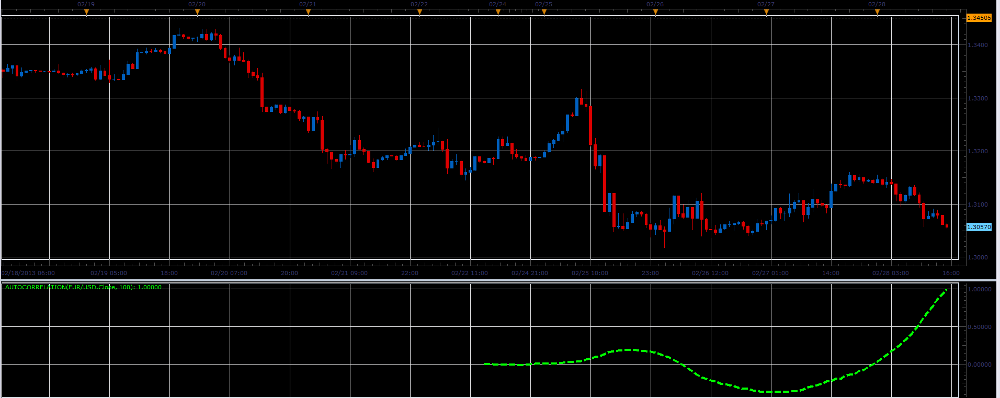

# Autocorrelation function

> Source: https://fxcodebase.com/code/viewtopic.php?f=17&t=32538  
> Forum: 17 · Topic 32538 · 3 post(s)

---

## Autocorrelation function

**Alexander.Gettinger** · Thu Feb 28, 2013 4:44 pm

Indicator calculates the autocorrelation on the specified part of the chart.
Autocorrelation in Wikipedia: [http://en.wikipedia.org/wiki/Autocorrelation](https://en.wikipedia.org/wiki/Autocorrelation)

 

Download:

 [Autocorrelation.lua](files/55429/Autocorrelation.lua)

The indicator was revised and updated

---

## Re: Autocorrelation function

**Alexander.Gettinger** · Thu Feb 28, 2013 5:34 pm

MQL4 version of autocorrelation: [viewtopic.php?f=38&t=32549](https://fxcodebase.com/code/viewtopic.php?f=38&t=32549)

---

## Re: Autocorrelation function

**Apprentice** · Mon May 01, 2017 6:51 am

Indicator was revised and updated.
