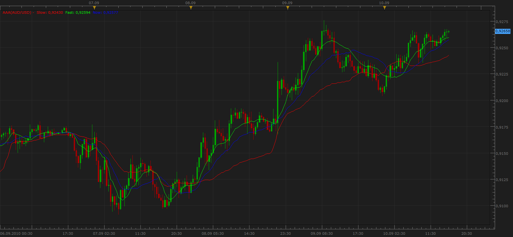

# Automatic Adaptive average

> Source: https://fxcodebase.com/code/viewtopic.php?f=17&t=2138  
> Forum: 17 · Topic 2138 · 14 post(s)

---

## Automatic Adaptive average

**Apprentice** · Sat Sep 11, 2010 6:58 pm

Another baby of my.

If you are always wondering what period moving average to use.
If given the correct answer, he is valid, only at that point.
Due to changes in market volatility waves lengt are variable.

I present to you a Automatic Adaptive Average,
which determine the number of periods for its calculation by himself.
Besides that, the length of the moving average, is changing from period to period.

So for that line of AAA, you can not say, it's MVA 25th
It was at one time, 15 MVA, 25 MVA in the second and so on.

You can say that it have variable length.

Draws three lines.

Blue signal line.
Red Stop Loss line.
Green trigger line.

To Buy signal lines must be appointed to the RBG series.
To Sell signal lines must be placed in series-GBR

 [aaa.bin](files/4409/aaa.bin)

To work should have CP.lua Cycle Period Indicator installed.
 [viewtopic.php?f=17&t=1908&p=3852&hilit=jes](https://fxcodebase.com/code/viewtopic.php?f=17&t=1908&p=3852&hilit=jes)

 [AP_MA.bin](files/4409/AP_MA.bin)

To work should have Tick_CP.lua Cycle Period Indicator installed.
 [viewtopic.php?f=17&t=1908&p=3852&hilit=jes](https://fxcodebase.com/code/viewtopic.php?f=17&t=1908&p=3852&hilit=jes)

---

## Re: Automatic Adaptive average

**DS0167** · Sun Sep 12, 2010 2:07 pm

Hello,

Could you please add the option for the tickness of the line?

Thank you.

Kind regards,
DS0167

---

## Re: Automatic Adaptive average

**Apprentice** · Mon Sep 13, 2010 3:50 am

Done.

---

## Re: Automatic Adaptive average

**Blackcat2** · Mon Sep 13, 2010 10:28 pm

How to install the .bin file? The same as usual?

---

## Re: Automatic Adaptive average

**Blackcat2** · Mon Sep 13, 2010 10:49 pm

Hi Apprentice,

Could you please explain a bit more what do you mean,
"...
To Buy signal lines must be appointed to the RBG series.
To Sell signal lines must be placed in series-GBR
..."

Maybe with example?

Thanks..
BC

---

## Re: Automatic Adaptive average

**Apprentice** · Tue Sep 14, 2010 2:36 am

First.
. Bin files are in all respects the same as with. Lua
Besides hiding the indicators Code.

Second.
For indecision or weak trend indicative is the position of Fast lines (green),
it is then located between the other two.

This rule is not mandatory.
This is part of the recommended trading strategy.

Which recommended that the line listed according to the speed of response,
from the fastest green line to the slowest red line. (GBR)

I have yet to upgrade, the outer part of AAA which detects the length of the cycle.
That part could be applied to the entire series, if not all the indicators, using the period of the cycle as its input variable.

If you have a good algorithm for this job, help will be appreciated.

---

## Re: Automatic Adaptive average

**Apprentice** · Mon Nov 21, 2011 4:17 am

Bin file recompiled for new version of TS.

---

## Re: Automatic Adaptive average

**mhodgson23** · Thu Jan 26, 2017 10:36 pm

Hey Apprentice,

Any chance you would be willing to share either an explanation of the method you used to code this or a snippet of code?

Specifically, I am interested in how you change the period of the moving averages while the indicator is running.

Appreciate anything you are willing to provide.

---

## Re: Automatic Adaptive average

**Apprentice** · Fri Jan 27, 2017 3:17 am

Period is based on Cycle Period Indicator.

---

## Re: Automatic Adaptive average

**Cactus** · Sat Jan 28, 2017 9:47 am

Sounds great.
Could you please add this Automatic Adaptive average into "Averages" indicator?
[viewtopic.php?f=17&t=2430](https://fxcodebase.com/code/viewtopic.php?f=17&t=2430)

So that it can be used by other indicator such as

ATR_Channels.lua
[viewtopic.php?f=17&t=11900&p=47452&hilit=ATR+Band#p47452](https://fxcodebase.com/code/viewtopic.php?f=17&t=11900&p=47452&hilit=ATR+Band#p47452)
Or Averages QQE
[viewtopic.php?f=17&t=1347&p=2585&hilit=qualitative#p2585](https://fxcodebase.com/code/viewtopic.php?f=17&t=1347&p=2585&hilit=qualitative#p2585)

Or can you create the above mentioned indicators, having this average used within them with no "period" setting?

---

## Re: Automatic Adaptive average

**Apprentice** · Sat Jan 28, 2017 1:25 pm

Indicator was revised and updated.

---

## Re: Automatic Adaptive average

**Cactus** · Sat Jan 28, 2017 1:53 pm

That's great to hear.
However, this is not to do with my previous post request, is it?

You are referring to the aaa indicator, and your post from 14 Sept 2010:
"I have yet to upgrade, the outer part of AAA which detects the length of the cycle.
That part could be applied to the entire series, if not all the indicators, using the period of the cycle as its input variable." correct?

I re-downloaded
CP.lua, aaa.bin, Averages.luam QQE,Averages.lua and ATR_Channels.lua but I can nowhere see the option to use aaa as the method of average in those indicators. I'm especially interested in ATR_Channels the most.

---

## Re: Automatic Adaptive average

**mhodgson23** · Sat Jan 28, 2017 10:50 pm

Apprentice, thank you for your responses and your help - much appreciated!

---

## Re: Automatic Adaptive average

**Apprentice** · Sun Jan 29, 2017 6:22 am

I can write ATR channels indicator, with MVA (SMA) as the only moving average option.
