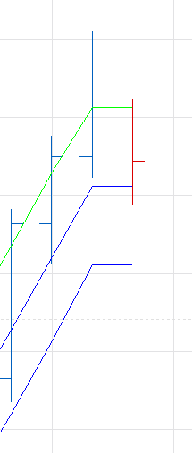

# Automatic Regression Channel

> Source: https://fxcodebase.com/code/viewtopic.php?f=17&t=63567  
> Forum: 17 · Topic 63567 · 7 post(s)

---

## Automatic Regression Channel

**Apprentice** · Mon Jun 06, 2016 4:58 am

Channel will recalculate slope and deviation,
if price exceeds top or bottom line.

 [Automatic Regression Channel.lua](files/106640/Automatic%20Regression%20Channel.lua)

---

## Re: Automatic Regression Channel

**Apprentice** · Mon Jun 06, 2016 5:00 am

Also try this version.
[viewtopic.php?f=17&t=548&p=55604&hilit=raff+channel#p55604](https://fxcodebase.com/code/viewtopic.php?f=17&t=548&p=55604&hilit=raff+channel#p55604)

---

## Re: Automatic Regression Channel

**conjure** · Thu Aug 10, 2017 12:23 pm

Is it possible to add an alert when trend changes?

---

## Re: Automatic Regression Channel

**conjure** · Thu Aug 10, 2017 12:30 pm

Also in the signal to add o signal no trend when the lines are flat?

 

---

## Re: Automatic Regression Channel

**Apprentice** · Sun Aug 13, 2017 2:35 am

Your request is added to the development list, Under Id Number 3845
 If someone is interested to do this task, please contact me.

---

## Re: Automatic Regression Channel

**Alexander.Gettinger** · Fri Oct 20, 2017 11:38 am

> **conjure wrote:**
> Is it possible to add an alert when trend changes?

Please try this version of the indicator:

 [Automatic Regression Channel with Alert.lua](files/115526/Automatic%20Regression%20Channel%20with%20Alert.lua)

---

## Re: Automatic Regression Channel

**Apprentice** · Sat May 05, 2018 6:44 am

The Indicator was revised and updated.
