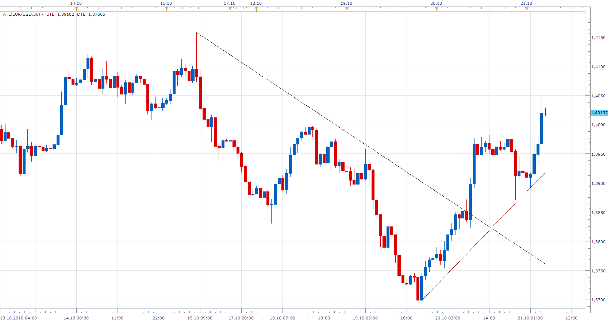

# Automatic Trend Line

> Source: https://fxcodebase.com/code/viewtopic.php?f=17&t=2467  
> Forum: 17 · Topic 2467 · 33 post(s)

---

## Automatic Trend Line

**richardtao** · Wed Oct 20, 2010 9:48 pm

The ATL indicator version 1 is applying of Trading Station II. The target user is junior trader.

ATL stands for Automatic Trend Line.
The purpose is to indentify Up/Down Trend Line Automatic. That could trace current trend more efficiency.
The first parameter is " The minimum number of periods used to mark wave."
This indicator will approach the most meaningful Up Trend Line and Down Trend Line.
The personal suggest that the best parameter setting is 30.
The previous Up Trend Line could be the resistance of rebound from current bearish.
Therefore, previous line will keep till appearance of new trend.
The reason to post this indicator by distinct is just for easy to search for everybody.

 [ATL.lua](files/5392/ATL.lua)

MT4/MQ4 Version of ATL
[viewtopic.php?f=38&t=68816](https://fxcodebase.com/code/viewtopic.php?f=38&t=68816)

---

## Re: Automatic Trend Line

**Apprentice** · Thu Oct 21, 2010 5:10 am

Richard Thank you.
Sorry for the inconvenience.

Another thing.
I get the error message Line 187
Index is Out or range.

I look at it later, or if you find time you can fix it.

---

## Re: Automatic Trend Line

**richardtao** · Thu Oct 21, 2010 10:48 pm

thanks for checking.

the revised version as attached.

---

## Re: Automatic Trend Line

**wizardpro** · Tue Oct 26, 2010 12:34 am

H,
Great product but some question.
I am using this whereby the length 30 does that mean it a time frames or just math for the paramarter to set it?
I am using H4 does that mean I had to convert this 30min to 4 hour into min or just leave the setting ?
When I go for higher time frames the trend seemed wrong.

---

## Re: Automatic Trend Line

**wizardpro** · Tue Oct 26, 2010 12:48 am

Hi
Base on the parameter setting at 30 ? Was it a default or was it a time frames which I had to change it if such as changing from H4 ?
The result seemed differnet from 30min and H4 as highlight the trend lin in blue and Red line as show in the images below.
Sceen shot 01 show 30min time frames for Eur/JPY
screen shot 02 show H4 Time frames for Eur/Jpy but it out of the line .
Please do advise.
Images attachment as below expired link on 30th Oct.
Here's the link to this file:
[http://www.yousendit.com/download/ZGJlY ... NE5jR0E9PQ](http://www.yousendit.com/download/ZGJlYnV6Q0N6NE5jR0E9PQ)

---

## Re: Automatic Trend Line

**richardtao** · Tue Oct 26, 2010 11:01 pm

hi wizardpro

the first parameter is the minimun periods to determin the pervailed trend at the selected time frame in this version.
the recommanded 30 is applied for every time frame.
the indicator will catch difference peaks at the difference time frames.
so that if you want to catch the same peak you need to enlarge parameter at the samller time frame.

in the screenshot002, the previous line is down.
the indicator won't regard 10/25 13:00 as a up trend bottom until break out line or high around 113.9.
the indicator says that from 10/06 around, the price could be constrained by the down trend line till break out.
the closely up trend line is not built by the most currently. it means the up trend is not solid yet.
therefore, the pervailed trend is still down.

in the screenshot002, the story is a little bit diference.
the indicator says that the closely up trend line is built by the most currently price pattern. it means the trend is forming into up.
in such price pattern, it mostly like to be wedge. for your reference.

---

## Re: Automatic Trend Line

**richardtao** · Tue Oct 26, 2010 11:06 pm

sorry the last paragraph is talk to screenshot001. it should be:
in the screenshot001, the story is a little bit diference.
the indicator says that the closely up trend line is built by the most currently price pattern. it means the trend is forming into up.
in such price pattern, it mostly like to be wedge. for your reference.

---

## Re: Automatic Trend Line

**jtatalov** · Tue Sep 06, 2011 4:55 am

Richardtao,

I just recently downloaded this indicator and love it, but it doesn't seem to recalculate when a new period takes place. I actually have to update my charts manually to get the like to extend to the current candle. Is this something that can be fixed?

Thanks in advance

J~

---

## Re: Automatic Trend Line

**richardtao** · Wed Sep 14, 2011 9:45 pm

hi J
try this version
if any problem please notice me, thanks!

 [ATL.lua](files/14968/ATL.lua)

---

## Re: Automatic Trend Line

**Blackcat2** · Fri Mar 01, 2013 3:04 am

Could we please have line style option be added?

Thanks
BC

---

## Re: Automatic Trend Line

**richardtao** · Tue Mar 05, 2013 7:03 am

hello blackcat2,
please try this version.

 [ATL_v2.bin](files/55743/ATL_v2.bin)

---

## Re: Automatic Trend Line

**kankatrader** · Sun Apr 19, 2015 11:48 am

Hello,
can we have Strategy for this Automatic Trend line indicator?

Following desqription:

Line Up crossing over: No Action/Buy / Sell or Close Position.
Line Up crossing under: No Action/Buy / Sell or Close Position.

Line Down crossing over: No Action/Buy / Sell or Close Position.
Line Down crossing under: No Action/Buy / Sell or Close Position.

Max Distance Filter Pips
Close Opposite On Signal Yes/NO

Thanks in advance

---

## Re: Automatic Trend Line

**Apprentice** · Mon Apr 20, 2015 4:07 am

Your request is added to the development list.

---

## Re: Automatic Trend Line

**4x4partners** · Tue Apr 28, 2015 4:49 am

Hi Richard,
I get an error in trying to open this file. Would you mind to repost with the latest versions in separate files please?

Thanks!

> **richardtao wrote:**
> hello blackcat2,
> please try this version.
>
>
>
> ATL_v2.bin

---

## Re: Automatic Trend Line

**forexakrep** · Fri May 01, 2015 7:10 pm

Hi Richard,

is it possible to show Automatic Trend Line on Tick Charts?

Thanks in advance

---

## Re: Automatic Trend Line

**richardtao** · Mon May 04, 2015 3:21 am

hello 4x4partners,

are you saying that open it by text editor ? if yes:
ATL_v2.bin is the binary file. it's difficult to read by human beings.
it can be imported into TSII as customer indicator directly.
if there had error please provide the error message on screen.

Rgds.

---

## Re: Automatic Trend Line

**richardtao** · Mon May 04, 2015 3:25 am

hello forexakrep,

the tick version will be built in the future.
please wait for a while.

---

## Re: Automatic Trend Line

**SANTOSH** · Sun May 10, 2015 3:01 am

There's nothing like it on the forum,

and if you can code such an indicator, I believe it will alert the test, or

break out of all the best 'human like' trend lines. If you do it, so it works

in all of FXCM's markets, for the FX can you just count the 0.0001 as the

tick and ignore the 5th decimal. That way, it will work in FX, equity and

commodity. However for gold make $0.10 as the tick, so it is similar to

future market ticks.

________________________________________________________________

The following pseudo code details an improved Automatic Trend line (TL) called

(NewATL), the explanation is done with respect to a bullish TL tests for 'up'

TL's, but obviously the indicator will annotate and alert up and down TL's, plus

the corresponding parallel channel line. It's meant to be an improvement over

the original custom indicator posted here:

[http://74.52.98.37/code/viewtopic.php?f ... 67&p=14577](http://74.52.98.37/code/viewtopic.php?f=17&t=2467&p=14577)

Summary: The logic is composed so the indicator adds TL's, updates them, or

then voids them in the most human way possible. It will therefore alert the touch

(test) of a TL, or the break out of a TL. This spec will therefore cover 7 main

functions to achieve this:

1. The NewATL settings,

2. The TL start position

3. The secondary steeper TL's

4. The TL void rules

5. The TL updates rules.

6. The trend channel line (TC).

7. The alert functions.

1. The TL settings:

- The 'Time Frame' setting will give 4 Booleans to annotate the ATL's for the main

time frames:

1. Show Weekly (YES/NO)

2. Show Daily (YES/NO)

3. Show Hourly (YES/NO)

4. Show m5 (YES/NO) for intra-day TL's.

These 4 main time frame define all the important market structure to which price

mostly interacts with. The same logic that defines the TL is used for all the time

frames.

- The NewATL will need the same 'style' settings as the 'Add Line' parameters

from marketscope 2.0. This is helpful because the different time frame TL's

can be given difference colors or widths.

- The ' Extended Length' setting is needed to extend ATL's into the future on the

chart [X] periods past the current price bar; this allows the trader to see where the

TL will get support tests.

- A ' penetration tolerance' setting is needed. The third test of the 'potential'

trend line is where most TL's hold or fail; the penetration tolerance lets the

equation of the TL get crossed by price [X] ticks below. If the penetration tolerance is not exceeded, then the original TL's angle which is based off the 2 original zigzag points is kept. This confirms the TL support held, then the TL will then alert at the 4th test of that original TL (see alert settings).

See the third test of the blue line in the dashed section

<http://tiny.cc/us30-5>

- The 'draw limit' can be an integer value that will limit the number of updated

TL's that can draw from an original start point. A default value of 4 can be used.

Once the TL is tested by price, the indicator logic needs to pause TL signals until price gets back above the TL. Once price is over the TL by an amount equal

to the penetration tolerance; the TL then becomes active again, and it will alert tests of the line equation when touched from above for up TL's.

If the penetration tolerance limit is exceeded, the original TL is 'greyed out' and left on the chart, and it no longer signal price test alerts. The greyed out trend line's

start and end points are saved to an multidimensional array, this is needed because it can be used to back test other signals against the TL tests if the LUA code is altered by another user. Price reversal signals like divergences tend to be found at TL support tests.

US30 daily chart, not the original TL from the two lows is left grey.

<http://tiny.cc/us30-2> file name 2015.03.06 2200 US30 DAILY - updated TL

 No closes below the TL's 3rd test

<http://tiny.cc/us30-6>

2. The start point for up trend lines:

The beginning of a 'key' TL should start at the edge of the range, the best way to ensure the start point is:

A) The newATL will use the ZigZag indicator (zig for short) to define the price troughs; therefore an ATL will start from a Zigzag trough which will therefore be a price trough. That zig TL start point will also be a "lower low" to a prior zig trough.

B) The TL start point is a 'zig lower low', plus it will also have printed afterwards a 'zig higher high' immediately following the low. This inverted head and shoulders of Zig yields the start point.

The US30 weekly chart below shows a TL zig start point.

<http://tiny.cc/us30-1> file name 2015.03.06 2200 US30 weekly key low with 3 points.

The 'second TL point' which then establishes the angle of a possible TL is another zig/price trough that is higher than the start level. This 'potential' TL will remain valid until it receives a third touch (test).

If case price rallies aggressively and the 'potential' TL is not touched a third time (virgin TL), the indicator can also start scanning for steeper TL's with their start point becoming the second point of the 'potential' TL, or another zig inside but higher. All steeper trend lines will also use the same logic to define their start point.

3. The secondary steeper TL (inside virgin TL)

After a 'potential' TL is in place with two points, so long as it hasn't been tested, the indicator will also scan for steeper TL that has a less picky start point. These steeper TL's can start from the potential TL's 'second point', or they will find new ones with the zig inverted H&S pattern. The only condition needed is that the steeper TL's start point will be a higher price than the virgin TL's start point.

US30 weekly, the indicator annotates steep TL's inside potential 'virgin' TL's

<http://tiny.cc/us30-3>

file name : 2015.03.06 US30 weekly - STEEPER TL

4. The TL void rules.

- IF the penetration tolerance is exceeded (at bar close) at the 3rd test, THEN that 'potential' TL is greyed out, and left on the chart, but will not alert further. The same applies for all other tests of the TL, once the price closes below it great than the penetration tolerance, it is void.

5. The TL update rules

When a 'potential' TL fails at it's third test, if price continues to make a deeper pull back, once that messy third test prints a zig trough, a new TL can

update here as a second point. We now have a new virgin potential TL to watch so

long as it is an up TL.

IF this new second point fails again, the indicator can continue to draw potential TL's from the original start point, provided they are still 'up' TL's, or until the draw limit is exceeded for that original start point.

These two conditions take care of the messy tests when repainting the TL is needed. However, if the third test holds, then there is one house keeping

rule.

- 'pinching down' a TL. Once the fourth test has completed, and price

is back above the TL, IF the third test was messy, then the low of that

third test can be made the TL's second point; meaning the original TL

and be repainted less steep. This just gives the lowest possible up TL.

6. The trend channel line (TC).

Again with respect to only up TL's. Once an established TL has 3 tests in place,

the indicator will add a parallel TC line from the highest zig peak between the

start point and the 3rd lower test.

TC's can be voided when their topside penetration tolerance is violated, and if

this occurs, they could be updated to the widest peak.

A TC start from an established potential TL.

<http://tiny.cc/us30-7>

7. The TL alert functions.

These setting need four Booleans.

1. The '3rd test alert' ' YES/NO. If the bool is set to NO, the indicator will ignore the 3rd test and only alert at the 4th or more test of an 'established' trend line. The third test of any potential TL is the 'make or break' point; so it is less likely to hold than the 4th test. When the bool is set to YES, the indicator will include the 3rd test.

2. The 'Break out (BO) alert' (yes/no). TL break outs only occur after the third

test is in place, so when this bool is set to YES, the indicator will alert any time

a penetration tolerance fails at a TL's 4th or more test. This is a good signal because trading the failure of a trend can provide an edge.

3. The Trend Channel (TC) alert has two Booleans. As we know, once there is an 'established' TL with 3 tests in place, the indicator calculates the opposite parallel TC line from one point that gives it the angle.

3a. 'Alert TC test' (yes/no). When set to YES the indicator will alert the second and

all subsequent tests of a TC until the lower TL is void.

3b. 'Skip TC 2nd test' (YES/NO). When set to YES, the second test of a TC is

skipped and it only alert at the 3rd test of a TC.

---

## Re: Automatic Trend Line

**SANTOSH** · Sun May 10, 2015 3:06 am

hi Richard ,

CAN YOU WORK ON THE NEW ATL SPECS PROVIDED BY MY FRIEND ,

DETAILS ARE IN THE BELOW LINK PROVIDED ,A LOT OF EFFORTS HAS BEEN PUT TO REVISE IT ,
SO CAN YOU KINDLY WORK ON IT AND REVISE THE SAME ?

[viewtopic.php?f=27&t=62011&p=99343&hilit=new+atl#p99343](http://www.fxcodebase.com/code/viewtopic.php?f=27&t=62011&p=99343&hilit=new+atl#p99343)

---

## Re: Automatic Trend Line

**rtsayers** · Mon May 11, 2015 3:12 pm

Hi Richard

I am having problems with the lines not refreshing on the 15min and 1 hour I downloaded the ATL v2?

My settings at 30

Thanks

---

## Re: Automatic Trend Line

**SANTOSH** · Tue May 19, 2015 5:46 pm

> **richardtao wrote:**
> hello blackcat2,
> please try this version.
>
>
>
> ATL_v2.bin

 how can i get the lua file from it , is there a way to get lua form the bin file ??

thanks ,
santosh

---

## Re: Automatic Trend Line

**Apprentice** · Wed May 20, 2015 3:48 am

As far as I know, only way to get this code
is to ask Richard to reveal it.

---

## Re: Automatic Trend Line

**SANTOSH** · Wed May 20, 2015 2:06 pm

thanks apprentice for your feedback ,

richard , can u provide the lua file for it ??

thanks ,
santosh

---

## Re: Automatic Trend Line

**richardtao** · Thu May 21, 2015 1:58 am

hello SANTOSH

your request has been post at NewATL thread.
it seems that had responsed by Apprentice.
who is very highly recommended expert.

the source code was post in the first page of this thread.
version 2 just revised for a little.
BTW, the ATL is not a big deal.
the backtest of trend line is poor.
please don't expect too much.

---

## Re: Automatic Trend Line

**richardtao** · Thu May 21, 2015 2:07 am

hello rtsayers,

would you please describe the process?
in what instrument? time frame?
is error occur in loading?
is error occur after how may bars?
what is wording of the error log in events tag?
please provide the error screenshot.
thanks!

---

## Re: Automatic Trend Line

**richardtao** · Thu May 21, 2015 2:19 am

hello there,

the tick only version attached.
there is one imperfection.
the tick chart draw at the side of each time interval by system.
but the line draw at the center of each interval by default.
sometimes it shows a difference gap in intersection.

 [ATL_tick.bin](files/100570/ATL_tick.bin)

---

## Re: Automatic Trend Line

**SANTOSH** · Thu May 21, 2015 8:05 am

> **richardtao wrote:**
> hello SANTOSH
>
> your request has been post at NewATL thread.
> it seems that had responsed by Apprentice.
> who is very highly recommended expert.
>
> the source code was post in the first page of this thread.
> version 2 just revised for a little.
> BTW, the ATL is not a big deal.
> the backtest of trend line is poor.
> please don't expect too much.

Hi Richard ,
Thanks for your feedback !!
Actually I am not going to see trendline as a alone technical indicator ..
I want to line up the RSI divergence and the reverse RSI divergence near the proximity of a trendline ..

Actually I have completed coding the RSI and reverse divergence entries ,
I am just in search and a theory to get a good long or short bias set up .
Once that done , then will see bullish divergence for a long bias and bearish divergence for a short bias !!

Yes ..apprentice helped me in clearing my doubts for sure ..thanks to him too..

Can u help me in getting just good bias set up? All my work will then sweeten up !!

Thanks ,
SANTOSH .

---

## Re: Automatic Trend Line

**SANTOSH** · Sun May 24, 2015 3:04 pm

hi apprentice and richard ,
the work i am trying to do with trendlines are below,
its the beauty of markets , that it gets lined up so beautifully ,
can any help in getting those set ups ?

thanks,
santosh

---

## Re: Automatic Trend Line

**richardtao** · Tue Jun 02, 2015 11:37 pm

hello SANTOSH,
Sorry, i am not interesting in this study.
do you mind do it by yourself.
the ATL source code had post in the beginning.

regards, richard.

---

## Re: Automatic Trend Line

**SANTOSH** · Fri Jun 05, 2015 8:42 am

No problem Richard .

But can you help with the NEW ATL ,
Subjected in the forum ?

---

## Re: Automatic Trend Line

**jebsrai** · Thu Sep 08, 2016 10:24 am

Hi Richardtao, can you please

(1) put optional extension lines in both directions and
(2) allow 2 indicators at once for example if you are in 1h time frame, can there be 8h or daily indicator seen automatically.

Many Thanks!

---

## Re: Automatic Trend Line

**Apprentice** · Fri Sep 09, 2016 10:22 am

Your request is added to the development list, Under Id Number 3620
If someone is interested to do this task, please contact me.

---

## Re: Automatic Trend Line

**Apprentice** · Fri Sep 07, 2018 11:34 am

The indicator was revised and updated.
