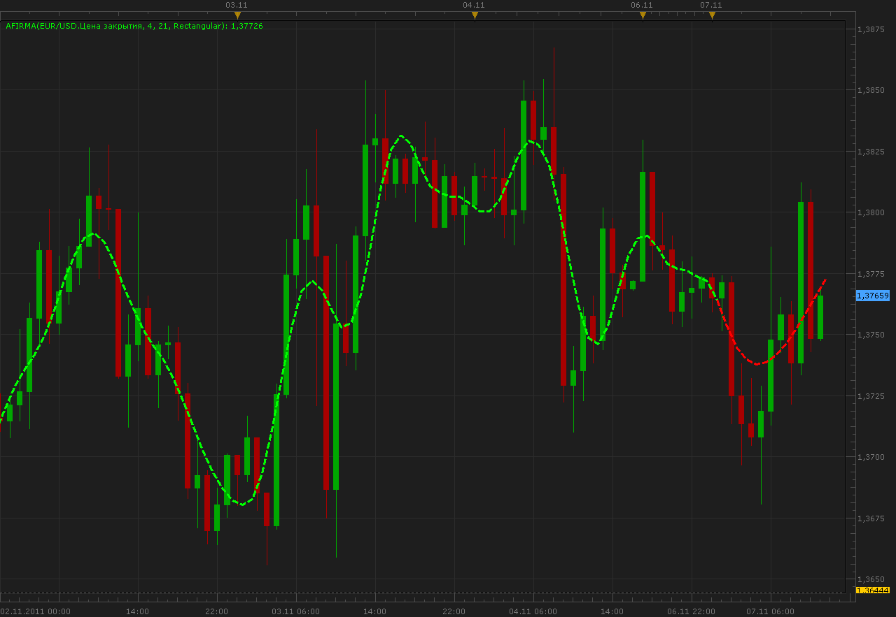

# Autoregressive Finite Impulse Response MA

> Source: https://fxcodebase.com/code/viewtopic.php?f=17&t=7888  
> Forum: 17 · Topic 7888 · 2 post(s)

---

## Autoregressive Finite Impulse Response MA

**Alexander.Gettinger** · Mon Nov 07, 2011 11:12 am

This indicator is a ported MQL5 indicator from [http://www.mql5.com/ru/code/603](http://www.mql5.com/ru/code/603) (in Russian).
The indicator uses 5 filter options.

 

Download:

 [AFIRMA.lua](files/17490/AFIRMA.lua)

The indicator was revised and updated

---

## Re: Autoregressive Finite Impulse Response MA

**Apprentice** · Sun Mar 19, 2017 10:50 am

Indicator was revised and updated.
