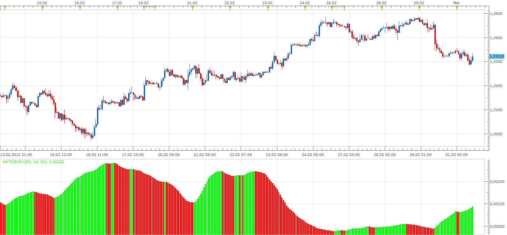

# Average Average True Range

> Source: https://fxcodebase.com/code/viewtopic.php?f=17&t=14414  
> Forum: 17 · Topic 14414 · 4 post(s)

---

## Average Average True Range

**Apprentice** · Thu Mar 01, 2012 10:53 am

This simple indicator is just that, as its name suggests.
Average of ATR.

 [AATR.lua](files/27358/AATR.lua)

The indicator was revised and updated

---

## Re: Average Average True Range

**waelsaleem** · Tue Mar 06, 2012 11:49 pm

Dear Apprentice,

Thank you so much for the AATR. It works perfectly. Note in the graph I attached how it has helped me position the watch zone of the breakout strategy in an optimal position to be able to catch the breakout. Also note how Fibonacci extensions work perfectly. I hope I will be able to backtest the Breakout strategy with GMMACD filter and Fibo Trace I requested.

Thanks for a great job.

---

## Re: Average Average True Range

**Alexander.Gettinger** · Tue Nov 18, 2014 5:08 pm

MQL4 version of Average Average True Range: [viewtopic.php?f=38&t=61477](https://fxcodebase.com/code/viewtopic.php?f=38&t=61477).

---

## Re: Average Average True Range

**Apprentice** · Wed Jun 28, 2017 5:21 am

The indicator was revised and updated.
