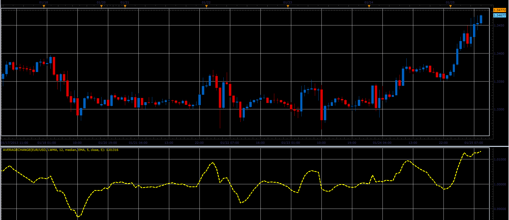

# Average change indicator

> Source: https://fxcodebase.com/code/viewtopic.php?f=17&t=31486  
> Forum: 17 · Topic 31486 · 2 post(s)

---

## Average change indicator

**Alexander.Gettinger** · Mon Jan 28, 2013 4:37 pm

This indicator is a ported MQL5 indicators from [http://www.mql5.com/en/code/1446](http://www.mql5.com/en/code/1446)

Formulas:
Average change = MA2(Ratio), where
Ratio = (Price/MA1(Price))^Power.

 

Download:

 [AverageChange.lua](files/53717/AverageChange.lua)

For this indicator must be installed Averages indicator ([viewtopic.php?f=17&t=2430](https://fxcodebase.com/code/viewtopic.php?f=17&t=2430)).

The indicator was revised and updated

---

## Re: Average change indicator

**Apprentice** · Mon May 01, 2017 5:48 am

Indicator was revised and updated.
