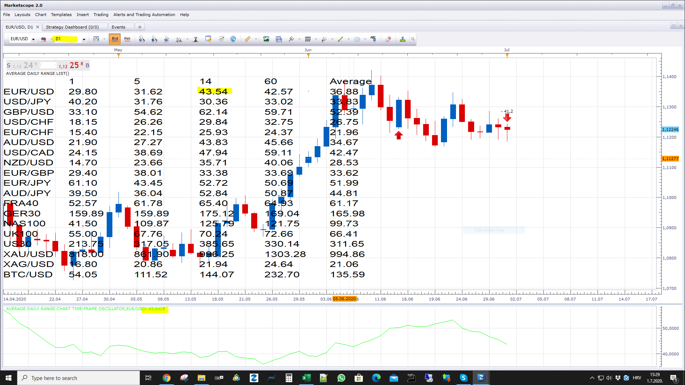

# Average Daily Range List

> Source: https://fxcodebase.com/code/viewtopic.php?f=17&t=70111  
> Forum: 17 · Topic 70111 · 5 post(s)

---

## Average Daily Range List

**Apprentice** · Wed Jul 01, 2020 8:25 am

 [Average Daily Range List.lua](files/135509/Average%20Daily%20Range%20List.lua)

 [Average Daily Range Chart Time Frame Oscillator.lua](files/135509/Average%20Daily%20Range%20Chart%20Time%20Frame%20Oscillator.lua)

---

## Re: Average Daily Range List

**chai88888** · Wed Jul 01, 2020 10:12 am

it is not have the same output value as the average daily range indicator

---

## Re: Average Daily Range List

**Apprentice** · Wed Jul 01, 2020 10:19 am

---

## Re: Average Daily Range List

**chai88888** · Mon Jul 13, 2020 5:16 am

hi there

theirs a difference between the average daily range and average daily range indicator.

im talking about the **average daily range indicato**r

---

## Re: Average Daily Range List

**Apprentice** · Wed Aug 05, 2020 6:20 am

Reply posted here.
[viewtopic.php?f=17&t=9374&start=30](https://fxcodebase.com/code/viewtopic.php?f=17&t=9374&start=30)
