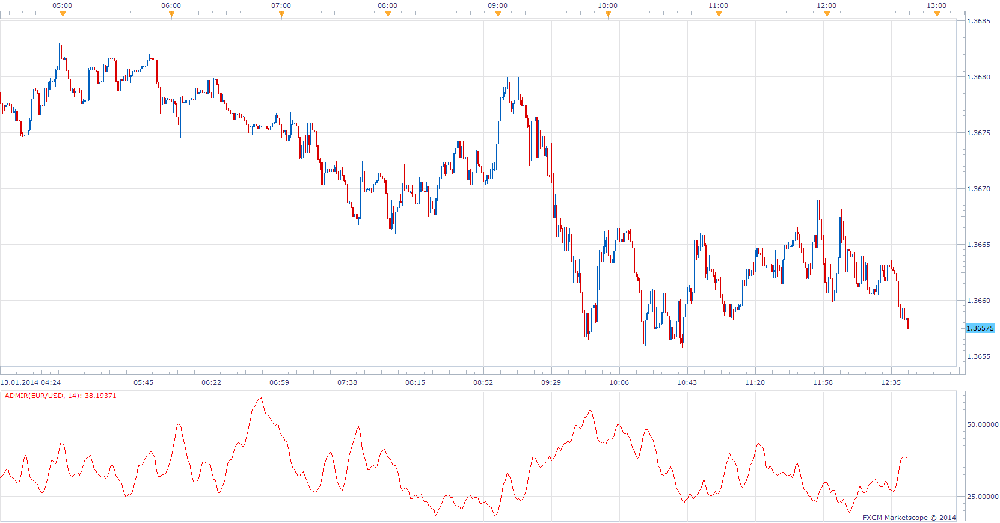

# Average Directional Movement Index Rating

> Source: https://fxcodebase.com/code/viewtopic.php?f=17&t=60198  
> Forum: 17 · Topic 60198 · 8 post(s)

---

## Average Directional Movement Index Rating

**Apprentice** · Mon Jan 13, 2014 6:45 am

Introduced in Wilders Book New Concept In TTS

ADXR stands for Average Directional Movement Index Rating, and is a component of the Directional Movement System developed by Welles Wilder. This system attempts to measure the strength of price movement in positive and negative directions, as well as the overall strength of the trend.
ADXR = ( ADX(today) + ADX(n days ago) ) / 2

 [ADMIR.lua](files/91956/ADMIR.lua)

The indicator was revised and updated

---

## Re: Average Directional Movement Index Rating

**Jeffreyvnlk** · Mon Jan 13, 2014 8:38 pm

This great and could you give an option for a level pls ? Welles Wilders said if ADXR under 20-25 it sort of non trending market.Thanks

---

## Re: Average Directional Movement Index Rating

**Alexander.Gettinger** · Mon Aug 18, 2014 12:34 pm

MQL4 version of Average Directional Movement Index Rating: [viewtopic.php?f=38&t=61044](https://fxcodebase.com/code/viewtopic.php?f=38&t=61044).

---

## Re: Average Directional Movement Index Rating

**Apprentice** · Wed Aug 20, 2014 2:09 pm

Level Lines Added.

---

## Re: Average Directional Movement Index Rating

**Jeffreyvnlk** · Mon Sep 22, 2014 9:08 am

> **Apprentice wrote:**
> Level Lines Added.

Appreciated if you could mark an arrow on the bar chart when the indicator crosses above or under level lines

---

## Re: Average Directional Movement Index Rating

**Apprentice** · Tue Sep 23, 2014 5:02 am

Arrow Option Added.

---

## Re: Average Directional Movement Index Rating

**Jeffreyvnlk** · Wed Sep 24, 2014 12:50 pm

> **Apprentice wrote:**
> Arrow Option Added.

So good.Thanks

---

## Re: Average Directional Movement Index Rating

**Apprentice** · Fri Jun 23, 2017 7:00 am

The indicator was revised and updated.
