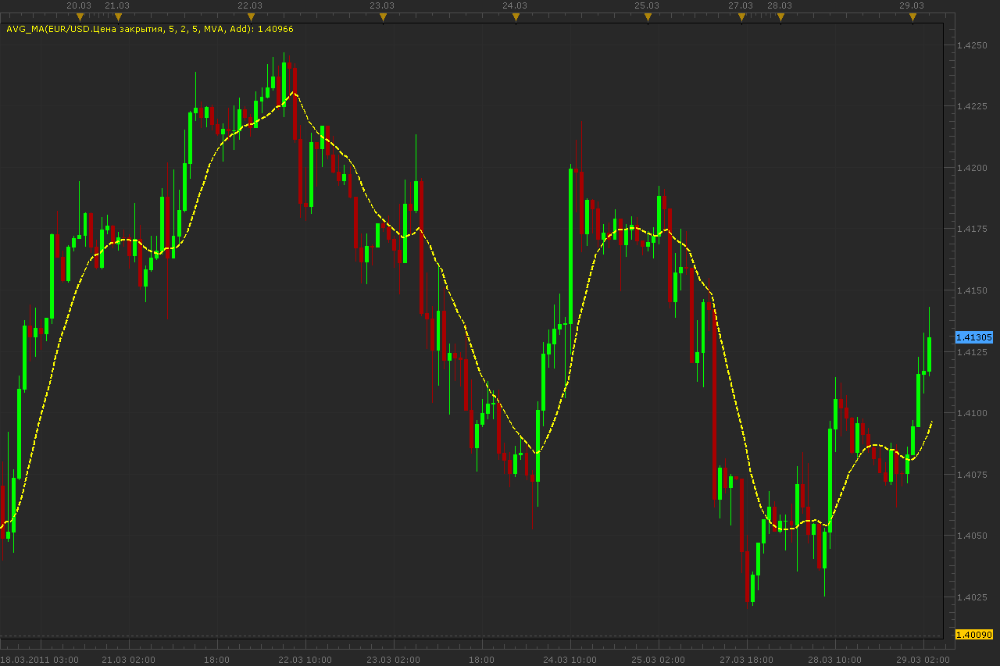

# Average from MA

> Source: https://fxcodebase.com/code/viewtopic.php?f=17&t=3767  
> Forum: 17 · Topic 3767 · 2 post(s)

---

## Average from MA

**Alexander.Gettinger** · Tue Mar 29, 2011 2:53 am

Indicator is a averages value from several MA.

For example:
if first period=5,
K=2,
Count of MA=5
Avg_MA=(MA(5)+MA(7)+MA(9)+MA(11)+MA(13))/5.

 

Download:

 [Avg_MA.lua](files/9151/Avg_MA.lua)

The indicator was revised and updated

---

## Re: Average from MA

**Apprentice** · Fri Mar 03, 2017 9:20 am

Indicator was revised and updated.
