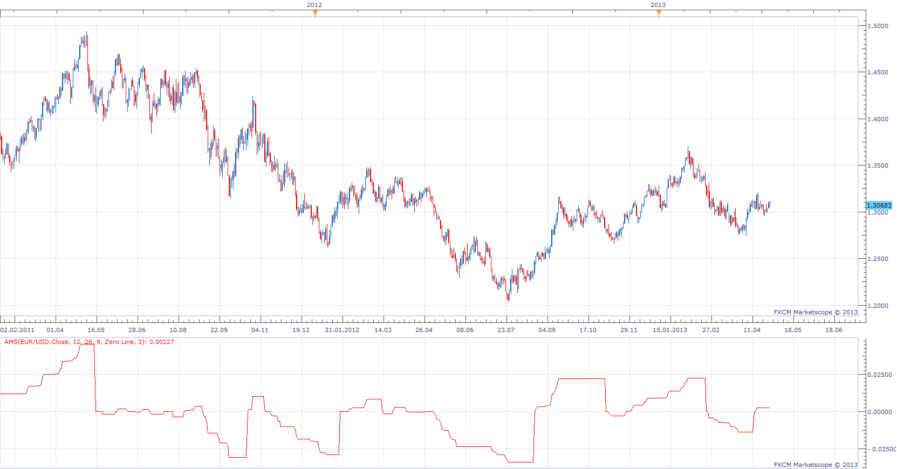

# Average MACD Swing

> Source: https://fxcodebase.com/code/viewtopic.php?f=17&t=36070  
> Forum: 17 · Topic 36070 · 3 post(s)

---

## Average MACD Swing

**Apprentice** · Tue Apr 30, 2013 6:54 am

 [AMS.lua](files/60675/AMS.lua)

The indicator was revised and updated

---

## Re: Average MACD Swing

**Alexander.Gettinger** · Mon Sep 15, 2014 12:16 pm

MQL4 version of Average MACD Swing: [viewtopic.php?f=38&t=61151](https://fxcodebase.com/code/viewtopic.php?f=38&t=61151).

---

## Re: Average MACD Swing

**Apprentice** · Sat Jun 24, 2017 4:54 am

The indicator was revised and updated.
