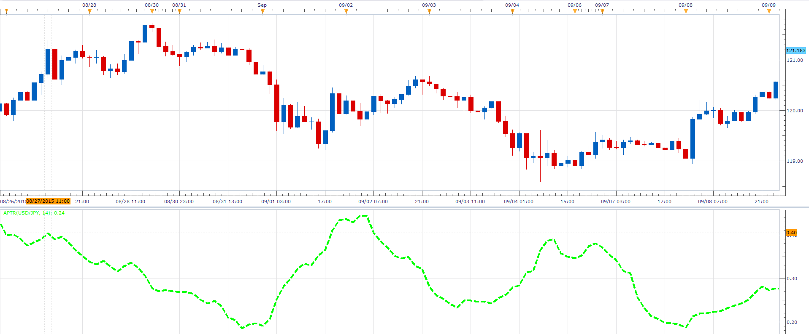

# Average Percentage True Range

> Source: https://fxcodebase.com/code/viewtopic.php?f=17&t=62823  
> Forum: 17 · Topic 62823 · 2 post(s)

---

## Average Percentage True Range

**Alexander.Gettinger** · Fri Oct 23, 2015 12:07 pm

This indicator has been described in the Stock&Commodities (November 2015).

 

Download:

 [APTR.lua](files/102999/APTR.lua)

Version with different smoothing methods:

 [APTR_MA.lua](files/102999/APTR_MA.lua)

---

## Re: Average Percentage True Range

**Apprentice** · Fri Oct 12, 2018 5:20 am

The indicator was revised and updated.
