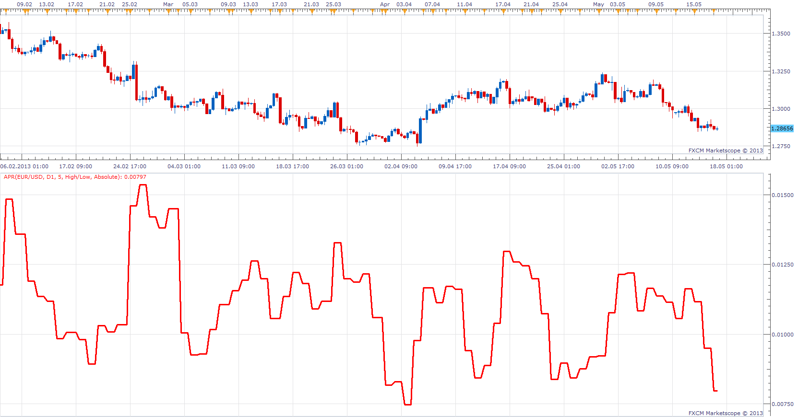

# Average Period Range

> Source: https://fxcodebase.com/code/viewtopic.php?f=17&t=38110  
> Forum: 17 · Topic 38110 · 9 post(s)

---

## Average Period Range

**Apprentice** · Fri May 17, 2013 4:00 am

Will show Average Range of Data for last N periods.

Range Method
abs(Open-Close) or High-Low

Presentation of Results
Absolute
Relativ - as a percentage

 [APR.lua](files/63087/APR.lua)

---

## Average Period Range Projections

**Apprentice** · Fri May 17, 2013 4:24 am

 [APR Projections.lua](files/63092/APR%20Projections.lua)

---

## Re: Average Period Range

**sho-me-pips** · Tue May 28, 2013 12:05 pm

> **Apprentice wrote:**
> Will show Average Range of Data for last N periods.
>
> Range Method
> abs(Open-Close) or High-Low
>
> Presentation of Results
> Absolute
> Relativ - as a percentage

Would you modify this indicator to the following math, or write a new indicator.

Range Method
Up=(High-Low)/(CurrentPrice-Low)/100 Green line when changes to up
Down=(High-Low)/(High-CurrentPrice)/100 Red line when changes to down
Current bar in not part of the calculated range. When indicator reaches 101% you have a breakout of the range.

---

## Re: Average Period Range

**Apprentice** · Sun Jun 02, 2013 11:38 am

Your request is added to the development list.

---

## Re: Average Period Range

**Apprentice** · Mon Jun 03, 2013 12:11 pm

Something like this.
[viewtopic.php?f=17&t=39716&p=65210#p65210](https://fxcodebase.com/code/viewtopic.php?f=17&t=39716&p=65210#p65210)

---

## Re: Average Period Range

**sho-me-pips** · Mon Jun 03, 2013 3:52 pm

Exactly!! Thank You very much.

---

## Re: Average Period Range

**Alexander.Gettinger** · Wed Aug 14, 2013 3:07 pm

MQL4 version of Average Period Range: [http://www.fxcodebase.com/code/viewtopi ... 38&t=59129](http://www.fxcodebase.com/code/viewtopic.php?f=38&t=59129).

---

## Re: Average Period Range

**Apprentice** · Sun Feb 18, 2018 7:48 am

The indicator was revised and updated.

---

## Re: Average Period Range Projections

**7510109079** · Fri Feb 08, 2019 8:48 am

> **Apprentice wrote:**
>
>
> APR Projections.png
>
>
>
>
> APR Projections.lua

can a history option be added to this which would plot prior period ranges?
