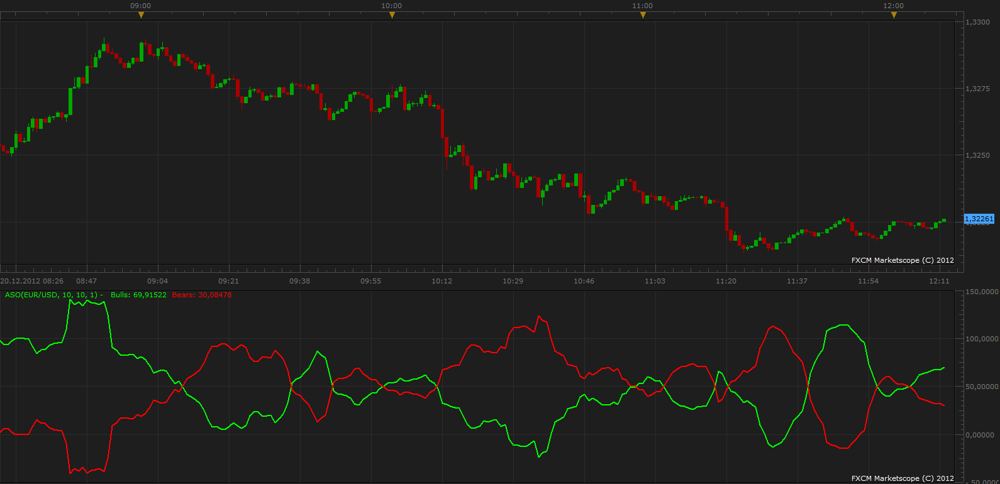

# Average Sentiment Oscillator

> Source: https://fxcodebase.com/code/viewtopic.php?f=17&t=27860  
> Forum: 17 · Topic 27860 · 3 post(s)

---

## Average Sentiment Oscillator

**Apprentice** · Thu Dec 20, 2012 12:08 pm

 [ASO.lua](files/48849/ASO.lua)

The indicator was revised and updated

---

## Re: Average Sentiment Oscillator

**Alexander.Gettinger** · Tue Sep 23, 2014 10:24 am

MQL4 version of Average Sentiment Oscillator: [viewtopic.php?f=38&t=61229](https://fxcodebase.com/code/viewtopic.php?f=38&t=61229).

---

## Re: Average Sentiment Oscillator

**Apprentice** · Fri Jun 23, 2017 7:16 am

The indicator was revised and updated.
