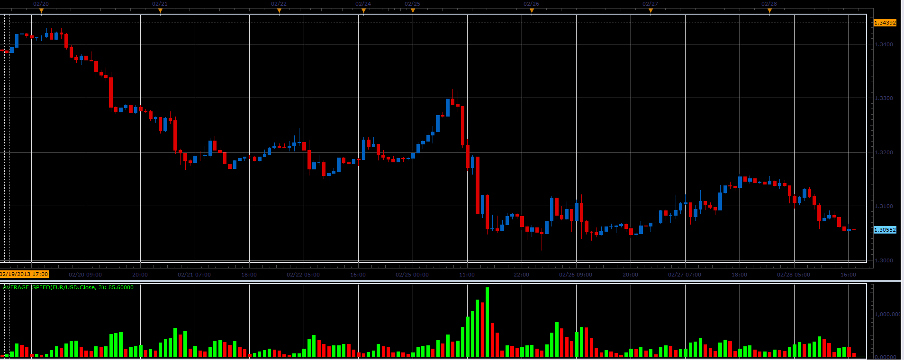

# Average speed

> Source: https://fxcodebase.com/code/viewtopic.php?f=17&t=32557  
> Forum: 17 · Topic 32557 · 13 post(s)

---

## Average speed

**Alexander.Gettinger** · Thu Feb 28, 2013 6:30 pm

This indicator is a ported MQL5 indicators from [http://www.mql5.com/en/code/1544](http://www.mql5.com/en/code/1544).

The Average Speed indicator measures how quickly the price is changing per unit of time (typically per second), adjusted by the instrument’s pip size. It then calculates the average of these speed values over a specified number of periods.

This helps traders understand how active or volatile the market is over time.

Formula
Speed between two ticks:

Speed[period] = |Price[period] - Price[period - 1]| / (pipSize × Δt)
Where Δt is the time difference between the two ticks.

Average Speed over N periods (e.g., 3):

AS[period] = average(Speed[period - N + 1] to Speed[period])
The indicator displays the average speed in green if it's increasing and red if it's decreasing.

Download:

 [Average_Speed.lua](files/55455/Average_Speed.lua)

 [Average_Speed with Alert.lua](files/55455/Average_Speed%20with%20Alert.lua)

---

## Re: Average speed

**Apprentice** · Mon May 01, 2017 6:46 am

Indicator was revised and updated.

---

## Re: Average speed

**Apprentice** · Mon Aug 05, 2024 3:10 am

Average_Speed with Alert.lua added.

---

## Re: Average speed

**mayk01** · Tue Aug 06, 2024 4:12 pm

Hi Apprentice,
That's great. Looks like it's working fine.
It helps very well in changing fractal situations.

Regards,
M.

---

## Re: Average speed

**mayk01** · Thu Mar 20, 2025 1:24 am

Hi Apprentice,
Can it be converted with a new name so that it is two-sided? I mean so that the direction of the speed coincides with the direction of the price? Also is it possible to add a signal arrow where it has crossed or touched the set alarm?

Regards,
M.

---

## Re: Average speed

**Apprentice** · Fri Mar 21, 2025 6:02 am

We have added your request to the development list.
Development reference 214

---

## Re: Average speed

**Apprentice** · Wed Mar 26, 2025 1:48 pm

Directional Separation (Up vs Down Candles):
Unlike the basic Average Speed indicator which calculates the overall price movement speed regardless of direction, Directional Average Speed separates the speed of up candles and down candles into two distinct streams. This allows you to see how fast price moves up versus how fast it moves down.

Two Outputs vs One:

Average Speed has a single output line showing the average speed of price changes.

Directional Average Speed has two outputs (if not cumulative):
One for up-candle average speed
One for down-candle average speed

Cumulative Mode:
The Directional version has a Cumulative option to merge the up/down values into a single stream (as either a difference or sum), something not available in the original.

Absolute (Use absolute value)
If enabled (true), calculates the absolute price change (ignores direction). If disabled, the indicator retains the direction (positive for up, negative for down).

Cumulative
If enabled, combines up and down speeds into a single line. If disabled, displays two separate lines: one for average speed during price increases, and one for price decreases.

 [Directional_Average_Speed.lua](files/158783/Directional_Average_Speed.lua)

---

## Re: Average speed

**mayk01** · Thu Mar 27, 2025 4:31 am

Great! The two-sided one is also very good, I think both are very useful.
I noticed with the alarm version that it starts with an error message, but when I pretend to modify it and click "OK" it works fine.
The log says this:
Line 564:
"Specified index is out of range."

Regards,
M.

---

## Re: Average speed

**Apprentice** · Mon Mar 31, 2025 4:01 am

We have added your request to the development list.
Development reference 244

---

## Re: Average speed

**mayk01** · Mon Mar 31, 2025 4:51 am

I tried it, but unfortunately the error still persists.
Now it references line 569 with the same "Specified index out of range" error message.
It also prints it when used alone, there is no other used next to it on a separate graph.

---

## Re: Average speed

**Apprentice** · Thu Jun 05, 2025 2:48 pm

Didn’t manage to reproduce it but added a check.

 [Average_Speed_with_Alert.lua](files/159505/Average_Speed_with_Alert.lua)

---

## Re: Average speed

**mayk01** · Mon Jun 09, 2025 7:00 am

Unfortunately, I can only help with my observations. If there are multiple exchange rates used with overlap, then it only does it with the indicator linked to the main instrument of the chart and only at startup. My current solution is to change the instrument or timeframe, for example, and then switch back to the original one. In this case, any indicator for which I requested an alert is restored.

---

## Re: Average speed

**Apprentice** · Mon Jun 09, 2025 10:36 am

We have added your request to the development list.
Development reference 385
