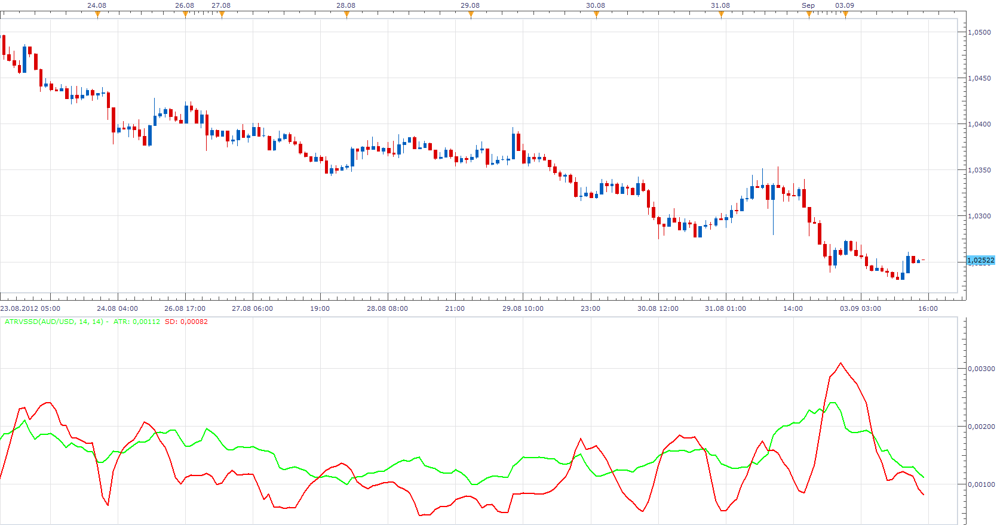

# Average True Range vs Standard Deviation

> Source: https://fxcodebase.com/code/viewtopic.php?f=17&t=22965  
> Forum: 17 · Topic 22965 · 5 post(s)

---

## Average True Range vs Standard Deviation

**Apprentice** · Mon Sep 03, 2012 2:00 pm

According to the author, web references, we have.

Ranging/Sideways market
 ATR(14) > Standard Deviation(14)

Trending market
ATR(14) < Standard Deviation(14) it means EUR/USD

 [ATRvsSD.lua](files/39582/ATRvsSD.lua)

 [ATRvsSD Bar.lua](files/39582/ATRvsSD%20Bar.lua)

The indicator was revised and updated

---

## Re: Average True Range vs Standard Deviation

**gmiller** · Tue Sep 04, 2012 9:02 pm

> According to the author, web references, we have.
>
> Ranging/Sideways market
> ATR(14) > Standard Deviation(14)
>
> Trending market
> ATR(14) < Standard Deviation(14) it means EUR/USD

But in the code looks like other way

Code: [Select all](https://fxcodebase.com/code/)
`if A.DATA[period] > mathex.stdev(source[Price], period - SP + 1, period) then
      Value:setColor(period, instance.parameters.Tranding);    
      else
      Value:setColor(period, instance.parameters.Ranging);   
      end`

---

## Re: Average True Range vs Standard Deviation

**Apprentice** · Wed Sep 05, 2012 2:37 am

Fixed.

---

## Re: Average True Range vs Standard Deviation

**rose123** · Wed Sep 05, 2012 6:05 am

this is very useful indicator.

---

## Re: Average True Range vs Standard Deviation

**Apprentice** · Mon Apr 24, 2017 5:32 am

Indicator was revised and updated.
