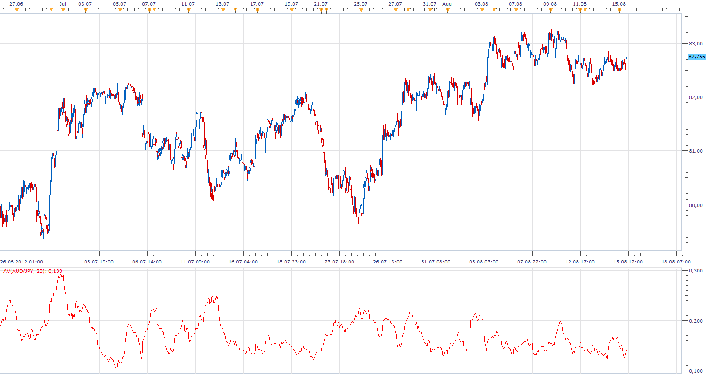

# Average Volatility

> Source: https://fxcodebase.com/code/viewtopic.php?f=17&t=22435  
> Forum: 17 · Topic 22435 · 3 post(s)

---

## Average Volatility

**Apprentice** · Wed Aug 15, 2012 9:06 am

Average Volatility a.k.a. Average Dollar Price Volatility Indicator
Volatility is calculated as Period High - Period Low.
Then we compute the average from obtained values.

 [AV.lua](files/38721/AV.lua)

The indicator was revised and updated

---

## Re: Average Volatility

**Alexander.Gettinger** · Mon Nov 17, 2014 5:27 pm

MQL4 version of Average Volatility oscillator: [viewtopic.php?f=38&t=61457](https://fxcodebase.com/code/viewtopic.php?f=38&t=61457).

---

## Re: Average Volatility

**Apprentice** · Tue Jun 27, 2017 4:33 am

The indicator was revised and updated.
