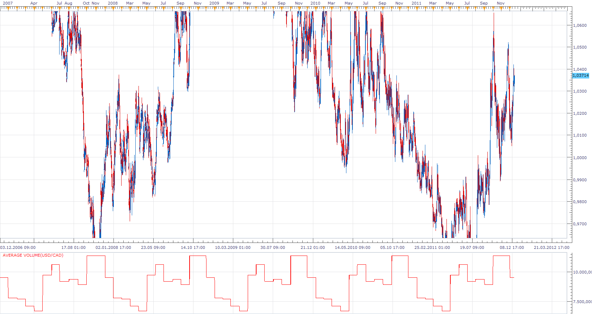

# Average Volume

> Source: https://fxcodebase.com/code/viewtopic.php?f=17&t=9831  
> Forum: 17 · Topic 9831 · 2 post(s)

---

## Average Volume

**Apprentice** · Fri Dec 16, 2011 11:41 am

This tool is not so interesting for traders,
It is useful to analysts.

It provides insight into the average volume achieved in a period of time, historically.

It shows you in which part of the day, week or month, you can expect unusual volatility.

 [Average Volume.lua](files/20883/Average%20Volume.lua)

The indicator was revised and updated

---

## Re: Average Volume

**Apprentice** · Wed Mar 22, 2017 9:52 am

Indicator was revised and updated.
