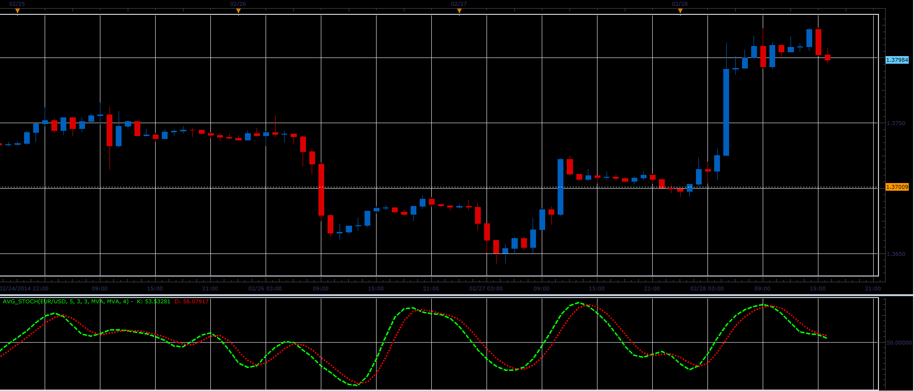

# Averaged stochastic oscillator

> Source: https://fxcodebase.com/code/viewtopic.php?f=17&t=60387  
> Forum: 17 · Topic 60387 · 5 post(s)

---

## Averaged stochastic oscillator

**Alexander.Gettinger** · Mon Mar 03, 2014 9:41 am

The indicator shows the average values ​​of the stochastic.

Formulas:
K = MVA(Stochastic.K, Avg. period),
D = MVA(Stochastic.D, Avg. period).

 

Download:

 [Avg_Stoch.lua](files/92986/Avg_Stoch.lua)

The indicator was revised and updated

---

## Re: Averaged stochastic oscillator

**Alexander.Gettinger** · Mon Mar 03, 2014 9:43 am

MQL4 version of Averaged stochastic oscillator: [viewtopic.php?f=38&t=60388](https://fxcodebase.com/code/viewtopic.php?f=38&t=60388).

---

## Re: Averaged stochastic oscillator

**Fx4mt.com** · Sat Aug 16, 2014 2:27 pm

Would it be possible to get this indicator to have up and down slope color levels? I.e as in when line sloping upwards green, sloping downwards red.
Thanks a bunch

---

## Re: Averaged stochastic oscillator

**Fx4mt.com** · Mon Aug 18, 2014 3:58 pm

Nevermind, I was able to replicated the desired affect with the averages indicator. Thank you

---

## Re: Averaged stochastic oscillator

**Apprentice** · Fri Jun 16, 2017 7:39 am

The indicator was revised and updated.
